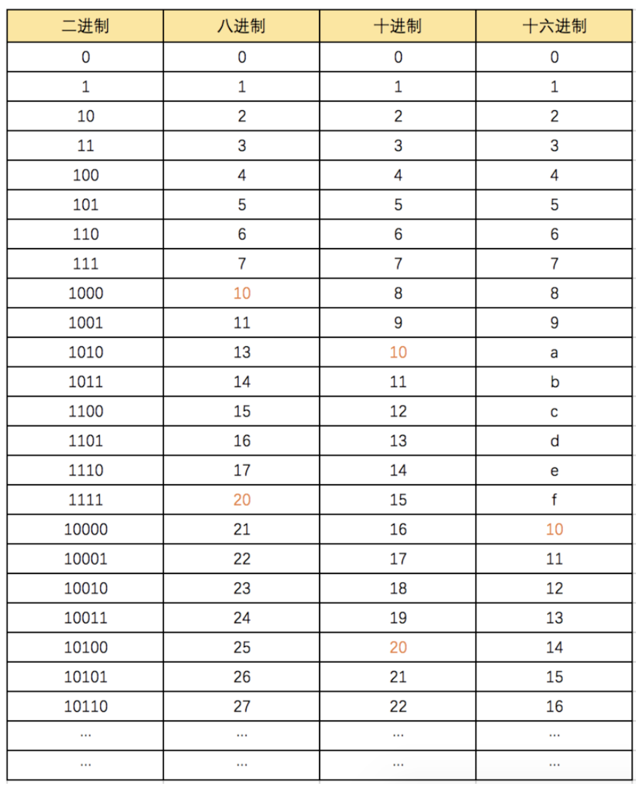
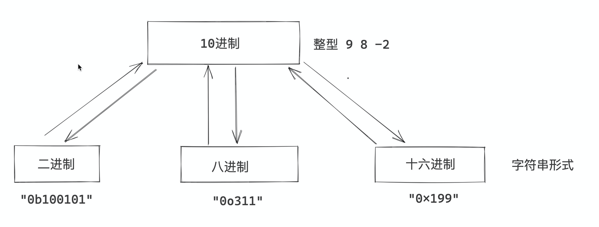
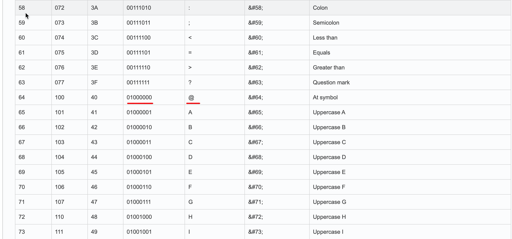
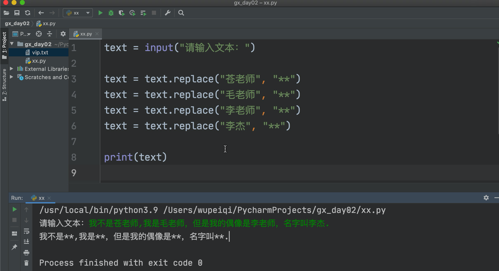

# day02 Python基础

今日概要：

- if条件语句
- while循环
- 字符串格式化
- 运算符（特殊）
- 计算机中的几个概念
  - 进制
  - 单位
  - 编码
- 常见数据类型

## 上节回顾

- Python解释器的安装。

  - 交互式
  - 文件式 `python 文件`

- 系统环境变量

  ```
  >>>C:\python39\python.exe  代码文件
  ```

  ```
  C:\python39\ 加入系统的环境变量之后。
  >>>python.exe  代码文件
  ```

- IDE，Pycharm

  - 项目，文件夹。
  - 文件，代码文件。

- 编码

  ```
  文件是以什么编码保存的，就要以什么编码去打开文件，不然就会出现乱码。
  计算机本质上存储所有数据都是 10101010010101
  ```

- 输入和输出

  ```python
  name = input("提示信息：")   # 卡住，等待用户输入。字符串
  
  print(12)
  print("sdf")
  print(name)
  ```

- 数据类型

  - 整型 int
  - 字符串 str
  - 布尔类型 bool

- 变量

  - 规范：三个

  - 建议（潜规则）

    ```python
    - 见名知意    age = 10  user_age = 10   v1 = 123  v2 = 123（不要写拼音）
    - 下划线连接  user_age = 19
    ```

- 注释

- 条件语句

  ```python
  if xxx :
      ..
      ..
      ..
  else:
      ...
      ...
      ...
  ```

  注意：冒号 + 缩进


## 1.条件语句

### 1.1 基本条件

```python
if 条件:
    pass
else:
    pass
```

```python
num = 1
if num > 9:
    print(123)
    print(456)
else:
    print(666)
    print(999)
```

```python
username = input(">>>")
password = input(">>>")

if username == "admin" and password == "123":
	print("成功")
else:
    print("失败")
```


### 1.2 多条件

```python
if 条件A:
    条件A成立，。。
    。。。
    。。。
elif 条件B:
    条件A不成立,条件B
    。。
    。。
elif 条件C:
    C成立
    ...
    ...
else:
    上述都不成立
```

```python
# 猜数字

num = input("请猜数字，猜对赠送500w，请开始：")
data = int(num)

if data > 66:
    print("太大了")
elif data < 66:
    print("太小了")
else:
    print("恭喜你获得500w")
```


提示：所有的条件中的else可以省略。

```python
if True:
    pass
```

```python
if 条件A:
    pass
elif 条件B:
    pass
```


### 1.3 嵌套

```python
if 条件A:
    if 条件:
        if xx:
            pass
        else:
            pass
    else:
        pass
elif 条件B:
    pass
```


模拟：联通10010客服。

```python
print("欢迎致电10010，提供以下服务：1.话费业务；2.宽带业务；3.企业业务；4.人工服务")
choice = input("请选择序号：")
if choice == "1":
    print("话费业务专区") # xxx
	# 谢新雪
    print("1.查询话费；2.缴话费；3.话费异常")
    second_choice = input("请输入：")
    if second_choice == "1":
        print("话费查询")
        print("你的话费余额是100w")
	elif second_choice == "2":
        print("成功缴费100元")
	elif second_choice == "3":
        print("....")
        print("....")
	else:
        print("输入错误")
	print("END")
elif choide = "2":
    print("宽带业务专区")
    print("宽带业务专区")
    print("宽带业务专区")
    print("宽带业务专区")
    print("宽带业务专区")
elif choide = "3":
    print("企业业务")
elif choide = "4":
    print("人工服务专区")
    
print("感谢您的来电，再见。")
```


### 答疑


就目前而言，只有写什么的时候会有缩进？【if条件】

```python
data = input(">>>")
value = "xxx" + "xxxx"
print(value)
```

```python
data = input(">>>")
if xxx :
    ...
else:
    ...
```

```python
v1 = 2 == 9

==，比较运算符 True/False
	1 == 2
    5 == 0
    
    v1 = 123
    v2 = 456
    v1 == v2
=，赋值
	v1 = 123
```


## 2.while循环

```
print("开始")

while 条件 :
	...
	..
	...

print("结束")
```


### 2.1 循环基本使用

示例1：

```python
print("开始")
while True:
    print("乔杉喜欢大保健")
    print("代言人")
print("结束")

# 输出：
开始
乔杉喜欢大保健
代言人
乔杉喜欢大保健
代言人
乔杉喜欢大保健
代言人
...
```


示例2：

```python
print("开始")
while 1 > 2:
    print("123")
print("结束")

# 输出
开始
结束
```


示例3：

```python
num = 1

print("开始")
while num > 2:
    print("123")
print("结束")

# 输出
开始
结束
```


示例4：

```python
num = True

print("开始")

while num:
    
    print("123")
    
    num = False
    
print("结束")

# 输出
开始
123
结束
```


示例5：

```python
print("开始")
num = 1
while num < 3:
    print("123")
    num = 5
print("结束")

# 输出
开始
123
结束
```


示例6：

```python
print("开始")
num = 1
while num < 3:
    print("123")
    num = num + 1  # num=2   num=3
print("结束")

# 输出
开始
123
123
结束
```


### 练习题

1. 基于while循环 + 计数 实现，输出5次 ”我爱我的祖国“。

   ```python
   num = 1
   
   while num < 6:
       print("我爱我的祖国")
       num = num + 1
   ```

2. 循环输出 1 ~ 10 以内所有的整数。

   ```python
   num = 1
   while num < 11:
       print(num)
       num = num + 1
   ```

3. 循环输出 10 ~ 1 以内所有的整数。

   ```python
   num = 10
   while num > 0:
       print(num)
       num = num - 1
   ```

4. 猜数字，给他三次机会。

   ```python
   print("开始")
   count = 1
   while count <= 3:
       num_string = input("请输入你要猜的数字：")
       num = int(num_string)
       if num > 66:
           print("大了")
       elif num < 66:
           print("小了")
       else:
           print("正确")
           count = 100
       count = count + 1
   
   print("结束")
   ```

5. 猜数字，一直猜，指导猜对为止。

   ```python
   print("开始")
   count = 1
   
   while count == 1:
       num_string = input("请输入你要猜的数字：")
       num = int(num_string)
       if num > 66:
           print("大了")
       elif num < 66:
           print("小了")
       else:
           print("正确")
           count = 100
   
   print("结束")
   ```

   ```python
   print("开始")
   flag = True
   
   while flag:
       num_string = input("请输入你要猜的数字：")
       num = int(num_string)
       if num > 66:
           print("大了")
       elif num < 66:
           print("小了")
       else:
           print("正确")
           flag = False
   
   print("结束")
   ```

   

### 2.2 break

break不能自己独立使用，只能放在循环的内部。

break，立即终止循环（从循环中跳出来）。

```python
print("开始")
while True:
    print("中国联通")
    break
    print(123)
print("结束")

# 输出
开始
中国联通
结束
```


```python
print("开始")
while True:
    print("中国联通")
    if 1 == 1:
	    break
    print(123)
print("结束")

# 输出
开始
中国联通
结束
```


```python
print("开始")
while True:
    print("中国联通")
    if 1 > 1:
	    break
    print(123)
print("结束")

# 输出
开始
中国联通
123
中国联通
123
中国联通
123
...
```


猜数字，一直猜，指导猜对为止。

```python
print("开始")
while True:
    num_string = input("请输入你要猜的数字：")
    num = int(num_string)
    if num > 66:
        print("大了")
    elif num < 66:
        print("小了")
    else:
        print("正确")
		break

print("结束")
```


### 2.3 continue

continue不能自己独立使用，只能放在循环的内部。

continue，立即结束当前循环，开始下次循环。

```python
print("开始")
while True:
    print(1)
    continue
    print(2)
print("结束")

# 输出
开始
1
1
1
1
1
...
```


案例：输出 1 ~ 10，不要7

```python
count = 1
while count < 11:
    if count == 7:
        continue
        
    print(count)
    count = count + 1
    
# 输入？
1
2
3
4
5
6
```

```python
count = 1
while count < 11:
    if count == 7:
        continue
    	count = count + 1
    print(count)
    count = count + 1
    
# 输入？
1
2
3
4
5
6
```

```python
count = 1
while count < 11:
    if count == 7:
		count = count + 1
        continue
    print(count)
    count = count + 1
    
# 输入
1
2
3
4
5
6
8
9
10
```


## 3.字符串格式化

### 3.1 format（推荐）

```python
text = "我的名字叫{0}今年{1}岁".format("武沛齐",18)
print(text) # "我的名字叫武沛齐今年18岁"
```

```python
text = "我的名字叫{0}今年{1}岁，就是{0}".format("武沛齐",18)
print(text) # "我的名字叫武沛齐今年18岁，就是武沛齐"
```

```python
text = "我的名字叫{}今年{}岁，就是{}".format("武沛齐",18,"武沛齐")
print(text)
```

```python
tpl = "我的名字叫{}，今年{}岁。"

v1 = tpl.format("武沛齐",18)  # 我的名字叫武沛齐，今年18岁。
v2 = tpl.format("邱恩婷",17)  # 我的名字叫邱恩婷，今年17岁。
```

注意：

```python
text = "我的名字叫{n1}今年{xx}岁，就是{p2}".format(n1="武沛齐",p2=18,xx="武沛齐")
print(text)
```


### 3.2 %

```python
text = "我的名字叫%s今年%d岁"  %("武沛齐",18)

print(text) # "我的名字叫武沛齐今年18岁"
```

```python
tpl = "我的名字叫%s，今年%d岁。"

v1 = tpl %("武沛齐",11)
v2 = tpl %("谢鹏",12)
```


### 3.3 f-string

Python3.6+之后才有的另外一个中的格式化。

```python
name = "武沛齐"
age = 18
text = f"我的名字{name}，今年{age}岁"
print(text)
```


## 4.运算符

- 算数运算符

  ```python
  value = 9 % 2
  print(value) # 1
  ```

- 比较运算符

  ```python
  >
  >=
  <
  <=
  ==
  !=
  ```

- 赋值运算

  ```python
  v1 = 123
  ```

  ```python
  num = 10
  num = num + 2  # num += 2
  ```

  ```python
  num = 10
  num = num - 2  # num -= 2
  ```

  ```python
  count = 1
  while count<11:
      print(count)
      count = count + 1   # count += 1
  ```

  ```python
  count = 10
  while count > 0:
      print(count)
      count = count - 1   # count -= 1
  ```

- 成员运算，xx中是否xx

  ```python
  v1 = "日本" in "日本人不是人"  # True
  v2 = "俄罗斯" in "日本人不是人"  # False
  ```

  ```python
  text = "日本人不是人"
  v3 = "日本" in text   # True
  ```

  ```python
  text  = input("请输入你的评论：")
  if "日本" in text:
      print("不能包含不是人的信息")
  else:
      print(text)
  ```

  ```python
  text  = input("请输入你的评论：")
  if "日本" not in text:
      print(text)    
  else:
      print("不能包含不是人的信息")
  ```

- 逻辑运算

  ```python
  v1 = True and True   # True
  v2 = True and False  # False
  ```

  ```python
  user = input(">>>")
  pwd = input(">>>")
  if user == "root" and pwd == "123":
      print("成功")
  else:
      print("失败")
  ```

  


关于逻辑运算符的特别应用：

- 一般

  ```python
  # v1 =  条件 and/or  条件
  v1 = user == "root" and  pwd == "123"
  ```

- 高级用法（很少写，面试题+源码）

  ```
  v1 = 值  and/or 值
  ```

  ```python
  v1 = 2 and 4
  
  print(v1)
  """
  值 and 值
  
  逻辑运算的结果取决于那个值？结果等于值。
  v1 = 2 and 4
  """
  ```

  ```python
  v1 = 6 and 9   # 9
  v2 = 0 and 1   # 0
  v3 = 88 and 0  # 0
  v4 = "" and 9  # ""
  v5 = "梁伟" and "罗小春"  # "罗小春"
  v6 = 1 or 2    # 1
  v7 = 0 or 2    # 2
  
  # 先分析and，or
  v8 = 1 and 8 or 9 and 10 or 11 or 12 and 0 or "" and "卢慧"
  ```

  ```python
  name = 19
  if bool(name):
      v1 = name
  else:
      v1 = 666
  ```

  ```python
  name = 19
  v1 = name or 666
  ```

  

## 5.基础概念

### 5.1 进制

计算机底层全都都是 0101010101010 （二进制）

```
0
1
10
11
100

武     100010000010000111100011
```






转换：

- 十进制 -> 其他进制

  ```python
  v1 = bin(238)
  print(v1) "0b11101110"
  
  v2 = oct(238)
  print(v2) # "0o356"
  
  v3 = hex(238)
  print(v3) # "0xee"
  ```

- 其他进制，转换成十进制整数

  ```python
  d1 = int("0b11101110", base=2)
  print(d1) # 238
  
  d2 = int("0o356", base=8)
  print(d2) # 238
  
  d3 = int("0xee", base=16)
  print(d3) # 238
  ```

  


### 5.2 计算机中的单位

内存：8G、硬盘：1T、流量：300M。

计算机底层本质上都是010101010，计算机中为了方便表示搞了一些单位。

```python
10001111 10001111 10001111 10001111 10001111
```

- b（bit），位

  ```python
  0   	1位
  1   	1位
  100   	3位
  ```

- B（byte），字节

  ```python
  8位是一个字节。
  10001111   			1个字节
  10001111 10001111   2个字节
  ```

- KB（kilobyte），千字节

  ```
  1024个字节就是1KB(千字节)。
  
  10010110 11010110  10010111 .. ，1KB
  1KB = 1024B= 1024 * 8 b
  ```

- M（Megabyte），兆   -> 8388608

  ```
  1024KB就是1M
  1M= 1024KB = 1024 * 1024 B = 1024 * 1024 * 8 b  
  ```

- G（Gigabyte），千兆

  ```
  1024M就是1G
  1 G=  1024 M=  1024 *1024KB =  1024 * 1024 * 1024 B =  1024 * 1024 * 1024 * 8 b
  ```

- T（Terabyte），万亿字节

  ```
  1024个G就是1T
  ```

- ...其他更大单位 PB/EB/ZB/YB/BB/NB/DB 不再赘述。


假设：

- 办理：1G套餐（1024 * 1024 * 1024 * 8）

- 密码文：

  ```
  武		10110011 10110011     -> 16位表示1个中文字符串
  ```

  

### 5.3 编码

编码，文字与二进制的对照表。


#### 5.3.1 ascii编码

ascii编码中总共有256个对应关系。



最开始的编码，只是照顾了美国。

在ascii编码中是用1个字节来表示二进制，所以他只能有256中可能。

```
NUL     00000000
...
@		01000000
...
H		01001000
...
ÿ		11111111
```


#### 5.3.2 gbk和gb2312

GB-2312，国家信息委员会制作（1980年）。

GBK，GB-2312的扩展，包含了中日韩等文字。（1995）。


#### 5.3.3 unicode（万国码）

- ucs2，用固定的2个字节去表示二进制和文字的对应关系。 2**16 = 65535
- ucs4，用固定的4个字节去表示二进制和文字的对应关系。 2**32 = 4294967296

```python
文字				 二进制
且             01001110 00010100                         ucs2
且             00000000 00000000 01001110 00010100       ucs4
```

```
文字 						 二进制					 十六进制
༃                    1001010101010101010              0F03
```


缺点，固定都用4个字节去存储文字对应的二进制  -> 浪费空间/浪费流量。


#### 5.3.4 utf-8编码

对unicode进行压缩，用尽可能少的自己来表示数据。


注意事项：

```
- 以后开发时，一定要使用utf-8编码。
- UTF-8编码中，1个中文用3个字节来表示。
```


#### 5.3.5 Python

```python
name = "武沛齐"     			# 字符串类型，unicode来存储（ucs4)。
data = name.encode('utf-8')	  # 字节类型，  utf-8编码来存储
print(data)
```

在Python开发中，以后再去做文件存储或网络传输时，不能直接用字符串，而是需要将字符串压缩成utf-8编码的字节，然后再来传输和存储。

```python
# 在文件中写入一个字符串
name = "武沛齐"

# 1.打开文件
file_object = open("vip.txt",mode='ab')

# 2.写入内容
file_object.write( name.encode('utf-8') )

# 3.关闭文件
file_object.close()
```


- 文件编码

  - 写文件，写了很多的文本的内容  -> 按照某种编码去存储文件。( 010100101010 )

  - 读文件，真正的内容读取出来，用同样的编码才能读取到文本内容。

    ```python
    Python解释器编码，指的是打开和读取某个py文件的内容时，用的是这种编码。 utf-8
    ```

- Python解释器将代码读取到内存之后，是需要进行：

  - 语法分析 & 词法分析

    ```python
    name = "武沛齐"     -> 字符串处理，去unicode对应关系中找 01010101010
    ```


## 6.数据类型

- 学汉语：拼音、数字、汉字、词语、成语，写文章  --->  老师批改。
- 学编程：整型、字符串、布尔值 ，写程序（写代码） ->  计算机。

```
布尔值（bool）：True  False
整型（int）	  ：1 19 22 300
字符串（str） ："中国联通"    "广西壮族自治区"    "北京市"
	upper/lower/isdecimal/strip/lstrip/rstrip/replace
列表（list）  ：[11,22,33]   ["李冉","谢鹏","陈青",11, 22 ,True]
元组（tuple） ：(11,22,33)   ("李冉","谢鹏","陈青",11, 22 ,True)
字典（dict）  ：{ "k1":123 , "k2":456 }  {"n1":1,"N2":True}
```

```python
n1 = "root"
res = n1.upper()    # res = "ROOT"

n2 = "admin"
value = n2.upper()  # value = "ADMIN"
```

```python
data_list1 = [11,22,33,44]
data_list1.append(55)  # 列表的功能，在列表的尾部追加某个值 [11,22,33,44,55]

data_list2 = [1,2,3]
data_list2.append(55)  # 列表的功能，在列表的尾部追加某个值 [1,2,3,55]
```

接下来我们学习是：某个中类独有的功能 & 公共功能。


### 6.1 字符串类型

#### 6.1.1 定义

```python
name = "武沛齐"
email = "xxxx@live.com"
```

注意：字符串是一个不可变类型。


#### 6.1.2 独有功能

```python
data = "root"
res = data.功能名()  # res=新的值
```


- 大写和小写

  ```python
  name = "root"
  res = name.upper()
  print(res) # "ROOT"
  print(name) # "root"
  ```

  ```python
  name = "ROOT"
  res = name.lower()
  print(res) # "root"
  print(name) # "ROOT"
  ```

  ```python
  # 你们以前去注册/等某个网站时，让你填写验证码（不区分大小写）。
  code = input("请输入验证码（FbeY）：")
  big_code = code.upper()
  
  if big_code == "FBEY":
  	print("验证码正确")
  else:
  	print("验证码错误")
  ```

  ```python
  code = input("请输入验证码（FbeY）：")
  big_code = code.lower()
  if big_code == "fbey":
  	print("验证码正确")
  else:
  	print("验证码错误")
  ```

  练习题：让用户循环输入姓名，用字符格式化给他给他输出 "恭喜xxx，获得500w"，如果用户输入的 q或 Q，循环终止。

  ```python
  while 条件:
      pass
  ```

  ```python
  text = "xxxx{}xxxx".format("武沛齐")
  ```

  ```python
  while True:
      name = input("请输入姓名（q/Q）：")  # "root"
      big_name = name.upper()  # big_name = "ROOT"
      if big_name == "Q":
          break
      text = "恭喜{}，获得500w奖励".format(name)
      print(text)
  ```

  ```python
  while True:
      name = input("请输入姓名（q/Q）：")  # "root"
      if name.upper() == "Q":
          break
      text = "恭喜{}，获得500w奖励".format(name)
      print(text)
  ```

- isdecimal，判断字符串里面是不是整数

  ```python
  data = "12"
  v1 = data.isdecimal()
  print(v1) # True
  ```

  ```python
  data = "a2"
  v1 = data.isdecimal()
  print(v1) # False
  ```

  ```python
  text = input("请输入一个数字：")  # "123"
  if text.isdecimal():
      print("输入正确")
  else:
      print("非数字")
  ```

  练习题：

  - 循环提示用户输入一个数字，如果不是数字，则继续输入，如果是，则终止循环。

    ```python
    while True:
        text = input("请输入一个数字：")  # "123"
        if text.isdecimal():
            print("输入正确")
            break
    ```

  - 关于作用域

    ```java
    // java代码
    if (1==1){
        int v1 = 123;
        // 在这个代码块中创建的变量，只能在此代码块中使用，外部无法使用
    }
    System.out.println(v1); // 读取不到v1变量
    ```

    ```python
    if 1 == 1:
        text = "毛钱"
        print(text)
    print(text) # "毛钱"
    ```

    ```python
    if 1 > 2:
        text = "毛谦"
        print(text)
        
    print(text) # 报错
    ```

  - 让用户循环反复的输入2个值（必须都是数字，不是数字就重复输入，直到都是数字为止），让两个数字相加。

    ```python
    while True:
        num_1 = input("请输入第一个数字：")
        if num_1.isdecimal():
            break
    
    while True:
        num_2 = input("请输入第二个数字：")
        if num_2.isdecimal():
            break
    
    res = int(num_1) + int(num_2)
    print(res)
    ```

- startswith和endswith，判断字符串是以xx开头或xx结尾。

  ```python
  name = "中华人民共和国"
  v1 = name.startswith("中华") # True
  v2 = name.endswith("中华") # False
  ```

  ```python
  address = input("请输入你的家庭住址：")
  if address.startswith("北京市"):
      print("京户")
  else:
      print("非京户")
  ```

  ```python
  file_name = "xxxxxxx.png"
  
  if file_name.endswith("png"):
      print("一张图片")
  else:
      print("不是图片")
  ```

- strip/lstrip/rstrip，去除空白（空格、换行符\n、制表符\t）。

  ```python
  name = " 台湾省 "
  
  v1 = name.strip()  # "台湾省"
  
  v2 = name.lstrip() # "台湾省 "
  
  v3 = name.rstrip() # " 台湾省"
  ```

  ```python
  name = input("请输入姓名：") # "   "
  data = name.strip()
  
  if data == "":
      print("输入不能为空")
  else:
      print(data)
  ```

  ```python
  if 123:
  	pass
  else:
      pass
  ```

  ```python
  name = input("请输入姓名：") # "   "
  data = name.strip() # data = ""   ->  False
  if data:
      # 用户输入的姓名不为空
  else:
      # 用户输入为空
  ```

  ```python
  name = input("请输入姓名：") # "   "
  data = name.strip() # data = ""   ->  False
  if not data:
      # 用户输入为空
  else:
      # 用户输入的姓名不为空
  ```

  ```python
  while True:
      num_1 = input("请输入第一个数字：")  # "  "
      num_1 = num_1.strip()  # ""
      if not num_1:
          print("输入不能为空")
          continue
      if num_1.isdecimal():
          break
  
  while True:
      num_2 = input("请输入第二个数字：")
      num_2 = num_2.strip()
      if num_2:
          if num_2.isdecimal():
              break
      else:
          print("输入不能为空")
  
  res = int(num_1) + int(num_2)
  print(res)
  ```

  去除空白：包含空格、换行、制表符

- replace，替换

  ```python
  text = "广西梁伟龚星云"
  
  data = text.replace("梁伟","李冉")
  
  print(text) # "广西梁伟龚星云"
  print(data) # "广西李冉龚星云"
  ```

  练习题：

  - 让用户输入一段文本，出现：毛谦，则替换成 **，输出被替换完成的内容。

    ```python
    text = input(">>>")  # "我的男生是毛谦，毛谦yyds"
    
    data = text.replace("毛谦", "**")
    print(data)
    ```

  - 让用户输入一段文本，将：`苍老师` 、`毛老师` 、`李老师`、`李杰`，则变成**。

    ```python
    text = input("请输入文本：")
    
    data1 = text.replace("苍老师", "**")
    data2 = data1.replace("毛老师", "**")
    data3 = data2.replace("李老师", "**")
    data4 = data3.replace("李杰", "**")
    
    print(data4)
    ```

    ```python
    text = input("请输入文本：")
    
    text = text.replace("苍老师", "**")
    text = text.replace("毛老师", "**")
    text = text.replace("李老师", "**")
    text = text.replace("李杰", "**")
    
    print(text)
    ```

    


## 总结

1. 条件语句

2. while循环语句； break、continue

3. 字符串格式化 -> format

4. 运算符

   - 一般都是按照咱们认知以内

   - 特殊逻辑运算

     - 一般应用

       ```python
       v1 = 1 == 1 and 2 == 2
       ```

     - 特殊应用

       ```python
       v2 = 4 and 9
       ```

5. 基础概念

   - 进制之间如何转换：bin/oct/hex/int
   - 计算机单位：8位1个字节
   - 编码
     - utf-8是对unicode压缩
     - utf-8表示中文3个字节。

6. 数据类型

   - 同一种数据类型，一般都具有共同的特征、同样的功能。
   - 字符串str
     - 字符串不可变，所以执行他的功能时，原数据不变，生成一个新的数据。
     - 独有的常见功能：...


