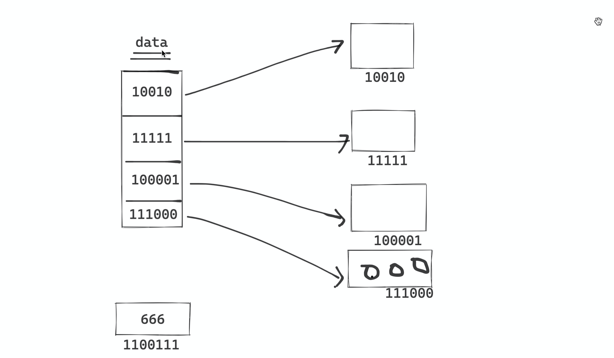

# day03 数据类型

- 学汉语：拼音、数字、汉字、词语、成语，写文章  --->  老师批改。
- 学编程：整型、字符串、布尔值 ，写程序（写代码） ->  计算机。

```
布尔值（bool）：True  False
整型（int）	  ：1 19 22 300
字符串（str） ："中国联通"    "广西壮族自治区"    "北京市"
	upper/lower/isdecimal/strip/lstrip/rstrip/replace/
	join/split/center/ljust/rjust/zfill
	len/索引/切片/for循环
列表（list）  ：[11,22,33]   ["李冉","谢鹏","陈青",11, 22 ,True]
	append/insert/remove/pop/clear/sort
	len/索引/切片/for循环
元组（tuple） ：(11,22,33)   ("李冉","谢鹏","陈青",11, 22 ,True)
字典（dict）  ：{ "k1":123 , "k2":456 }  {"n1":1,"N2":True}
```

```python
n1 = "root"
res = n1.upper()    # res = "ROOT"

n2 = "admin"
value = n2.upper()  # value = "ADMIN"
```

```python
data_list1 = [11,22,33,44]
data_list1.append(55)  # 列表的功能，在列表的尾部追加某个值 [11,22,33,44,55]

data_list2 = [1,2,3]
data_list2.append(55)  # 列表的功能，在列表的尾部追加某个值 [1,2,3,55]
```


今日概要：

- 字符串类型
- 列表类型
- 元组类型


## 1.字符串（str）

### 1.1 定义

```python
v = "xxxx"
```


### 1.2 独有功能

1. 大写

2. 小写

3. 是否是数字

4. 替换

5. 去除空白/左边/右边

6. 切割

   ```python
   file_name = "day01 python基础编程入门.mp4"
   
   # 切割字符串后得到的是一个列表
   #                       0                   1  
   # data_list = [ "day01 python基础编程入门" , "mp4"  ]
   data_list = file_name.split(".")
   
   data_list[0]    # "day01 python基础编程入门"
   data_list[1]    # "mp4"
   ```

   ```python
   text = "武沛齐,root,wupeiqi@live.com,19"
   
   #    0       1           2            3
   # ["武沛齐","root","wupeiqi@live.com","19"]
   
   data_list = text.split(",")
   data_list[0]
   data_list[1]
   data_list[2]
   data_list[3]
   ```

7. 拼接

   ```python
   # 1.字符串相加
   v1 = "李阳金"
   v2 = "大神"
   
   text = v1 + "是" + v2
   ```

   ```python
   # 2.字符串格式化
   v1 = "李阳金"
   v2 = "大神"
   text = "{}是{}".format(v1,v2)
   ```

   ```python
   # 3.列表，里面有很多字符串，你想要让他们按照某个连接符拼接起来。
   
   data_list = ["张松杰","懵懂绝","秦萍","马其坤"]
   
   res = "_".join(data_list)
   print(res) # "张松杰_懵懂绝_秦萍_马其坤"
   ```

   ```python
   data_list = ["张松杰","懵懂绝","秦萍","马其坤"]
   
   res = ",".join(data_list)
   print(res) # "张松杰,懵懂绝,秦萍,马其坤"
   ```

   ```python
   data_list = ["张松杰","懵懂绝","秦萍","马其坤"]
   
   res = "".join(data_list)
   print(res) # "张松杰懵懂绝秦萍马其坤"
   ```

   注意事项：想要通过join去拼接，列表中必须都是字符串。

8. 字符串转换成字节类型

   ```
   字符串		 unicode
   字节		 utf-8/gbk（文件存储、网络传输）
   ```

   ```python
   data = "中国联通"
   v1 = data.encode("utf-8")
   print(v1) 
   # b'  \xe4       \xb8      \xad \xe5\x9b\xbd \xe8\x81\x94 \xe9\x80\x9a'
   #   01110010   10111000
   ```

   ```python
   text = v1.decode("utf-8")
   print(text) # "中国联通"
   ```

9. 长度的补足

   ```python
   name = "宁摆场"
   
   text = name.center(13,"*")
   print(text) # "*****宁摆场*****"
   ```

   ```python
   name = "宁摆场"
   
   text = name.ljust(13,"#")
   print(text) # "宁摆场##########"
   ```

   ```python
   name = "宁摆场"
   
   text = name.rjust(13,"#")
   print(text) # "##########宁摆场"
   ```

10. 长度的补足，只能在左边补0（二进制字符串前面补0）

    ```python
    name = "卢红萍"
    
    v1 = name.zfill(10)
    print(v1) # "0000000卢红萍"
    ```

    ```python
    data = "10101"
    
    res = data.zfill(8)
    print(res) # "00010101"
    ```

    

### 练习题

1. 写代码实现，提示用户输入文本，你来判断文本是否是以 ”中国“开头，输入：中国人、否则外国人。

   ```python
   text = input(">>>")
   if text.startswith("中国"):
       print("中国人")
   else:
       print("外国人")
   ```

2. 写代码实现，提示用户输入文本，将文本中的 上 替换成 下。

   ```python
   text = input(">>>")
   res = text.replace("上","下")
   print(res)
   ```

3. 提示用户输入两个数字相加，例如：5+2、6+9 格式（不用考虑 yy+77 ）。

   ```python
   #            0  1
   data_list = [11, 9]
   data_list[0]
   data_list[1]
   ```

   ```python
   text = input(">>>")   # "5+9"
   data_list = text.split("+")  # ["5","9"]
   
   res = int(data_list[0]) + int(data_list[1])
   print(res)
   ```

4. 提示用户输入两个数字相加，例如：5+2、6+9 、你好+9，判断如果都是数字，数字相加，只要有任意一个不是数字，则提示输入错误。

   ```python
   text = input(">>>")   # "5+9"
   data_list = text.split("+")  # ["5","9"]
   
   if data_list[0].isdecimal() and data_list[1].isdecimal():
       res = int(data_list[0]) + int(data_list[1])
       print(res)
   else:
       print("输入错误")
   ```

5. 排队买票

   ```python
   # ["罗小春","谢鹏",龚星云]
   name_list = []
   name_list.append("罗小春")  
   name_list.append("谢鹏")  
   name_list.append("龚星云")  
   
   # name_list = ["罗小春","谢鹏",龚星云]
   ```

   ```python
   # 1.循环让用户输入姓名（q/Q终止），每输入一个姓名都追加到列表中。
   
   # 2.输入q退出之后，将所有的人员姓名通过逗号连接成字符串并输出。
   ```

   ```python
   user_list = []
   while True:
       name = input("请输入姓名：")
       if name.upper() == "Q":
           break
       user_list.append(name)
       
   res = ",".join(user_list)
   print(res)
   ```

   

### 1.3 公共功能

1. 长度

   ```python
   name = "欧阳娜娜"
   
   res = len(name)
   print(res) # 4
   ```

   ```python
   v1 = len("陆梅yy8899")
   print(v2) # 8
   ```

2. 索引

   ```python
   #       0  1 2  3 4  5 6 7 8 9 10 11
   text = "我 要 学 习 P y t h o n 编 程"
   
   text[0] # "我"
   text[8] # "o"
   text[10] # "编"
   
   v1 = 3
   text[v1] # "习"
   
   text[100] # 报错
   
   v2 = len(text) - 1 # 12
   text[v2]  # "程"
   ```

   ```python
   text = "我要学习python编程"
   index = 0
   while index < len(text):
       print(text[index])
       index += 1
   ```

   ```python
   #       0  1 2  3 4  5 6 7 8 9 10 11
   #                           -3 -2 -1
   text = "我 要 学 习 P y t h o n 编 程"
   
   text[-1]  # "程"
   ```

3. 切片

   ```python
   #       0  1  2  3 4  5 6 7 8 9 10 11
   #                           -3 -2 -1
   text = "我 要 学 习 P y t h o n 编 程"
   
   text[0:2]  # "我要"
   text[2:8]  # "学习Pytho"
   text[2:-1]  # "学习Python编"
   text[2:]  # "学习Python编程"
   text[:-1]  # "我要学习Python编"
   text[:]  # "我要学习Python编程"
   
   # 注意：1.前取后不取；   2.索引位置是从0开始。
   ```

   ```python
   num = 189
   
   # 1.转换成二进制的字符串
   bin_string = bin(num)   # '0b10111101'
   
   # 2.不要0b， data="10111101"
   data = bin_string[2:]
   
   # 3.将二进制字符串补足16位，在他的前面补0
   result = data.zfill(16)
   print(result) # "0000000010111101"
   ```

4. 循环

   ```python
   给你一个字符串 data = "我要学习Python编程" ，让你循环字符串中的每个元素。
   - while循环+索引
   - for循环
   ```

   - while循环

     ```python
     data = "我要学习Python编程"
     
     index = 0
     while index < len(data):
         char = data[index]
         print(char)
         index += 1
     ```

   - for循环，直接获取。

     ```python
     data = "我要学习Python编程"
     
     for item in data:
         print(item)
     ```

     ```python
     data = [11,22,33,44,55,66]
     
     for item in data:
         print(item)
         ..
         ..
         ...
     ```

     ```python
     # range函数作用，帮助你生成一个数字列表。
     v1 = range(5)        # [0,1,2,3,4]
     v2 = range(5,10)     # [5,6,7,8,9]
     v3 = range(5,10,2)   # [5,7,9]
     v5 = range(10,0,-1)  # [10,9,8,7,6,5,4,3,2,1]
     ```

     ```python
     for item in range(5): # [0,1,2,3,4]
         print(item)
         
     for item in range(5,10): # [5,6,7,8,9]
         print(item)
         
     for item in range(10,0,-1): # [10,9,8,7,6,5,4,3,2,1]
         print(item) 
     ```

     ```python
     # 请实现获取字符串中的每个元素并输出。
     data = "我要学习Python编程"
     
     # 方式1
     index = 0
     while index < len(data):
         char = data[index]
         print(char)
         index += 1
         
     # 方式2
     for item in data:
         print(item)
         
     # 方式3
     for idx in range(len(data)): # [0,1,2,3,4,5,6,7,8,9,10,11]
     	char = data[idx]
         print(char)
     ```

     

### 练习题

1. for循环输出 `message = "伤情最是晚凉天，憔悴厮人不堪言"`的每一个字符。

   ```python
   message = "伤情最是晚凉天，憔悴厮人不堪言"
   for item in message:
       print(item)
   ```

2. for循环+range实现倒序输出 `message = "伤情最是晚凉天，憔悴厮人不堪言"` 中的每一个字符。

   ```python
   message = "伤情最是晚凉天，憔悴厮人不堪言"
   
   for i in range(len(message)-1, -1, -1):
       print(message[i])
   ```

3. 让用户输入输入一段文本，计算输出的文本中 "浪" 出现的次数。

   ```python
   text = input(">>>")
   count = 0
   for item in text:
       if item == "浪":
           count += 1
           
   data = "浪出现的次数：{}次".format(count)
   print(data)
   ```

4. 写代码实现：

   - 提示用户输入内容，内容包含：as8dfa9784adfasdf沙发垫
   - 将用户输入的内容中的数字提取出来：89784
   - 将提取出来的数字转换为整形，再将整型转换为二进制字符串。
   - 将二进制的字符串前面的 0b 去除。
   - 输出去除0b之后的二进制字符串。

   ```python
   text = input(">>>") # abc11uu98f3
   
   char_list = [] # ["1","1","9","8","3"]
   for item in text:
       if item.isdecimal():
           char_list.append(item)
           
   num_string = "".join(char_list) # "11983"
   num_int = int(num_string) # 11983
   bin_string = bin(num_int) # 0b110101010010101
   res = bin_string[2:]
   print(res)
   ```

   ```python
   text = input(">>>") # abc11uu98f3
   
   char_list = [] # ["1","1","9","8","3"]
   for item in text:
       if item.isdecimal():
           char_list.append(item)
           
   res = bin(int("".join(char_list)))[2:]
   print(res)
   ```

5. 查询你自己电脑上的某个目录下的所有文件，判断文件的扩展名是否是：png、PNG，如果是则输出。

   ```python
   import os
   
   # mac
   # ['WX20201115-092707@2x.png', 'WX20201114-164908@2x.png', 'WX20201114-165144@2x.png', 'demo.py', '.idea']
   data_list = os.listdir("/Users/wupeiqi/PycharmProjects/gx_day03")
   for file_name in data_list:
       print(file_name)
   
   # win
   import os
   data_list = os.listdir(r"C:\xx\xx\xx")
   for file_name in data_list:
       print(file_name) # "字符串"
   ```

   ```python
   import os
   
   data_list = os.listdir("/Users/wupeiqi/PycharmProjects/gx_day03")
   for file_name in data_list:
       # print(file_name)  # "字符串"
       if file_name.upper().endswith(".PNG"):
           print(file_name)
   ```

   ```python
   import os
   
   data_list = os.listdir("/Users/wupeiqi/PycharmProjects/gx_day03")
   for file_name in data_list:
       # text = "中国联通"
       # text[-1]
       # name_list = ["WX20201115-092707@2x","png"]
       # name_list[-1]
       name_list = file_name.split(".")  # WX20201115-092707@2x.png
       if name_list[-1].upper() == "PNG":
           print(file_name)
   ```


## 2.列表（list）

列表，是一个有序且可变的容器，元素可以是多种不同的数据类型。

### 2.1 定义

```python
data_list = [ 11, 22, "中国俩通", True]
```

```python
data = []
data.append(11)
data.append(999)
```

注意：列表是可变类型，绝大部分的功能都是对原列表操作。


### 2.2 独有功能

1. 追加

   ```python
   data_list = []
   
   data_lista.append(11)
   data_lista.append("wupeiqi")
   ```

   ```python
   hobby_list = []
   while True:
       hobby = input("请输入你的爱好：")
       if hobby.upper() == "Q":
           break
       hobby_list.append(hobby)
   ```

2. 插入，把数据插入到那个位置。

   ```python
   #              0      1       2      3
   user_list = ["陈清","李阳金","马其坤","刘东"]
   user_list.insert(1,"孟东珏")
   
   print(user_list) # ["陈清", "孟东珏", "李阳金","马其坤","刘东"]
   ```

   ```python
   user_list = ["李柔","周雪梅","卢慧","孟东珏","陈清","李阳金","马其坤","刘东"]
   
   user_list.insert(0,"孟东珏")
   user_list.insert(0,"卢慧")
   user_list.insert(0,"周雪梅")
   user_list.insert(0,"李柔")
   ```

   ```python
   # 案例：排队
   user_list = []
   while True:
       name = input("请输入姓名：")
       if name.upper() == "Q":
           break
   	if name.startswith("刁"):
           user_list.insert(0,name)
   	else:
           user_list.append(name)
   ```

3. 删除（值删除）

   ```python
   user_list = ["李柔","周雪梅","卢慧","孟东珏","陈清","李阳金","马其坤","刘东"]
   
   user_list.remove("陈清清")
   
   # ["李柔","周雪梅","卢慧","孟东珏","李阳金","马其坤","刘东"]
   print(user_list)
   ```

   注意：利用remove去删除列表的元素时，如果元素不存在，则会报错。

   ```python
   user_list = ["李柔","周雪梅","卢慧","孟东珏","陈清","李阳金","马其坤","刘东"]
   if "陈清清" in user_list:
       user_list.remove("陈清清")
   ```

   ```python
   # 抽象小程序
   
   import random
   
   # 1.构造200名员工并存放在列表中。
   user_list = []
   for i in range(1, 201):
       name = "工号-{}".format(i)
       user_list.append(name)
       
   # 2.随机抽取1名员工，发奖金20w
   # 随机去user_list列表中抽取一个数据
   data = random.choice(user_list)
   print("获得3等奖的是：", data)
   
   # 将用户在列表中删除
   user_list.remove(data)
   
   # 随机去user_list列表中抽取一个数据
   data = random.choice(user_list)
   print("获得2等奖的是：", data)
   ```

4. 删除（索引位置）

   ```python
   user_list = ["李柔","周雪梅","卢慧","孟东珏","陈清","李阳金","马其坤","刘东"]
   
   user_list.pop(1)
   
   # ["李柔", "卢慧","孟东珏","陈清","李阳金","马其坤","刘东"]
   print(user_list)
   ```

   ```python
   user_list = ["李柔","周雪梅","卢慧","孟东珏","陈清","李阳金","马其坤","刘东"]
   
   user_list.pop()
   
   #  ["李柔","周雪梅","卢慧","孟东珏","陈清","李阳金","马其坤"]
   print(user_list)
   ```

   ```python
   user_list = ["李柔","周雪梅","卢慧","孟东珏","陈清","李阳金","马其坤","刘东"]
   
   # 1.在原列表中删除指定索引位置的值
   # 2.将刚删除的数据获取到并赋值前面的变量。
   data = user_list.pop(1)
   print(data) # "周雪梅"
   print(user_list) # ["李柔", "卢慧","孟东珏","陈清","李阳金","马其坤","刘东"]
   ```

   ```python
   # 排队买火车票
   
   # 1.排队买票的人
   user_queue = []
   while True:
       name = input("上海~北京火车票，购买者姓名(Q/q）：")
       if name.upper() == "Q":
           break
       user_queue.append(name)
   
   # 2.放了3张票
   for i in range(3):
       username = user_queue.pop(0)
       message = "恭喜{}，购买成功".format(username)
       print(message)
   
   # 3.通知其他人，无票，请选择其他出行方式
   others = "，".join(user_queue)
   data = "票已售罄，请以下人员选择其他出行方式：{}".format(others)
   print(data)
   ```

5. 清空列表

   ```python
   user_list = ["李柔","周雪梅","卢慧","孟东珏","陈清","李阳金","马其坤","刘东"]
   
   user_list.clear()
   
   print(user_list) # []
   ```

6. 列表元素排序

   ```python
   num_list = [11, 22, 8, 12, 99, 231, 1]
   
   num_list.sort()
   
   print(num_list)  # [1, 8, 11, 12, 22, 99, 231]
   ```

   ```python
   num_list = [11, 22, 8, 12, 99, 231, 1]
   
   num_list.sort(reverse=True)
   
   print(num_list)  # [231, 99, 22, 12, 11, 8, 1]
   ```

   

   中文排序的规则：unicode（了解）

   ```python
   user_list = ["页子", "青青", "韦神", ]
   
   user_list.sort()
   
   print(user_list)  # ['青青', '韦神', '页子']
   ```

   

### 2.3 公共功能

1. 长度

   ```python
   data_list = [11,22,33,44]
   
   res = len(data_list)
   print(res) # 4
   ```

2. 索引

   ```python
   #              0       1      2       3     4     5        6      7
   #                                                ...     -2      -1
   user_list = ["李柔","周雪梅","卢慧","孟东珏","陈清","李阳金","马其坤","刘东"]
   
   # 获取值
   user_list[0]
   user_list[2]
   user_list[  len(user_list)-1   ]
   user_list[-1]
   
   # 修改
   user_list[1] = "马冬梅"
   print(user_list) # ["李柔","马冬梅","卢慧","孟东珏","陈清","李阳金","马其坤","刘东"]
   
   # 删除
   del user_list[5]
   print(user_list) #  ["李柔","周雪梅","卢慧","孟东珏","陈清",马其坤","刘东"]
   ```

3. 切片

   ```python
   user_list = ["李柔","周雪梅","卢慧","孟东珏","陈清","李阳金","马其坤","刘东"]
   
   # 读取一部分
   user_list[0:4]  #  ["李柔","周雪梅","卢慧","孟东珏"]
   user_list[0:-1]  #  ["李柔","周雪梅","卢慧","孟东珏","陈清","李阳金","马其坤"]
   user_list[2:]  # ["卢慧","孟东珏","陈清","李阳金","马其坤","刘东"]
   user_list[:]  # ["李柔","周雪梅","卢慧","孟东珏","陈清","李阳金","马其坤","刘东"]
   
   # 修改一部分
   user_list = ["李柔", "周雪梅", "卢慧", "孟东珏", "陈清", "李阳金", "马其坤", "刘东"]
   user_list[0:2] = [11, 22, 33, 44]
   # [11, 22, 33, 44, '卢慧', '孟东珏', '陈清', '李阳金', '马其坤', '刘东']
   print(user_list)
   
   # 删除
   user_list = ["李柔", "周雪梅", "卢慧", "孟东珏", "陈清", "李阳金", "马其坤", "刘东"]
   del user_list[2:4]
   # ['李柔', '周雪梅', '陈清', '李阳金', '马其坤', '刘东']
   print(user_list)
   ```

4. for循环

   ```python
   user_list = ["李柔","周雪梅","卢慧","孟东珏","陈清","李阳金","马其坤","刘东"]
   for item in user_list:
       print(item)
   ```

   ```python
   user_list = ["李柔","周雪梅","卢慧","孟东珏","陈清","李阳金","马其坤","刘东"]
   
   for i in range(len(user_list)):
       print(i)
       print( user_list[i]  )
   ```

   ```python
   user_list = ["李柔", "周雪梅", "卢慧", "孟东珏", "陈清", "李阳金", "马其坤", "刘东"]
   
   for i in range(len(user_list)):
       data = "{}-{}".format(i, user_list[i])
       print(data)
   ```

   


### 2.4 嵌套

列表是一个 ”容器“，容器中可以放很多东西。

```python
data_list = [11,22,"武沛齐",["中国联通","中国移动"],666, True]
```

```python
data_list = [
    "梁吉宁",
    "赵建先",
    'root',
    [999,888,777,666],
    'admin',
    666,
	["周杰伦","刘欢","林俊杰","王一博"],
    ["刘翔","周琦",["姚明","王治郅","巴蒂尔"],"赵继伟"],
]

res = data_list[2].upper()
print(data_list) # 中的root是小写的。
print(res) # ROOT


# 取值
data_list[1] 			"赵建先"
data_list[1][-1]   		"先"
data_list[-1][2][-2]	"王治郅"

# 操作
data_list[0] = "李柔"
data_list[3][-1] = "666"

data_list[4][0] = "A"  # 报错？  admin-> Admin
print(data_list)

# 操作
data_list.append(123)
data_list[-1].append("大侄子")
data_list[-1][2].append("大侄子")
# 列表是一个可变类型，列表中的常见功能是对列表本身进行操作。
```


### 练习题

1. 用户注册，循环提示用户输入用户名和密码，如果输入用户名时 Q、q则终止。

   ```python
   user_list = [ ["用户名A","密码A"] , ["用户名A","密码A"], ["用户名A","密码A"]  ]
   ```

   ```python
   user_list = []
   
   while True:
       user = input(">>>")
       if user.uppper() == 'Q':
           break
   	pwd = input(">>>")
       
       item = [ user, pwd ]
       user_list.append(item)
   ```

2. 循环输出商品信息

   ```python
   goods = [
       ["飞机",3000],
       ["迫击炮",1000],
       ["AK47",300],
       ["m6",600],
   ]
   
   for i in range(len(goods)):
       message = "{} {}".format(i, goods[i][0] )
       print(message)
   ```

   ```python
   # 输出
   0 飞机
   1 迫击炮
   2 AK47
   3 m6
   ```

3. 循环输出商品信息，用户去输入：序号，根据用户输入的序号获取商品信息，并输出，格式如下：

   ```
   您选择的商品是xx,价格是xx。
   ```

   ```python
   goods = [
       ["飞机", 3000],
       ["迫击炮", 1000],
       ["AK47", 300],
       ["m6", 600],
   ]
   
   # 1.展示商品信息
   for i in range(len(goods)):
       message = "{} {}".format(i, goods[i][0])
       print(message)
   
   # 2.用户选择
   choice = input("请选择：")
   if choice.isdecimal():
       # 整型
       choice = int(choice)
       # 范围
       if choice >= 0 and choice < len(goods):
           data_info = goods[choice]
           message = "您选择的商品是{},价格是{}。".format(data_info[0], data_info[1])
           print(message)
       else:
           print("序号输入不合法")
   else:
       print("输入必须是整数")
   
   ```

   ```python
   goods = [
       ["飞机", 3000],
       ["迫击炮", 1000],
       ["AK47", 300],
       ["m6", 600],
   ]
   
   # 1.展示商品信息
   for i in range(len(goods)):
       message = "{} {}".format(i, goods[i][0])
       print(message)
   
   # 2.用户选择
   choice = input("请选择：")
   if choice.isdecimal():
       # 整型
       choice = int(choice)
       # 范围
       if 0 <= choice < len(goods):
           data_info = goods[choice]
           message = "您选择的商品是{},价格是{}。".format(data_info[0], data_info[1])
           print(message)
       else:
           print("序号输入不合法")
   else:
       print("输入必须是整数")
   ```

4. 现提供给大家一些敏感词

```python
key_list = ["日本","台湾","美国","新疆"]

text = input("请输入评论：")

# 将评论的内容中出现的关键字全部替换成 **
```

```python 
key_list = ["日本","台湾","美国","新疆"]
text = input("请输入评论：") # "你美国和日本人的混血"
for key in key_list:
    text = text.replace(key,"**")
print(text)
```


## 3.元组

列表，是一个有序且可变的容器，元素可以是多种不同的数据类型。

元组，是一个有序且不可变的容器，元素可以是多种不同的数据类型。

```python
data = []
data.append(11)
data.append(234)
```

```python
# 定义了一个元组，元组中有三个元素。
data = (11,22,33)
```

### 3.1 定义

```python
v1 = (11,22,33)
v2 = (11,22,True,"武沛齐")
v3 = (11,22,True,(55,66), "武沛齐",[11,22,33,44])
```

元组的个数不能修改；元组的元素也不能被替换成其他的值。


注意：元组中的易错点。

```python
v1 = (11,22)   # 正确，元组
v2 = (33,44,)  # 正确，元组
```

```python
v3 = (666)    # v3 = 666
v4 = (666,)   # v4 = 元组，只有一个元素666
```

如果元组中只有一个元素，如果尾部没有逗号，则他不是元组，而是去除括号后的那个值。

```python
1. 比较一下三个值的区别：
	v1 = (1)
    v2 = 1 
    v3 = (1,)
    
2.比较一下三个值的区别：
	v1 = ( (1),(2),(3) )
	v2 = ( 1, 2, 3 )
	v3 = ( (1,), (2,), (3,) )
```


### 3.2 独有功能

无


### 3.3 公共功能

1. 长度

   ```python
   v1 = (11,22,True,"武沛齐")
   
   res = len(v1)
   print(res) # 4
   ```

2. 索引（只能读取）

   ```python
   v1 = (11,22,True,"武沛齐")
   
   v1[0]
   v1[2]
   v1[-1]
   ```

3. 切片

   ```python
   v1 = (11,22,True,"武沛齐")
   
   v2 = v1[1:3] 
   print(v2) # (22,True)
   
   v3 = v1[1:] 
   print(v3) # (22,True,"武沛齐")
   ```

4. for循环

   ```python
   v1 = (11,22,True,"武沛齐")
   for item in v1:
       print(item)
   ```

   ```python
   v1 = (11,22,True,"武沛齐")
   for i in range(len(v1)):
       print(i)
       print( v1[i] )
   ```

   

### 3.4 嵌套

```python
data = (
	11,
    22,
    True,
    ("陆梅","吴国锋",[1,2,3,4])
    "武沛齐",
    ["陈清","马其坤","李冉"]
)

data[-2]   # ""武沛齐""
data[-3][0] # "陆梅"
data[-3][-1][0] # 1

# 元组的元素不可以被替换，元素个数也不允许修改。
data[0] = 123  # 报错
data[-1] = 666 # 报错

data[-1][0] = "张电摩"  # 正确
```




### 练习题

1. 先有一个元组，里面存放了了一些数据，例如：

   ```python
   data = ("京A99110","沪B88776","黑A88776",...)
   
   # 1.获取所有京牌的车牌并放到一个列表中。
   
   # 2.输出列表；再输出京牌的个数。
   ```

   ```python
   data = ("京A99110", "沪B88776", "黑A88776", "京A11111","京A111331")
   result = []
   for item in data:
       if item.startswith("京"):
           result.append(item)
   
   print(result)
   print(len(result))
   ```

2. 创建一副扑克牌（不含大小王）

   ```python
   color_list = ["红桃","黑桃","方片","梅花"]
   
   # num_list = range(1,14)
   num_list = [1,2,3,4,5,6,7,8,9,10,11,12,13]
   
   # 获取一副扑克牌
   # result = [ ("红桃",1),("红桃",2)....,("黑桃",1)..("梅花",13)  ]
   ```

   ```python
   color_list = ["红桃", "黑桃", "方片", "梅花"]
   
   num_list = [1, 2, 3, 4, 5, 6, 7, 8, 9, 10, 11, 12, 13]
   
   result = []
   for color in color_list:
       # print(color)  # color="黑桃"
       for num in num_list:
           item = (color, num)
           result.append(item)
   
   print(result)
   ```


