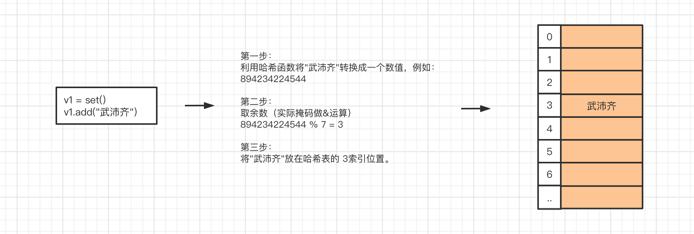

# day04 数据类型和函数

今日概要：

- 数据类型
  - 字符串、列表、元组
  - 字典、集合、整型、布尔类型、None、浮点型、字节类型
- 文件操作
- 函数入门

## 内容回顾

```
布尔值（bool）：True  False
整型（int）      ：1 19 22 300
字符串（str） ："中国联通"    "广西壮族自治区"    "北京市"
    upper/lower/isdecimal/strip/lstrip/rstrip/replace/
    join/split/center/ljust/rjust/zfill
    len/索引/切片/for循环
列表（list）  ：[11,22,33]   ["李冉","谢鹏","陈青",11, 22 ,True]
    append/insert/remove/pop/clear/sort
    len/索引/切片/for循环
元组（tuple） ：(11,22,33)   ("李冉","谢鹏","陈青",11, 22 ,True)
字典（dict）  ：{ "k1":123 , "k2":456 }  {"n1":1,"N2":True}
```

## 1.字典类型（dict）

字典是一个  无序、键不重复 且 元素只能是  键值对  的可变的  容器。

```python
info = { "k1":123, "k2":999 }
```

- 键值对

- 键不能重复，重复时数据会被覆盖。
  
  ```python
  info = { "k1":123, "k1":999 }
  print(info) # {"k1":999}
  ```

- 键必须是可哈希类型
  
  ```python
  可哈希：int、bool、str、tuple
  不可哈希：列表、字典
  ```
  
  ```python
  v1 = 123
  v2 = "武沛齐"
  v3 = (11, 22, 33)
  
  v4 = [11, 22] # 不可哈希
  v5 = {"k1": 123} # 不可哈希
  
  res = hash(v5)
  print(res)
  ```

- 容器

- 无序（Python3.6前，字典无序；Python3.6之后就是有序）

### 1.1 定义

```python
data = { "K1":1,"K2":123 }
```

```python
info = {
    "name":"武沛齐",
    "age":18,
    "status":True,
    "hobby":["篮球","足球"]
}
```

```python
info = {}
```

之前存储用户信息时：

```python
user_list = [ 
    ["root","123",18,"xx@live.com"],   
    ["admin","123",18,"xx@live.com"],
]
```

```python
user_list = [
    {"name":"root","pwd":"123","age":18,"email":"xx@live.com"},
    {"name":"admin","pwd":"555","age":18,"email":"oo@live.com"}
]
```

```python
data = {
    "status":True,
    "data": [11,22,33,44,55]
}

data = {
    "status":False,
    "data": []
}
```

### 1.2 独有功能

1. 获取值
   
   ```python
   info = {
       "name":"武沛齐",
       "age":18,
       "status":True,
       "hobby":["篮球","足球"]
   }
   
   # 去字典中根据键，获取对应的值
   v1 = info.get("name")
   print(v1) # "武沛齐"
   
   v2 = info.get("email")
   print(v2) # None / null
   
   v3 = info.get("email", "xxx")  # 当键不存在时，v3 = "xxx"
   print(v3) # "xxx"
   
   v4 = info.get("age", "999")  # 当键不存在时，v4 = 18
   print(v4) # 18
   ```
   
   ```python
   # 案例：字典存储用户信息
   user_dict = {
       "wupeiqi":"666",
       "hanchao":"999",
       "huangyou":"123"
   }
   
   user = input("请输入用户名：") # "root"
   pwd = input("请输入密码：")
   
   # 如果键不存在 db_password = None
   # 如果键存在 db_password = 密码
   db_password = user_dict.get(user)
   if db_password == None:
       print("用户名不存在")
   else:
       if db_password == pwd:
           print("登录成功")
       else:
           print("登录失败")
   ```

2. 键
   
   ```python
   info = {
       "name":"武沛齐",
       "age":18,
       "status":True,
       "hobby":["篮球","足球"]
   }
   
   v1 = info.keys()  # 高仿的列表
   print(v1)  # dict_keys(['name', 'age', 'status', 'hobby'])
   
   # 循环高仿的列表
   for item in info.keys():
       print(item)
   ```
   
   ```python
   info = {
       "name":"武沛齐",
       "age":18,
       "status":True,
       "hobby":["篮球","足球"]
   }
   
   v1 = info.keys()  # 高仿的列表
   
   res = list(v1) # 高仿的列表转换成Python的列表
   print(res)
   ```

3. 值
   
   ```python
   info = {
       "name":"武沛齐",
       "age":18,
       "status":True,
       "hobby":["篮球","足球"]
   }
   
   v1 = info.values()  # 高仿的列表
   print(v1) # dict_values(['武沛齐', 18, True, ['篮球', '足球']])
   
   for item in info.values():
       print(item)
   ```

4. 键值
   
   ```python
   info = {
       "name":"武沛齐",
       "age":18,
       "status":True,
       "hobby":["篮球","足球"]
   }
   
   # dict_items([('name', '武沛齐'), ('age', 18), ...('hobby', ['篮球', '足球'])])
   v2 = info.items()
   print(v2) 
   
   for ele in info.items():
       print(ele) # ele=('name', '武沛齐')
   
   for key,value in info.items():
       print(key,value)
   ```
   
   ```python
   v1,v2,v3 = [11,22,22]
   v1,v2,v3 = (11,22,33)
   ```

### 1.3 公共功能

1. 长度，有多少个键值对
   
   ```python
   info = {
       "name":"武沛齐",
       "age":18,
       "status":True,
       "hobby":["篮球","足球"]
   }
   
   data = len(info)
   print(data) # 4
   ```

2. 索引取值（与列表、元组、字符串索引操作不一样）
   
   ```python
   列表、元组、字符串    ->    0/1/2/3/4...
   字典                ->    键
   ```
   
   ```python
   data = [11,22,33,44]
   data[0]
   data[1]
   data[-1]
   ```
   
   ```python
   info = {
       "name":"武沛齐",
       "age":18,
       "status":True,
       "hobby":["篮球","足球"]
   }
   
   # 获取值
   v1 = info["name"]   # v1 = "武沛齐"
   v2 = info["email"]  # 报错
   
   v3 = info.get("name")  # v3="武沛齐"
   v4 = info.get("email") # v4=None
   ```
   
   ```python
   info = {
       "name":"武沛齐",
       "age":18,
       "status":True,
       "hobby":["篮球","足球"]
   }
   
   # 新增和修改
   info["age"] = 100
   
   info["email"] = "xxxxx@xx.com"
   ```
   
   ```python
   info = {
       "name":"武沛齐",
       "age":18,
       "status":True,
       "hobby":["篮球","足球"]
   }
   
   # 删除（不存在，删除时会报错）
   del info["email"]
   
   # 判断键是否存在，存在了再删除
   if "email" in info:
       del info['email']
   ```

3. for循环
   
   ```python
   info = {
       "name":"武沛齐",
       "age":18,
       "status":True,
       "hobby":["篮球","足球"]
   }
   
   for item in info.keys():
       print(item)
   
   for item in info.values():
       print(item)
   
   for k,v in info.items():
       print(k,v)
   ```

### 练习题

1. 对用户输入的数据进行处理，并构造成字典。
   
   ```python
   # info = { "wupeiqi":"123" }
   info = {}
   
   while True:
       text = input(">>>")  # wupeiqi,123
       # 1. 输入q/Q，则终止
   
       # 2. 输入文本构造成字典
   ```

```python
#这是自己做的但是老师做的下面的更好
info = []
while True:
    int_put = input(">>>")
    if int_put.upper() =="Q":
        break
    else:
        a, b = int_put.split(",")
        item = {a: b}
        info.append(item)
print(info)
```


# 3. 输出字典中所有的键值对

```python
```
info = {}

while True:
    text = input(">>>")  # asdf,dfsdf
    if text.upper() == "Q":
        break
    data_list = text.split(",")  # ["asdf","dfsdf"]
    info[data_list[0]] = data_list[1]

for k, v in info.items():
    print(k, v)
```

2. 输出商品列表，用户输入序号，显示用户选中的商品
   
   ```python
   # 商品列表：
   goods = [
       {"name": "电脑", "price": 1999},
       {"name": "鼠标", "price": 10},
       {"name": "游艇", "price": 20},
       {"name": "美女", "price": 998}
   ]
   # 要求
   1.输出序号
       0 电脑 1999
       1 鼠标 10
       2 游艇 20
       ...
   
   2.输出序号
       1 电脑 1999
       2 鼠标 10
       3 游艇 20
       ...
   
   3.用户输入序号：1，输出对应位置的商品信息。
       "您购买的商品是xx,价格是：xx"
   ```
   
   ```python
   goods = [
       {"name": "电脑", "price": 1999},
       {"name": "鼠标", "price": 10},
       {"name": "游艇", "price": 20},
       {"name": "美女", "price": 998}
   ]
   
   for i in range(len(goods)):  # [0,1,2,3]
       msg = "{} {} {}".format(i, goods[i]['name'], goods[i]['price'])
       print(msg)
   ```
   
   ```python
   goods = [
       {"name": "电脑", "price": 1999},
       {"name": "鼠标", "price": 10},
       {"name": "游艇", "price": 20},
       {"name": "美女", "price": 998}
   ]
   
   for i in range(len(goods)):  # [0,1,2,3]
       msg = "{} {} {}".format(i + 1, goods[i]['name'], goods[i]['price'])
       print(msg)
   
   choice = input("请选择商品的序号：")  # "1"
   
   choice = int(choice)
   index = choice - 1
   current_dict = goods[index]
   text = "您购买的商品是{},价格是：{}".format(current_dict['name'], current_dict['price'])
   print(text)
   ```
   
   ```python
   goods = [
       {"name": "电脑", "price": 1999},
       {"name": "鼠标", "price": 10},
       {"name": "游艇", "price": 20},
       {"name": "美女", "price": 998}
   ]
   
   for i in range(len(goods)):  # [0,1,2,3]
       msg = "{} {} {}".format(i + 1, goods[i]['name'], goods[i]['price'])
       print(msg)
   
   choice = input("请选择商品的序号：")  # "1"
   if choice.isdecimal():
       choice = int(choice)
       index = choice - 1
       if 0 <= index < len(goods):
           current_dict = goods[index]
           text = "您购买的商品是{},价格是：{}".format(current_dict['name'], current_dict['price'])
           print(text)
       else:
           print("序号范围错误")
   else:
       print("序号必须是数字")
   ```

3. 看代码
   
   ```python
   info = {
       "k1":[11,22,33],
       "k2":[44,55,66,999]
   }
   
   info["k1"]                # [11,22,33]
   info["k1"][-1]            # 33
   info["k2"].append(999)
   ```
   
   ```python
   data_list = [11,22,33,44,55,66,77,88]
   
   result = {
       "k1":[],
       "k2":[]
   }
   
   for item in data_list:
       if item < 50:
           result["k1"].append(item)
       else:
           result["k2"].append(item)
   
   print(result)
   """
   {
       "k1":[11,22,33,44],
       "k2":[55,66,77,88]
   }
   """
   ```
   
   ```python
   info = { "k1":123, "k2":88 }
   
   # 判断字典中是否已存在xx这个键。
   if "xx" in info:
       pass
   ```
   
   ```python
   # info = { "k1":[1] }
   info = { }
   
   if "k1" in info:
       pass
   else:
       info["k1"] = [1]
   
   if "k1" in info:
       info["k1"].append(999)
   else:
       pass
   
   print(info) # info = { "k1":[1,999] }
   ```
   
   ```python
   data_list = [11,22,33,44,55,66,77,88]
   
   result = {
       "xx":[11,22,33,44],
       "hh":[55,66,77,88]
   }
   
   # <50加入到 k1:[...]，>=50添加到 k2:[...]
   for item in data_list:
       # item=66
       if item < 50:
           # 判断字典中是否存在xx这个键。
           if "xx" in result:
               result["xx"].append(item)
           else:
               # 给字典添加一个值 
               result["xx"] = [item ]
       else:
           if "hh" in result:
               result["hh"].append(item)
           else:
               result["hh"] = [item ]
   
   # 问题1：第一次循环完之后 result 的值？
   result = { "xx":[11] }
   
   # 问题2：第二次循环完之后 result 的值？
   result = { "xx":[11,22] }
   ```

4. 快递信息分拣，输出所有的省市信息
   
   ```python
   addr_list = [
       ['王*龙', '北京市,海淀区', '苏州街大恒科技大厦南座4层'],
       ['庞*飞', '北京市,昌平区', '汇德商厦四楼403'],
       ['顾*锐', '江苏省,扬州市', '三垛镇工业集中区扬州市立华畜禽有限公司'],
       ['王*飞', '上海市,徐汇区', '上海市徐汇区H88越虹广场B座5E'],
       ['华*升', '北京市,海淀区', '杰睿大厦'],
       ['朱*锴', '上海市,浦东新区', '川沙新镇华川家园33号楼503'],
       ['陈*盼', '浙江省,杭州市', '闲林街道，西溪华东园，十幢一单元401。'],
       ['司*鹏', '河南省,鹤壁市', '淇滨大道310号  鹤壁京立医院'],
       ['聂*睿', '河北省,石家庄市', '中山路勒泰中心写字楼b座11层'],
       ['张*', '辽宁省,本溪市', '明兴丽城九号楼四单元'],
       ['冉*晗', '河北省,石家庄市', '体育南大街385号'],
       ['高*杰', '北京市,朝阳区', '广渠路42号院3号楼，408'],
       ['李*国', '安徽省,合肥市', '新站区淮合花园'],
       ['常*源', '江苏省,南京市', '白下路242号，南京市红十字医院，放射科'],
       ['张*玉', '河北省,沧州市', '新居然家居广场'],
       ['王*川', '上海市,奉贤区', '南桥镇 贝港七区'],
       ['冀*庆', '河北省,保定市', '河北大学坤兴园生活区'],
       ['胡*晨', '浙江省,宁波市', '浙江省宁波市江东区中山首府A座2004室'],
       ['尹*婷', '湖北省,武汉市', '武汉大学信息学部'],
       ['李*东', '辽宁省,大连市', '大关一街3号3-3-1'],
       ['张*', '天津市,河西区', '隆昌路94号（天津科技馆）'],
       ['刘*', '湖北省,黄冈市', '城关镇'],
   ]
   
   for item in addr_list:
       # name = item[0]
       city = item[1].split(',')[0]
       print(city)
   ```

5. 快递信息分拣，
   
   ```python
   addr_list = [
       ['王*龙', '北京市,海淀区', '苏州街大恒科技大厦南座4层'],
       ['庞*飞', '北京市,昌平区', '汇德商厦四楼403'],
       ['顾*锐', '江苏省,扬州市', '三垛镇工业集中区扬州市立华畜禽有限公司'],
       ['王*飞', '上海市,徐汇区', '上海市徐汇区H88越虹广场B座5E'],
       ['华*升', '北京市,海淀区', '杰睿大厦'],
       ['朱*锴', '上海市,浦东新区', '川沙新镇华川家园33号楼503'],
       ['陈*盼', '浙江省,杭州市', '闲林街道，西溪华东园，十幢一单元401。'],
       ['司*鹏', '河南省,鹤壁市', '淇滨大道310号  鹤壁京立医院'],
       ['聂*睿', '河北省,石家庄市', '中山路勒泰中心写字楼b座11层'],
       ['张*', '辽宁省,本溪市', '明兴丽城九号楼四单元'],
       ['冉*晗', '河北省,石家庄市', '体育南大街385号'],
       ['高*杰', '北京市,朝阳区', '广渠路42号院3号楼，408'],
       ['李*国', '安徽省,合肥市', '新站区淮合花园'],
       ['常*源', '江苏省,南京市', '白下路242号，南京市红十字医院，放射科'],
       ['张*玉', '河北省,沧州市', '新居然家居广场'],
       ['王*川', '上海市,奉贤区', '南桥镇 贝港七区'],
       ['冀*庆', '河北省,保定市', '河北大学坤兴园生活区'],
       ['胡*晨', '浙江省,宁波市', '浙江省宁波市江东区中山首府A座2004室'],
       ['尹*婷', '湖北省,武汉市', '武汉大学信息学部'],
       ['李*东', '辽宁省,大连市', '大关一街3号3-3-1'],
       ['张*', '天津市,河西区', '隆昌路94号（天津科技馆）'],
       ['刘*', '湖北省,黄冈市', '城关镇'],
   ]
   
   # 获取所有的城市，将城市信息构造成一个字典。
   
   result = {}
   
   # 写代码实现
   for item in addr_list:
       name = item[0]
       city = item[1].split(",")[0]
       if city in result:
           result[city].append(name)
       else:
           result[city] = [name ]
   
   print(result)
   ```

### 1.4 补充：嵌套

- 容器：元组、列表、字典（键可哈希）

```python
info = {
    "k1":123,
    "k2":(11,22,33),
    "k3":[11,22,3],
    "k4":[11,22,3,{"v1":123,"v2":456},],
}
```

### 1.5 补充：可哈希

```python
v1 = [11,22,33,44,55,66]
```


正是由于他的底层存储原理，导致他在根据键去获取值时速度特别快。

```python
info = {...}

info["name"]
info.get("name")
if 'xx' in info:
    pass
```

```python
v1 = [11,22,33,44,55,66,]
if 66 in v1:
    pass
```

目前，不可哈希的类型有：字典、列表，无法作为字典的键。

### 练习题

以下那些值不能作为字典的键？

```python
1
-2
True
""
"xxx"
None
[1,2]  # 不可以
(1,)
{"k1":'v1',"k2":123}  # 不可以
```

## 小结

- 字符串 str
  
  - 独有功能
    
    ```
    大写/小写/去除空白/分割/替换/join/是否数字/左右填充
    ```
  
  - 公共
    
    ```
    长度/索引/切片/for循环/in是否包含
    ```

- 列表 list
  
  - 独有功能
    
    ```
    追加/插入/删除（值）/删除（索引）/清空/排序
    ```
  
  - 公共
    
    ```python
    长度/索引（读、删、改）/切片（读、删、改）/for循环/in是否包含
    ```

- 元组 tuple
  
  - 独有功能（无）
  
  - 公共
    
    ```python
    长度/索引/切片/for循环/in是否包含
    ```

- 字典 dict
  
  - 独有功能
    
    ```
    get/keys/values/items
    ```
  
  - 公共
    
    ```
    len/索引键（读、删、改、添加）/for循环/in是否包含（键）
    ```
    
    ```python
    info = {
        "k1":123,
        "k2":456
    }
    info["k3"] = 1234
    del info["k2"]
    ```

## 2.集合（set）

集合是一个 无序、可变、元素必须可哈希且 元素不重复的 容器。

### 2.1 定义

```
v1 = { 11, 22, 33, 44, 55}
```

- 无序，没有索引的操作。

- 可变
  
  ```python
  v1 = {11,22}
  v1.add(33)
  
  print(v1) # {11,22,33}
  ```

- 元素不重复
  
  ```python
  v1 = {11,22}
  v1.add(11)
  
  print(v1) # {11,22}
  ```

- 元素必须可哈希
  
  ```python
  不可哈希：list、dict、set
  可哈希：int、bool、str、tuple
  ```

一般什么时候用集合？

> 不希望重复的一个数据的集合，例如：通过网络爬虫的技术去网上下载各种图片，每个图片都有一个URL，维护一个集合，集合里面存放所有已下载过得图片的URL。

注意事项：定义空值的情况。

```python
# 定义空列表
v1 = []
v2 = list()

# 定义空元祖
v3 = ()
v4 = tuple()

# 定义空字典
v5 = {}
v6 = dict()

# 定义空集合
v7 = set()
```

### 2.2 独有功能

1. 添加元素
   
   ```python
   v1 = {11,22}
   v1.add(33)
   
   print(v1) # {11,22}
   ```
   
   ```python
   v1 = set()
   v1.add("龚星云")
   v1.add("张杰斌")
   v1.add(666)
   
   print(v1)  # {"龚星云","张杰斌",666}
   ```

2. 删除元素
   
   ```python
   v1 = {11,22}
   
   v1.discard(11)
   
   print(v1) # {22}
   ```
   
   ```python
   v1 = {11,22}
   
   v1.discard(33) # 不报错，与列表的remove不同。
   
   print(v1) # {22}
   ```

3. 交集
   
   ```python
   v1 = {"马其坤","毛谦","李阳进"}
   v2 = {"毛谦","郑莉","高倩"}
   
   # 方式1
   res = v1.intersection(v2)
   print(res) # {"毛谦"}
   
   # 方式2
   res = v1 & v2
   print(res) # {"毛谦"}
   ```

4. 并集
   
   ```python
   v1 = {"马其坤","毛谦","李阳进"}
   v2 = {"毛谦","郑莉","高倩"}
   
   # 方式1
   res = v1.union(v2)
   print(res) # {"马其坤","毛谦","李阳进","郑莉","高倩"}
   
   # 方式2
   res = v1 | v2
   print(res) # {"马其坤","毛谦","李阳进","郑莉","高倩"}
   ```

5. 差集
   
   ```python
   v1 = {"马其坤","毛谦","李阳进"}
   v2 = {"毛谦","郑莉","高倩"}
   
   s1 = v1.difference(v2) # v1中有但v2中没有的值 s1={"马其坤",李阳进"}
   s2 = v1 - v2           # v1中有但v2中没有的值 s2={"马其坤",李阳进"}
   ```

   s3 = v2.difference(v1) # v2中有但v1中没有的值 s1={"郑莉","高倩"}
   s4 = v2 - v1           # v2中有但v1中没有的值 s1={"郑莉","高倩"}

```
### 2.3 公共

1. 长度

```python
v1 = {"马其坤","毛谦","李阳进"}

data = len(v1)
print(data) # 3
```

2. for循环
   
   ```python
   v1 = {"马其坤","毛谦","李阳进"}
   for item in v1:
       print(item)
   ```

3. in是否包含（效率高、速度快 => 字典查询键的速度一样）
   
   ```python
   v1 = {"马其坤","毛谦","李阳进"}
   
   if "马其坤" in v1:
       print("在")
   else:
       print("不在")
   ```

### 2.4 存储



## 3.容器之间的转换

- list
  
  ```python
  v1 = [11,22,33,44]
  ```

- tuple
  
  ```python
  v2 = (11,22,33,44)
  ```

- set
  
  ```python
  v3 = {11,22,33,44}
  ```

三个之间可以进行相互转换，原则：想转化弄成谁就让谁的英文名字包裹一下。

```python
v1 = [11,22,33,44]
res = tuple(v1)
print(res) # (11,22,33,44)
```

当元组或列表转换成集合时，会自动去重。

```python
v1 = [11,22,33,11,33,44]
res = set(v1)
print(res) # {11,22,33,44}
```

## 4.None类型

None表示空值。

```python
# v1设置为空
v1 = None

# 再在内从创建一个字符串，让v1指向字符串。
v1 = "武沛齐"
```

```python
# v2设置为空字符串
v2 = ""

v2 = "武沛齐"
```

```python
v1 = None
v2 = None
v3 = None
```

```python
v4 = ""
v5 = ""
v6 = ""
```


注意：None相当于其他语言的 null

## 5.布尔类型

真假 True/False。

很多类型的值都可以转换成布尔值，有真有假，如下值转换为布尔值时为False

```python
0、""、[]、()、{}、set()、None   -> False

其他均为True。
```

如果你将布尔值放在条件或循环语句后面：

```python
if True:
    pass

while True:
    pass

if 1>2:
    pass
```

```python
# 内部会自动转换为布尔值，True 或 False
if "武沛齐":
    pass

if "":
    pass
else:
    pass

if None:
    pass
else:
    pass

while 2:
    pass
```

## 6.浮点型（float）

浮点型，就是我们常说的小数。

```python
v1 = 3.24
v2 = 9.8
```

由于计算机底层浮点型的存储原理，有时候浮点型获取的值会不太精确。

> 与语言无关，计算机中的底层存储原理导致。
> 
> https://www.bilibili.com/video/BV1354y1B7o1

```python
v1 = 0.1
v2 = 0.2

v3 = v1 + v2
print(v3) # 0.30000000000000004
```

如果大家以后要做特别精确的数值计算：

```python
import decimal

v1 = decimal.Decimal("0.1")
v2 = decimal.Decimal("0.2")

v3 = v1 + v2
print(v3) # 0.3
```

## 7.字节类型（bytes）

```python
name = "武沛齐"                # str字符串，底层是unicode编码

data = name.encode("utf-8")   # bytes字节，底层是utf-8编码
print(data) # b'\xe6\xad\xa6 \xe6\xb2\x9b \xe9\xbd\x90'
```

```python
name = "武沛齐"                # str字符串，底层是unicode编码

data = name.encode("gbk")     # bytes字节，底层是gbk编码
print(data) # b'\xce\xe4 \xc5\xe6 \xc6\xeb'
```

如果以后咱们获取到一个字节，字节.decode转换为字符串。

```python
name = "武沛齐"                # str字符串，底层是unicode编码
data = name.encode("utf-8")   # bytes字节，底层是utf-8编码

old = data.decode("utf-8")
print(old) # "武沛齐"
```

## 小结

- int *
- bool
- str *
- list *
- tuple
- dict *
- set
- None
- float
- bytes

问题：为什么总是在赋值和运算符加空格。

```python
name = "武沛齐"
```

PEP8规范，标准的程序员都会这么干。

```python
name = "武沛齐"
age = 19
email = "xx"
data = "{}={}".format("v1", "v2")
```

## 8.文件操作

普通的文本文件。

三个基本步骤搞定文件操作：

```python
# 1.打开文件

# 2.操作文件

# 3.关闭文件
```

### 8.1 快速读写

- 写文件
  
  ```python
  # 1.打开文件
  #     - "unicom.txt" 文件路径
  #     - mode="wb"    写文件的模式打开
  file_object = open("unicom.txt", mode="wb")
  
  # 2.写内容
  name = "武沛齐"   # unicode
  file_object.write( name.encode("utf-8") )
  
  # 3.关闭文件
  file_object.close()
  ```
  
  ```python
  # 打开文件时，由于是wb模式：文件不存在，则创建文件；文件存在，则清空文件。
  file_object = open("unicom.txt", mode="wb")
  
  # 2.写内容
  v1 = "我是武沛齐\n"  # unicode
  file_object.write(v1.encode("utf-8"))
  v1 = "我是马奇迹\n"  # unicode
  file_object.write(v1.encode("utf-8"))
  v1 = "我是邱恩婷\n"  # unicode
  file_object.write(v1.encode("utf-8"))
  
  # 3.关闭文件
  file_object.close()
  ```
  
  练习题：实现用户注册，每注册一个用户就在文件中写入一行。(循环操作，指导用户q终止)
  
  ```python
  user = input("用户名：")
  pwd = input("密码：")
  ```
  
  ```
  wupeiqi,123
  root,999
  admin,asdf
  ```
  
  ```python
  file_object = open("user.txt", mode='wb')
  
  while True:
      user = input("请输入用户名：")
      if user.upper() == 'Q':
          break
      pwd = input("请输入密码：")
  
      line = "{},{}\n".format(user, pwd)
  
      file_object.write(line.encode('utf-8'))
  
  file_object.close()
  ```
  
  ```python
  file_object = open("user.txt", mode='wb')
  
  while True:
      user = input("请输入用户名：")
      if user.upper() == 'Q':
          break
      pwd = input("请输入密码：")
  
      line = "{},{}\n".format(user, pwd)
  
      # 真的写到文件了吗？写到计算机的内存（缓冲区）
      file_object.write(line.encode('utf-8'))
  
      # 强制将内容中的数据写入到硬盘（文件中）
      file_object.flush()
  
  file_object.close()
  ```

- 追加，在文件的尾部进行追加。
  
  ```python
  # ab，文件不存在，则创建文件；存在则打开文件，写内容时，永远写的文件的尾部
  file_object = open("xxxx.txt",mode="ab")
  
  file_object.write(  "武沛齐".encode("utf-8")  )
  
  file_object.close()
  ```
  
  ```python
  file_object = open("user.txt", mode='ab')
  
  while True:
      user = input("请输入用户名：")
      if user.upper() == 'Q':
          break
      pwd = input("请输入密码：")
  
      line = "{},{}\n".format(user, pwd)
  
      # 真的写到文件了吗？写到计算机的内存（缓冲区）
      file_object.write(line.encode('utf-8'))
  
      # 强制将内容中的数据写入到硬盘（文件中）
      file_object.flush()
  
  file_object.close()
  ```

- 读取文件内容
  
  ```python
  # 1.打开文件
  file_object = open("user.txt", mode='rb')
  
  # 2.读取文件的所有内容
  data = file_object.read()
  data_string = data.decode('utf-8')
  print(data_string)
  
  # 3.关闭文件
  file_object.close()
  ```
  
  ```python
  # 1.打开文件
  file_object = open("user.txt", mode='rb')
  
  # 2.读取文件的所有内容
  data = file_object.read()
  data_string = data.decode('utf-8')
  print(data_string)
  
  # 将读取到的字符串切割并获取每一行数据
  row_list = data_string.strip().split("\n")
  print(row_list)
  
  # 3.关闭文件
  file_object.close()
  ```
  
  如果文件有100G，我们能用上述的模式去读取吗？
  
  ```python
  # 1.打开文件
  file_object = open("user.txt", mode='rb')
  
  # 2.读取大的文件时，可以逐行去读取
  line1 = file_object.readline()
  print(line1)
  
  line2 = file_object.readline()
  print(line2)
  
  # 3.关闭文件
  file_object.close()
  ```
  
  ```python
  # 1.打开文件
  file_object = open("user.txt", mode='rb')
  
  # 2.读取大的文件时，可以逐行去读取
  for line in file_object:
      line_string = line.decode('utf-8')
      line_string = line_string.strip()
      print(line_string)
  
  # 3.关闭文件
  file_object.close()
  ```
  
  练习题：读取以下文件中的企业名称。
  
  
  
  ```python
  # 1.打开文件
  file_object = open("data.txt", mode='rb')
  
  # 2.读取大的文件时，可以逐行去读取
  for line in file_object:
      line_string = line.decode('utf-8')
      line_string = line_string.strip()
      if line_string:
          name = line_string.split(",")[1]
          print(name)
  
  # 3.关闭文件
  file_object.close()
  ```

### 练习题

1. 用户注册和用户登录的功能。
   
   - 注册部分：用户名和密码写入文件中。
     
     ```python
     wupeiqi,123
     root,123
     admin,666
     ```
   
   - 登录部分：输入一次用户名和密码，去文件中比对用户名和密码是否正确。

```python
# 1.注册
print("========== 用户注册 ===========")
register_file = open('user_info.txt', mode='ab')
while True:
    user = input("请输入用户名：")
    if user.upper() == "Q":
        break
    pwd = input("请输入密码：")

    line = "{},{}\n".format(user, pwd)
    register_file.write(line.encode('utf-8'))
register_file.close()

# 2.用户登录
print("========== 用户登录 ===========")
username = input("用户名：")
password = input("密码：")

is_success = False

login_file = open('user_info.txt', mode='rb')
for item in login_file:
    # item="用户名,密码"
    item_string = item.decode('utf-8')
    item_string = item_string.strip()
    if item_string:
        user_pwd_list = item_string.split(',')  # ["用户名","密码"]
        if username == user_pwd_list[0] and password == user_pwd_list[1]:
            is_success = True
login_file.close()

if is_success:
    print("登录成功")
else:
    print("登录失败")
```

### 8.2 with上下文

你以后编写文件操作的代码时，一定会有时候忘记关闭文件。

```python
file_object = open(...)

file_object.read()

file_object.close() # 强调，记得关闭文件。
```

```python
print("开始")

# 离开缩进时，自动关闭文件。
with open("xxx.txt",mode='rb') as file_object  :
    data = file_object.read()
    print(data)

print("结束")
```

### 8.3 打开文件的模式

- wb，写
  
  ```python
  file_object = open("unicom.txt", mode="wb")
  
  file_object.write( "武沛齐".encode("utf-8")  )
  
  file_object.close()
  ```

- w，写
  
  ```python
  file_object = open("unicom.txt", mode="w", encoding="utf-8")
  
  file_object.write( "武沛齐" )  # 由于打开文件是设置coding，在内部自动会encode压缩
  
  file_object.close()
  ```

- ab，追加
  
  ```python
  file_object = open("unicom.txt", mode="ab")
  
  file_object.write( "武沛齐".encode("utf-8")  )
  
  file_object.close()
  ```

- a，追加
  
  ```python
  file_object = open("unicom.txt", mode="a", encoding="utf-8")
  
  file_object.write( "武沛齐"  )
  
  file_object.close()
  ```

- rb，读
  
  ```python
  file_object = open("unicom.txt", mode="rb")
  
  # 读取到的文件内部原始的被压缩之后的数据utf-8编码的数据
  data = file_object.read()
  # utf-8编码 -> unicode(字符串)
  data_string = data.decode('utf-8')
  print(data)
  
  file_object.close()
  ```

- r，读
  
  ```python
  file_object = open("unicom.txt", mode="r", encoding="utf-8")
  
  # 直接读取到的是字符串
  data_string = file_object.read()
  
  file_object.close()
  ```

```python
# 1.注册
print("========== 用户注册 ===========")
register_file = open('user_info.txt', mode='a', encoding='utf-8')
while True:
    user = input("请输入用户名：")
    if user.upper() == "Q":
        break
    pwd = input("请输入密码：")

    line = "{},{}\n".format(user, pwd)
    register_file.write(line)
register_file.close()

# 2.用户登录
print("========== 用户登录 ===========")
username = input("用户名：")
password = input("密码：")

is_success = False

login_file = open('user_info.txt', mode='r', encoding='utf-8')
for item_string in login_file:
    # item="用户名,密码"
    item_string = item_string.strip()
    if item_string:
        user_pwd_list = item_string.split(',')  # ["用户名","密码"]
        if username == user_pwd_list[0] and password == user_pwd_list[1]:
            is_success = True
login_file.close()

if is_success:
    print("登录成功")
else:
    print("登录失败")
```

```python
v = open("xxx"...)
```

```python
m = open("xxx"...)
m.xxx
```
