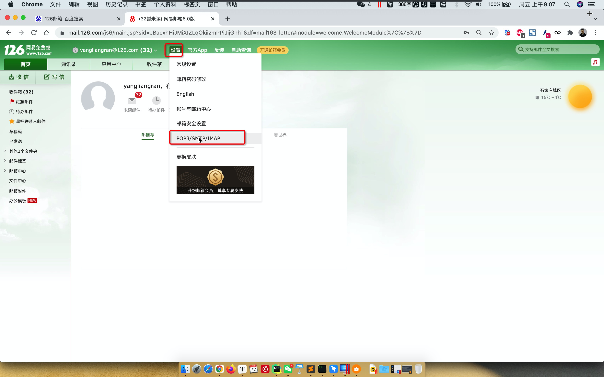
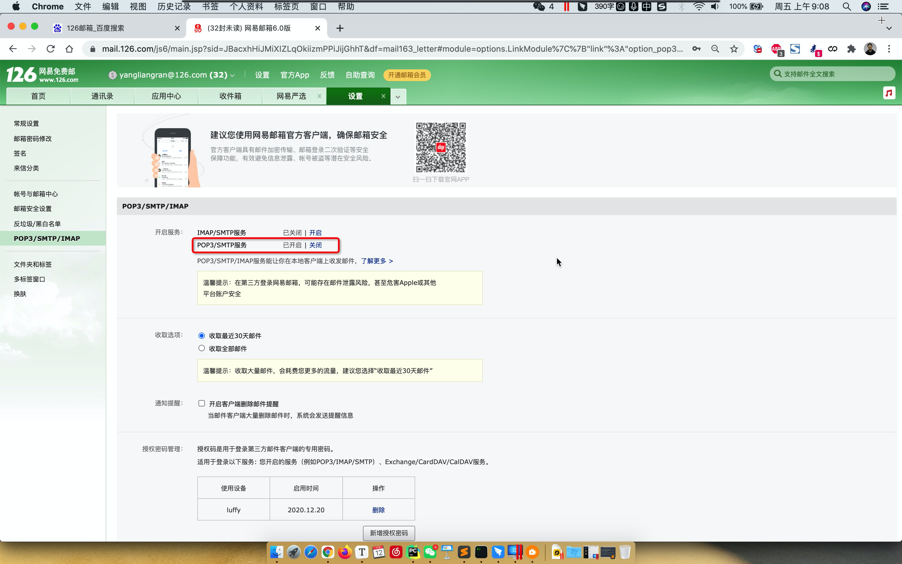
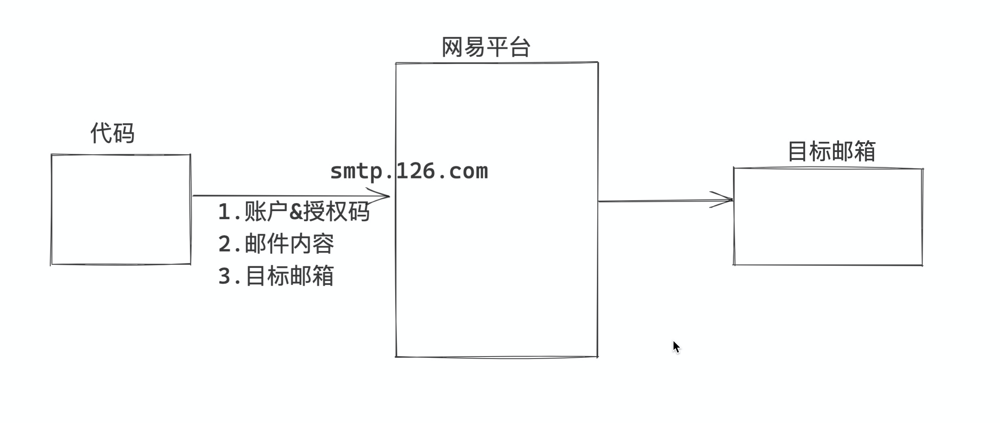

# day05 函数

今日概要：函数

## 1.初识函数

函数到底是个什么？

函数，一大堆代码，给这一堆的代码再起个名字。

```python
# 定义一个函数
def 函数名():
    print(123)
    print(123)
    print(123)
    print(123)
    ....

# 执行函数（函数内部代码就会执行）
函数名()
```

```python
def get_info_data():
    print("欢迎使用xxx")
    v1 = 123
    v2 = 567
    v3 = v1 + v3
    if True:
        print(123)
    else:
        print(999)
    print("END")

get_info_data()
```

了解函数是什么了，那么他的应用场景是什么？

- 面向过程编码：按照业务逻辑从上到下去累代码。
  
  - 监控系统，监控公司的电脑。
    
    ```python
    print("欢迎使用xx监控系统")
    
    if CPU占用率 > 90%:
        发送报警邮件-10行
    
    if 硬盘使用率 > 95%:
        发送报警邮件-10行
    
    if 内容使用率 > 98%:
        发送报警邮件-10行
    ```
  
  - 棋牌游戏扎金花
    
    ```python
    # 1.生成一副扑克牌6行代码
    
    # 2.洗牌3行代码
    
    # 3.给5个玩家发三张牌 15行代码
    
    # 4.玩家手中牌的大小比较（80行）
        - 是否是豹子（大小）
        - 是否是同花顺（大小）
        - 是否是同花（大小）
        - 是否是对子（大小）
        - 是否是单点（大小）
    ```

- 函数式编程：用函数来写代码。
  
  - 监控系统，监控公司的电脑【增强代码的重用性】【应用场景1】
    
    ```python
    def 发送邮件():
        发送报警邮件-10行
    
    print("欢迎使用xx监控系统")
    
    if CPU占用率 > 90%:
        发送邮件()
    
    if 硬盘使用率 > 95%:
        发送邮件()
    
    if 内容使用率 > 98%:
        发送邮件()
    ```
  
  - 棋牌游戏扎金花，【增强代码的可读性】
    
    ```python
    def 发牌():
        ...
        ..
    
    def 是否是豹子():
        ..
        ..
    
    def 是否是同花顺():
        ..
        ..
    
    def 是否是同花():
        ..
        ..
    
    def 是否是对子():
        ..
        ..
    
    def 是否是单点():
        ..
        ..
    
    # 1.生成一副扑克牌6行代码
    
    # 2.洗牌3行代码
    
    # 3.给5个玩家发三张牌 15行代码
    发牌()
    
    # 4.玩家手中牌的大小比较（80行）
    是否是豹子()
    是否是同花顺()
    ...
    ```

函数应用场景：

- 反复用到重复代码时，可以选择用函数编程。【增强代码的重用性】
- 业务逻辑代码太长，可以选择用户函数将代码拆分。【增强代码的可读性】

## 2.Python代码发邮件

- 注册邮箱：网易126、163邮箱。

- 配置
  
  
  
  ```
  大家需要去获取授权码，通过代码发邮件，再发送邮件时不要告诉我的账号和密码。
  所以，Python代码后续需要使用的：
      - 账号
      - 授权码（不是网易邮箱的密码）
  
  保存好自己的授权码。
  
  SMTP服务器: smtp.126.com
  ```
  
  

- 代码发邮件
  
  ```python
  # 1.将Python内置的模块（功能导入）
  import smtplib
  from email.mime.text import MIMEText
  from email.utils import formataddr
  
  # 2.构建邮件内容
  msg = MIMEText("领导早上好，领导今天辛苦了。", "html", "utf-8")  # 内容
  msg["From"] = formataddr(["武沛齐", "yangliangran@126.com"])  # 自己名字/自己邮箱
  msg['to'] = "424662508@qq.com"  # 目标邮箱
  msg['Subject'] = "360一天"  # 主题
  
  # 3.发送邮件
  server = smtplib.SMTP_SSL("smtp.126.com")
  server.login("yangliangran@126.com", "LAYEVIAPWQAVVDEP")  # 账户/授权码
  server.sendmail("yangliangran@126.com", "424662508@qq.com", msg.as_string())  # 自己邮箱/目标邮箱/内容
  server.quit()
  ```

## 案例

1. 伪代码：监控系统
   
   ```python
   def 发送邮件():
       # 1.将Python内置的模块（功能导入）
       import smtplib
       from email.mime.text import MIMEText
       from email.utils import formataddr
   
       # 2.构建邮件内容
       msg = MIMEText("领导早上好，领导今天辛苦了。", "html", "utf-8")  # 内容
       msg["From"] = formataddr(["武沛齐", "yangliangran@126.com"])  # 自己名字/自己邮箱
       msg['to'] = "424662508@qq.com"  # 目标邮箱
       msg['Subject'] = "360一天"  # 主题
   
       # 3.发送邮件
       server = smtplib.SMTP_SSL("smtp.126.com")
       server.login("yangliangran@126.com", "LAYEVIAPWQAVVDEP")  # 账户/授权码
       server.sendmail("yangliangran@126.com", "424662508@qq.com", msg.as_string())  # 自己邮箱/目标邮箱/内容
       server.quit()
   
   print("欢迎使用xx监控系统")
   
   if CPU占用率 > 90%:
       发送邮件()
   
   if 硬盘使用率 > 95%:
       发送邮件()
   
   if 内容使用率 > 98%:
       发送邮件()
   ```

2. 需求
   
   ```python
   # 目前我有3个邮箱，希望实现给三个邮箱发邮件。
   v1 = "424662508@qq.com"
   v2 = "424662509@qq.com"
   v3 = "424662501@qq.com"
   ```
   
   - 小白思路
     
     ```python
     # 1.将Python内置的模块（功能导入）
     import smtplib
     from email.mime.text import MIMEText
     from email.utils import formataddr
     
     # ###### 领导1 ######
     
     # 2.构建邮件内容
     msg = MIMEText("领导早上好，领导今天辛苦了。", "html", "utf-8")  # 内容
     msg["From"] = formataddr(["武沛齐", "yangliangran@126.com"])  # 自己名字/自己邮箱
     msg['to'] = "424662508@qq.com"  # 目标邮箱
     msg['Subject'] = "360一天"  # 主题
     
     # 3.发送邮件
     server = smtplib.SMTP_SSL("smtp.126.com")
     server.login("yangliangran@126.com", "LAYEVIAPWQAVVDEP")  # 账户/授权码
     server.sendmail("yangliangran@126.com", "424662508@qq.com", msg.as_string())  # 自己邮箱/目标邮箱/内容
     server.quit()
     
     # ###### 领导2 ######
     # 2.构建邮件内容
     msg = MIMEText("领导早上好，领导今天辛苦了。", "html", "utf-8")  # 内容
     msg["From"] = formataddr(["武沛齐", "yangliangran@126.com"])  # 自己名字/自己邮箱
     msg['to'] = "424662509@qq.com"  # 目标邮箱
     msg['Subject'] = "360一天"  # 主题
     
     # 3.发送邮件
     server = smtplib.SMTP_SSL("smtp.126.com")
     server.login("yangliangran@126.com", "LAYEVIAPWQAVVDEP")  # 账户/授权码
     server.sendmail("yangliangran@126.com", "424662509@qq.com", msg.as_string())  # 自己邮箱/目标邮箱/内容
     server.quit()
     
     # ###### 领导3 ######
     # 2.构建邮件内容
     msg = MIMEText("领导早上好，领导今天辛苦了。", "html", "utf-8")  # 内容
     msg["From"] = formataddr(["武沛齐", "yangliangran@126.com"])  # 自己名字/自己邮箱
     msg['to'] = "424662501@qq.com"  # 目标邮箱
     msg['Subject'] = "360一天"  # 主题
     
     # 3.发送邮件
     server = smtplib.SMTP_SSL("smtp.126.com")
     server.login("yangliangran@126.com", "LAYEVIAPWQAVVDEP")  # 账户/授权码
     server.sendmail("yangliangran@126.com", "424662501@qq.com", msg.as_string())  # 自己邮箱/目标邮箱/内容
     server.quit()
     ```
   
   - 函数实现
     
     ```python
     # 1.将Python内置的模块（功能导入）
     import smtplib
     from email.mime.text import MIMEText
     from email.utils import formataddr
     
     def send_email1():
         # 2.构建邮件内容
         msg = MIMEText("领导早上好，领导今天辛苦了。", "html", "utf-8")
         msg["From"] = formataddr(["武沛齐", "yangliangran@126.com"])
         msg['to'] = "424662508@qq.com"  # 目标邮箱
         msg['Subject'] = "360一天"  # 主题
     
         # 3.发送邮件
         server = smtplib.SMTP_SSL("smtp.126.com")
         server.login("yangliangran@126.com", "LAYEVIAPWQAVVDEP")  # 账户/授权码
         server.sendmail("yangliangran@126.com", "424662508@qq.com", msg.as_string())  # 自己邮箱/目标邮箱/内容
         server.quit()
     
     def send_email2():
         # 2.构建邮件内容
         msg = MIMEText("领导早上好，领导今天辛苦了。", "html", "utf-8")
         msg["From"] = formataddr(["武沛齐", "yangliangran@126.com"])
         msg['to'] = "424662509@qq.com"  # 目标邮箱
         msg['Subject'] = "360一天"  # 主题
     
         # 3.发送邮件
         server = smtplib.SMTP_SSL("smtp.126.com")
         server.login("yangliangran@126.com", "LAYEVIAPWQAVVDEP")  # 账户/授权码
         server.sendmail("yangliangran@126.com", "424662509@qq.com", msg.as_string())  # 自己邮箱/目标邮箱/内容
         server.quit()
     
     def send_email3():
         # 2.构建邮件内容
         msg = MIMEText("领导早上好，领导今天辛苦了。", "html", "utf-8")
         msg["From"] = formataddr(["武沛齐", "yangliangran@126.com"])
         msg['to'] = "424662501@qq.com"  # 目标邮箱
         msg['Subject'] = "360一天"  # 主题
     
         # 3.发送邮件
         server = smtplib.SMTP_SSL("smtp.126.com")
         server.login("yangliangran@126.com", "LAYEVIAPWQAVVDEP")  # 账户/授权码
         server.sendmail("yangliangran@126.com", "424662501@qq.com", msg.as_string())  # 自己邮箱/目标邮箱/内容
         server.quit()
     ```

     send_email1()
     send_email2()
     send_email3()
     ```

- 函数的参数
  
  ```python
  def 函数名():
      pass
  
  函数名()
  ```
  
  ```python
  def 函数名(data):
      print(data)
  
  函数名("123")
  函数名(666)
  ```
  
  ```python
  # 1.将Python内置的模块（功能导入）
  import smtplib
  from email.mime.text import MIMEText
  from email.utils import formataddr
  
  def send_email(to_email):
      # 2.构建邮件内容
      msg = MIMEText("领导早上好，领导今天辛苦了。", "html", "utf-8")
      msg["From"] = formataddr(["武沛齐", "yangliangran@126.com"])
      msg['to'] = to_email  # 目标邮箱
      msg['Subject'] = "360一天"  # 主题
  
      # 3.发送邮件
      server = smtplib.SMTP_SSL("smtp.126.com")
      server.login("yangliangran@126.com", "LAYEVIAPWQAVVDEP")
      server.sendmail("yangliangran@126.com", to_email, msg.as_string())
      server.quit()
  
  send_email("424662508@qq.com")
  send_email("424662509@qq.com")
  send_email("424662501@qq.com")
  ```

## 3.函数的参数

### 3.1 基本使用

```python
def 函数名(形式参数1,形式参数2,形式参数3): # 简称形参
    函数内部代码，将形式参数当做是变量来使用。


# 执行函数时，传入的值：实际参数（实参）
函数名(1,2,3)
```

```python
def my_func(a1,a2,a3):
    result = a1 + a2 - a3
    print(result)

# 执行函数
my_func(1,4,1)

# 执行函数
my_func(11,14,99)
```

在执行函数时，传入参数时候一般有两种模式：

- 位置传参
  
  ```python
  def my_func(a1,a2,a3):
      result = a1 + a2 - a3
      print(result)
  
  # 执行函数
  my_func(1,4,1)
  
  # 执行函数
  my_func(11,14,99)
  ```

- 关键字传参
  
  ```python
  def my_func(a1,a2,a3):
      result = a1 + a2 - a3
      print(result)
  ```

  my_func(a1=11,a2=99,a3=10)

  my_func(a2=99,a3=10,a1=10)

```
- 混合使用

```python
def my_func(a1,a2,a3):
    result = a1 + a2 - a3
    print(result)

# 位置传参在前面，关键字传参是在后面
my_func(123,99,a3=10)

my_func(123,a2=99,a3=10)
```

注意：

- 函数要求传入几个参数，你就要传入几个参数。
- 参数可以是任意类型：None、bool、int、str、list、dict....

### 练习题

1. 定义函数，接收1个字符串类型的参数，函数内部计算字符串中 字符 “a” 出现的次数并输出。
   
   ```python
   def func(data_string):
       count = 0
       for item in data_string:
           if item == "a":
               count += 1
       print(count)
   
   func("asduf;akjsdfakejaknduqkjnakjdfa;ds")
   ```

2. 定义函数，接收2个参数：`字符串-文本` 、`字符串-关键字`，计算某一个字符串出现的次数。
   
   ```python
   def func(data_string, key):
       count = 0
       for item in data_string:
           if item == key:
               count += 1
       print(count)
   
   func("afdsfasdfasdfasldfkqj;kjafsdf", "a")
   func("afdsfasdfasdfasldfkqj;kjafsdf", "b")
   func("ffffffffsdfsd;kjafsdf", "f")
   ```

3. 定义函数，接收1个参数：列表，列表中以 a 开头的所有元素并将此元素添加到列表中再输出.
   
   ```python
   def func(data):
       res = []
       for item in data:
           if item.startswith("a"):
               res.append(item)
       print(res)
   
   func(["xxx","武沛齐","xxx","alex"])
   
   v1 = ["xxx","武沛齐","xxx","alex"]
   func(v1)
   ```

### 3.2 默认参数

```python
def func(a1,a2,a3):
    pass

func(1,2,3)
```

在定义函数时，也可以为某个参数设置默认值。

```python
def func(a1,a2=1,a3=123):
    pass

# 位置传参
func(9)
func(9,10)
func(9,10,100)

# 关键字传参
func(a1=9)
func(a1=100,a2=9)
func(a1=100,a2=9,a3=123)

# 注意注意：函数定时设置的默认参数，只能放在最后。
```

### 练习题

```python
def func(data_string, key="a"):
    count = 0
    for item in data_string:
        if item == key:
            count += 1
    print(count)


func("afdsfasdfasdfasldfkqj;kjafsdf")
func("afdsfasdfasdfasldfkqj;kjafsdf", "a")
func("afdsfasdfasdfasldfkqj;kjafsdf", "b")
func("ffffffffsdfsd;kjafsdf", "f")
```

### 3.3 动态参数

```python
def func(a1,a2,a3=123):
    pass

func(1,2)

# 参数传入的都是有限的个数。
```

- *
  
  ```python
  def func(*a1):
      # 用户传来的参数统一会被打包成元组
      # a1 = (1,)
      # a1 = (11,22,33)
      # a1 = (11,22,33,"xxxx",True)
      # a1 = (11,22,33,"xxxx",True, [11,22,33],999)
      # a1 = ( [11,22,33,44,55] ,  )
      # a1 = ( (11,22,33),   )
      print(a1)
  
  # 可以通过位置参数的形式传入n个参数。
  func(1)
  func(11,22,33)
  func(11,22,33,"xxxx",True)
  func(11,22,33,"xxxx",True, [11,22,33],999)
  
  func( [11,22,33,44,55] )
  func( (11,22,33) )
  func()
  ```

- **
  
  ```python
  def func(**dt):
      # 自动将数据打包整字典
      # dt = {"a1":1,"b1":88,"cc":99}
      print(dt)
  
  # 必须用关键字的形式传参
  func(a1=1,b1=88,cc=99)
  func(a1=1,b1=88,cc=99)
  func()
  ```

- *，**
  
  ```python
  def func(*x1,**dt):
      # x1 = (11,22,3)   dt = {"xx":123,"uu":999, "b12":"root"}
      # x1 = ()    dt = {}
      pass
  
  func(11,22,3, xx=123,uu=999,b12="root")
  func()
  
  # 注意实现
  #   1.定义函数顺序     *x1,**dt
  #    2.执行函数传参的时，位置传参在前，关键字传参在后。
  #    3.当不传参数时
  ```

- 混合之前的使用
  
  ```python
  def func(a1,a2,a3,*x1,**dt):
      pass
  
  func(11,22,33,44,55,66,77,a1=123)
  ```

重点：

- *，** 支持传入多个参数，自动会将参数打包成 元组 、字典。

- 【潜规则】在定义动态参数时，*args、**kwargs
  
  ```python
  def func(*args,**kwargs):
      pass
  ```

## 4.函数的返回值

- print，输出，可以在任何的地方使用。
- 函数的返回值

在以后的开发过程中，定义一个函数，帮助你实现某个功能，希望函数给你产出一个结果。

```python
def func(a1,a2):
    res = a1 + a2
    return res

# 1.执行func函数
# 2.将函数执行的返回值 赋值给data
data = func(100,200)
```

关于返回值：

- 返回值可以是任意类型
  
  ```python
  def f1():
      return 123
  
  v1 = f1()
  ```
  
  ```python
  def f1():
      return [11,22,33,44]
  
  v1 = f1()
  ```
  
  ```python
  def f1():
      return (11,22,33,44)
  
  v1 = f1()
  ```
  
  ```python
  def f1():
      return 11,22,33  # 返回的是一个元组 (11,22,33)
  
  v1 = f1()
  ```

- 函数没有返回值，默认返回None（**）
  
  ```python
  def func(a1,a2):
      res = a1 + a2
  
  # data = None
  data = func(100,200)
  ```

- 在函数的执行过程中，一旦遇到return，立即结束当前函数的执行并返回值。
  
  ```python
  def func():
      v1 = 123
      v2 = 456
      return 999
      v3 = 180
  
  res = func()
  ```
  
  ```python
  def func():
      for i in range(100):
          return i
  
  res = func() # 0
  ```
  
  ```python
  def func():
      for i in range(100):
          break
  
  res = func() # res = None
  ```
  
  ```python
  def func():
      for i in range(100):
          continue
  
  res = func() # res = None
  ```
  
  ```python
  def func():
      for i in range(100):
          print(i)
      print("END")
  res = func() # 函数返回值 res=None
  ```

- 在函数中可以只写return，后面没有值也是返回None
  
  ```python
  def func():
      print(1)
      print(2)
      return 
      print(3)
  
  res = func()
  ```

### 练习题

1. 定义一个函数，可以接收任意个参数（位置传参 + 整数），在函数的内部将所有的参数相加并获得结果，返回给函数的调用者。
   
   ```python
   def get_sum(*args):
       # args = (11,22,33,44)
       # args = (11,2,3)
       res = 0
       for item in args:
           res += item # res = res + item
       return res
   
   v1 = get_sum(11,22,33,44)
   
   v2 = get_sum(11,2,3)
   ```

2. 看代码写结果（输出）
   
   ```python
   def func():
       print("开始")
       for i in range(2):
           print(i)
       print("结束")
   
   res = func()
   print(res)
   ```
   
   ```
   开始
   0
   1
   结束
   None
   ```

3. 看代码分析结果（输出）
   
   ```python
   print("123",end="")
   print("456")
   ```

```python
def func():
    print("开始")
    for i in range(2):
        print(i)
        break
    if 2 == 2:
        return 999
    else:
        return 123
    print("结束")

res = func()
print(res)
```

```
开始
0
999
```

4. 写函数，接收两个参数。
   
   - 参数1：字符串，文件路径。
   
   - 参数2：字符串
   
   - 函数内部：
     
     - 判断文件是否存在，如果文件不存在，则返回None
       
       ```python
       import os
       
       file_path = r"/Users/wupeiqi/PycharmProjects/gx_day05"
       res = os.path.exists(file_path)
       print(res) # True/False
       ```
     
     - 读取文件的每一行数据，判断 每一行是否包含 `参数2：字符串`
       
       - 在，将这一行数据追加到列表中。
       - 不在，继续读下一行
     
     - 返回列表，包含字符串的每一行数据。
   
   - 自己调用自己写的这个函数，来进行验证。
   
   ```python
   import os
   
   def check_file_key(file_path, key):
       # 判断路径是否存在 False/True
       res = os.path.exists(file_path)
       if not res:
           return None
   
       data_list = []
   
       # 文件存在
       file_object = open(file_path,mode='r',encoding="utf-8")
   
       for line in file_object:
           line = line.strip()
           # line = "字符串.."
           if key in line:
               data_list.append(line)
       file_close()
   
       return data_list
   
   result = check_file_key("/user/xxxx/xxxx/xxx", "哈哈")
   ```

## 5. 函数的调用

```python
def func():
    print(123)
    print(123)

func()
```

```python
func() # 报错

def func():
    print(123)
    print(123)
```

注意：内存中如果已创建了函数，才可以调用。

```python
def f1():
    print(123)

def f2():
    print(456)

f1()
f2()
f1()
```

```python
def f1():
    print(123)
    return 1

def f2(arg):
    data = arg + 100
    return data

def f3(xx):
    print(xx)

v1 = f1()
v2 = f2(v1)
v3 = f3(v2)

# v1= 1
# v2= 101
# v3= None
```

```python
def f1():
    print(1)
    print(2)

def f2():
    print(666)
    f1()
    print(999)

f2()
```

```python
666
1
2
999
```

```python
def f1():
    print(1)
    print(2)

def f2():
    print(666)
    data = f1()
    print(data)
    print(999)

f2()
```

```python
666
1
2
None
999
```

在数据类型的可变和不可变类型：

- 可变类型：列表、字典、集合【独有、公共能时，一般都可以对内部元素进行修改】
- 不可变类型：字符串、整型、元组、布尔类型 ，一般都是要新生成一个

## 6. 函数参数传递的是内存地址

```python
v1 = "武沛齐"
v2 = v1
两个指向的是同一个地址
```


```python
def func(a1):
    print(a1)

v1 = "武沛齐"
func(v1)
#
# 注意：函数在传递参数时，默认不会重新创建一份数据，再赋值给函数中的参数，
#      传递的是地址而是同时指向同一块内存。
# 参数传递是：引用、内存地址。
```

```python
def func(a1):
    a1.upper()

v1 = "wupeiqi"
func(v1)

print(v1) # wupeiqi
```

注意：a1和v1是同一块内存地址，但由于字符串是不可变类型。a1.upper() 生成新的值而不影响原来的值。

```python
def func(a1):
    a1.append(666)

v1 = [11,22,33]
func(v1)

print(v1) # [11,22,33,666]
```

注意：a1和v1是同一块内存地址，但由于列表是可变类型 & append是在原列表中追加数据。

注意事项：

- 函数传递参数时，默认传递是内存地址/引用（不会重新拷贝一份数据再传递）
- 一定要注意参数传递是可变/不可变类型；  函数内部执行操作时，是重新生成数据；修改原数据。

## 7.数据是否会混乱？

```python
def func(a1):
    data = a1 + 100
    print(data)

func(100)    func(200)
```

当我们每次执行一个函数时，都会为此执行的过程创建一块内存（调用栈）。

## 8.作用域

### 8.1 作用域基础

- 作用域，理解成就是一块内存区域，只要在这个区域就可以共享这个区域的数据。
- 在Python中，执行函数函数，就会为函数创建一个作用域。
- Python代码只要一运行，就会有一个全局的作用域。

```python
name = "武沛齐"
# print(age) # 报错、999
age = 999
if True:
    email = "xxx@live.com"
else:
    gender = "男"

for i in range(10):
    pass
print(name)
print(age)  # 999
print(email)
print(i)
age = 100
print(age)  # 100

# print(gender) # 报错
```

```python
name = "武沛齐"

def func():
    v1 = 100
    v2 = 200
    v3 = v1 + v2
    print(v3)
func()
# 寻找变量的值时，优先回去自己的作用域中找，自己没有的话，去父级作用域找。
# print(v1) # 报错 / 100 --> 报错。

def f1():
    age = 19
    print(age)

def f2():
    print(age)

f1()
# f2() # 报错

def f3():
    txt = "我是"
    data = text + name
    print(data)

f3()

def f4():
    txt = "我是"
    name = "李国良"
    data = text + name
    print(data)

f4()

print(name) #  "武沛齐"


```

注意：

- 在Python中函数是一个作用域。
- 在作用域中寻找数据时，优先在自己作用域找，自己没有就去上级作用域找。

### 8.2 关于变量

- 全局变量，在非函数中定义的（py文件顶层）
- 局部变量，在函数中定义的变量。

潜规则：定义全局变量时，要用大写，多个单词用下划线连接。

```python
# 全局变量
NAME = 123
if 1 == 1:
    # 全局变量
    AGE = 18

def func():
    # 局部变量
    data = 999
```

案例：用户注册系统和展示系统

```python
USER_LIST = []

def register():
    while True:
        name = input(">>>")
        if name.upper() == "Q":
            return 
        USER_LIST.append(name)

def show_users():
    name = "xxx"
    for item in USER_LIST:
        print(item)

def run():
    register()
    show_users()

run()
```

```python
NAME = "武沛齐"

def func():
    NAME = "张电摩"
    print(NAME)

print(NAME)
func()
print(NAME)
```

```
武沛齐
张电摩
武沛齐
```

### 8.3 global关键字

global是用在函数中，用于表示此变量不是新创建的数据，而是全局变量中的那个数据（地址指向相同）。

案例1：

```python
NAME = "武沛齐"

def func():
    global NAME      # 指的就是全局变量中的NAME
    NAME = "张电摩"   # 将全局变量的那个值重新赋值成张电摩
    print(NAME)

print(NAME)
func()
print(NAME)
```

```python
武沛齐
张电摩
张电摩
```

关键：

- 内部global之后，变量就是全局变量。

- 赋值操作
  
  ```python
  NAME = "武沛齐"
  NAME = "张电摩"
  ```
  
  动态

案例2：

```python
NAME = "root"
NAME.upper()

print(NAME) # root
```

```python
NAME = "root"

def func():
    global NAME      # 指的就是全局变量中的NAME
    NAME.upper()
    print(NAME)

print(NAME)
func()
print(NAME)
```

```python
root
root
root
```

案例3：

```python
NAME = [11,22]

def func():
    global NAME      # 指的就是全局变量中的NAME
    NAME = [33,44]
    print(NAME)

print(NAME)
func()
print(NAME)
```

```python
[11,22]
[33,44]
[33,44]
```

案例4：

```python
NAME = [11,22]

def func():
    global NAME
    NAME.append(999)
    print(NAME)

print(NAME)
func()
print(NAME)
```

```python
[11,22]
[11,22,999]
[11,22,999]
```

- 局部变量中没有变量，去哪里找？
- append是生成新的值？原来的列表中修改。

<mark>案例5：</mark>

```python
NAME = [11,22]

def func():
    NAME = [33,44]  
    NAME.append(999)
    print(NAME)

print(NAME)
func()
print(NAME)
```

#### 核心要领

- 找变量，优先在自己作用域找，自己没有就去上一级找。

- 【无global关键字】全局变量和局部变量重名时，自己内部创建的变量，与全部无关
  
  ```python
  name = "武沛齐"
  
  def info():
      name = "root"
      print(name)
  
  print(name)
  info()
  print(name)
  ```

- 【有global关键字】全部变量和局部变量重名时，所有的都是全局变量。
  
  ```python
  name = "武沛齐"
  
  def info():
      global name
      name = "root"
      print(name)
  
  print(name)
  info()
  print(name)
  ```

## 9.函数名就是变量名

```python
name = "武沛齐"
age = 18
def func():
    print(123)
    print(456)

func = 123
print(func) # 123
```

```python
v1 = "武沛齐"
v2 = v1

print(v2) # "武沛齐"
```

```python
def func():
    print(123)
    return 111

data = func()
```

```python
def func():
    print(123)
    print(123)
    print(123)

v1 = func
v2 = func()
v3 = v1()
# v1 = 函数func
# v2 = None
# v3 = None
```

本质上：func就是一个变量，代指这个函数而已，  func() -> 执行函数。

在Python的列表中可以存放各种数据类型：

```python
data = [11,22,True,"xxx",(11,223),{},]
```

```python
def func():
    return 123

v1 = 999

data_list = [1,2,"武沛齐",v1, func, func, func, func(), func() ]

data_list[4] # 函数
m1 = data_list[4]()

data_list[5] # 函数
m2 = data_list[5]()

data_list[6] # 函数
m3 = data_list[6]()

data_list[7] # 123
data_list[8] # 123
```

补充代码实现：开发xx系统，监控功能：发送钉钉报警、微信报警、短信报警、邮件报警。

```python
def send_sms():
    print("发送短信报警")

def send_email():
    print("发送邮件报警")

def send_dingding():
    print("发送钉钉报警")

def send_wechat():
    print("发送微信报警")

if 达到某种指标:
    send_sms()
    send_email()
    send_dingding()
    send_wechat()
```

```python
def send_sms():
    print("发送短信报警")

def send_email():
    print("发送邮件报警")

def send_dingding():
    print("发送钉钉报警")

def send_wechat():
    print("发送微信报警")


func_list = [ send_sms, send_email, send_dingding, send_wechat ]
for item in func_list:
    item()
```

### 案例：用户管理系统

请基于函数实现用户登录、注册、查看所有用户信息。

- 普通版

```python
def register():
    pass

def login():
    pass

def show_users():
    pass

print("欢迎xx系统")
print("1.注册;2.登录;3.查看所有用户")

choice = input("请选择序号：")
choice = int(choice)

if choice == 1:
    register()
elif choice == 2:
    login()
elif choice == 3:
    show_users()
else:
    print("选择错误")
```

- vip版本

```python
def register():
    pass

def login():
    pass

def show_users():
    pass

print("欢迎xx系统")
print("1.注册;2.登录;3.查看所有用户")

choice = input("请选择序号：")
choice = int(choice)

func_list = [register, login, show_users]
# func_list[0]()
# func_list[1]()
# func_list[2]()
func_list[ choice-1 ]()
```
