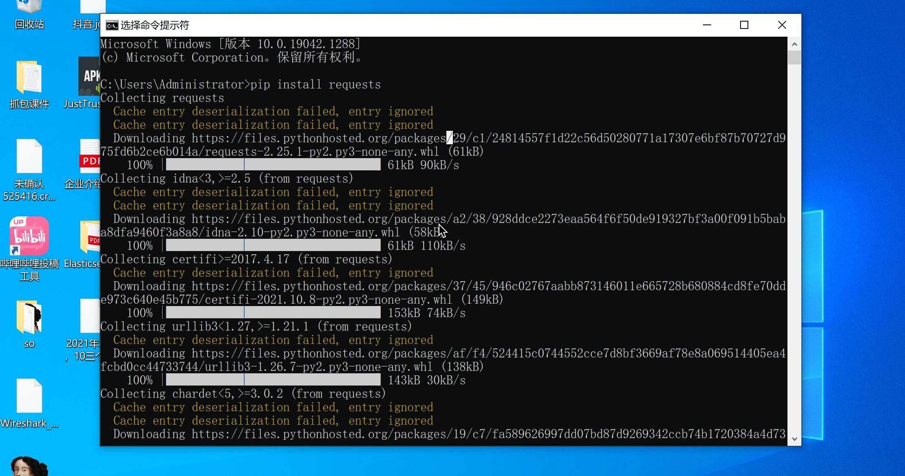
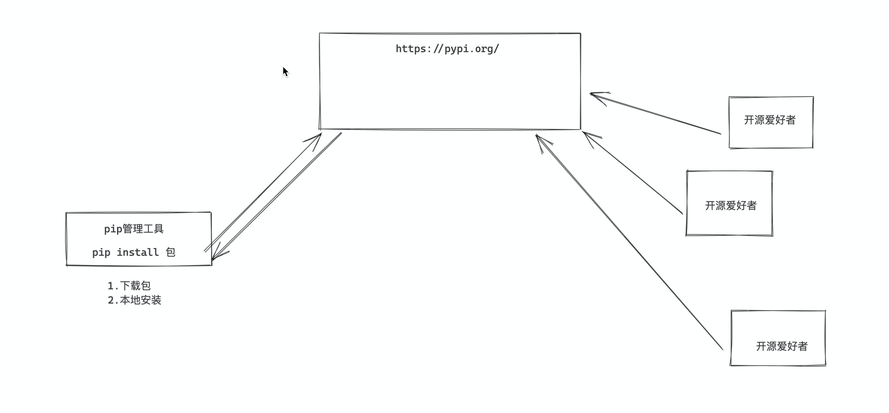
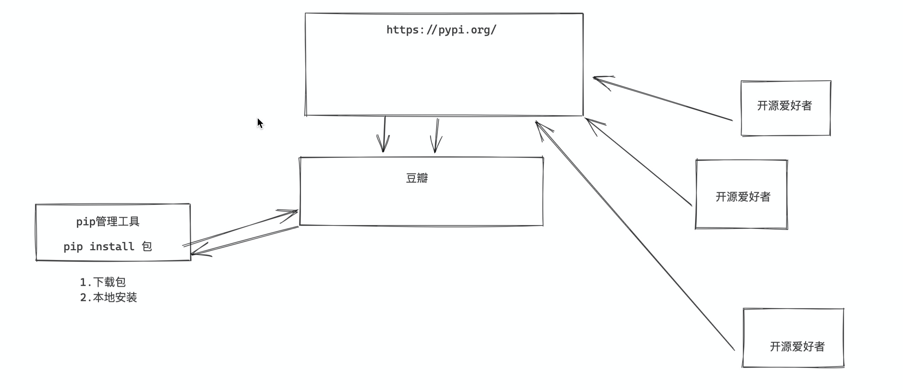
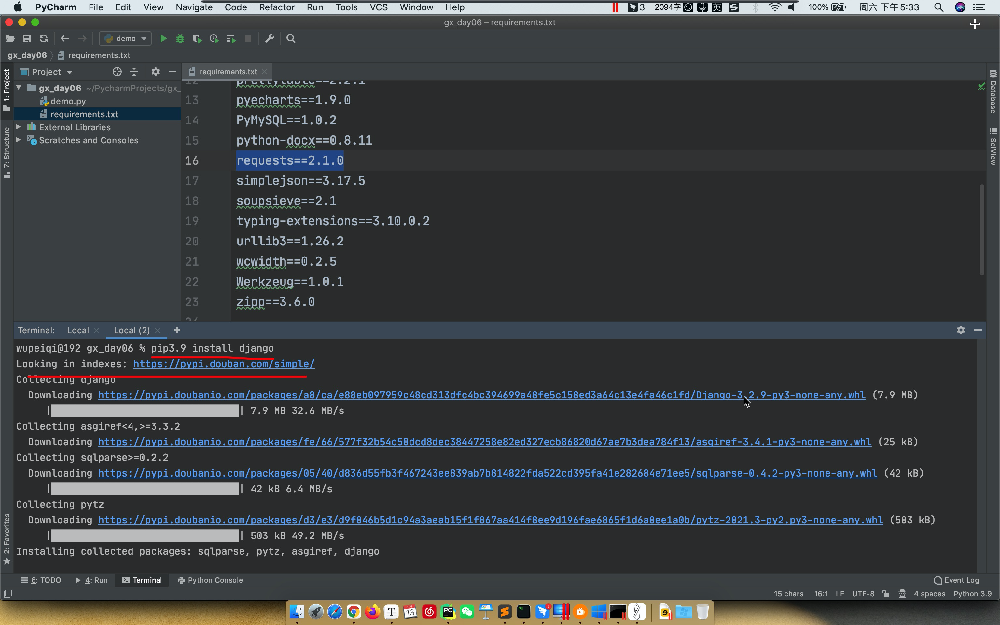
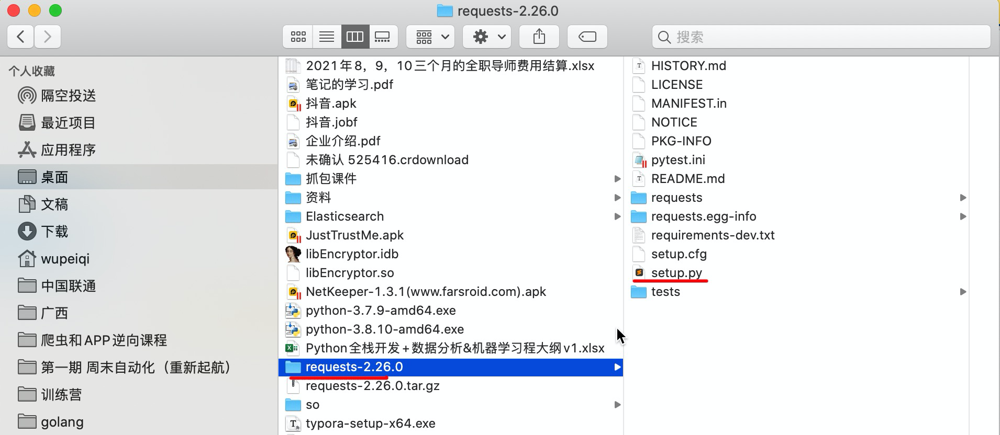
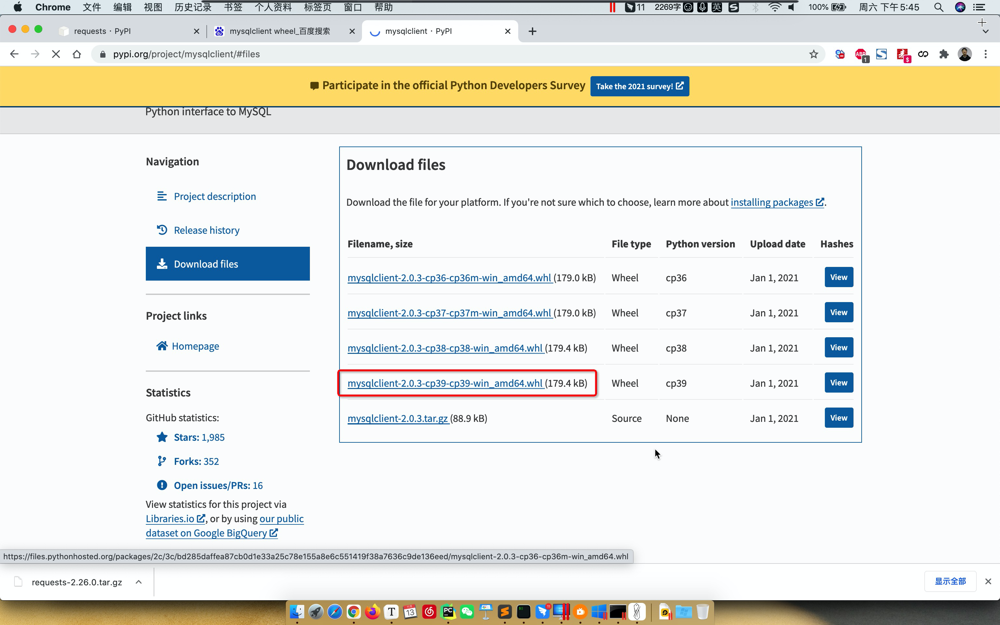

# day06 函数进阶

今日概要：

- 函数名就是一个变量（扩展）
- 匿名函数 lambda 表达式
- 内置函数（内置的很多功能）
- 推导式（一行代码生成数据）


## 1.函数名就是变量

```python
def func():
    pass

v1 = func

func()
v1()
```

```python
def func():
    return 123

data_list = [11,22,True,"武沛齐","中国联通", func, func() ]

data_list[-2]()
```

```python
def send_sms():
    print("发送短信报警")
    
def send_email():
    print("发送邮件报警")
    
def send_dingding():
    print("发送钉钉报警")
    
def send_wechat():
    print("发送微信报警")

    
func_list = [ send_sms, send_email, send_dingding, send_wechat ]
for item in func_list:
    item()
```


```python
def register():
    pass

def login():
    pass

def show_users():
    pass

print("欢迎xx系统")
print("1.注册;2.登录;3.查看所有用户")

choice = input("请选择序号：")
choice = int(choice)

func_list = [ register, login, show_users ]
# func_list[0]()
# func_list[1]()
# func_list[2]()
func_list[ choice-1 ]()
```


让函数当做字典的值。

```python
def func():
    return 123

func_dict = {
    "11":func,
    "22":func,
    "33":func
}

# 获取函数并执行
# func_dict["11"]()
# func_dict["22"]()

# 获取函数并执行
func_object = func_dict.get("22")
if func_object == None:
    print("函数不存在")
else:
    func_object()
```

### 案例1

用户登录系统显示：`1.登录；2.注册；3.查询`，让用户选择序号，选择对应的序号，然后根据序号找到对应的函数并执行。

```python
def login():
    pass

def register():
    pas
    
def query():
    pass

func_dict = {
    "1":login,
    "2":register,
    "3":query
}

choice = input("请输入序号：")
data = func_dict.get(choice)  # None、函数
if not data:
    print("序号输入错误")
else:
    data()
```


### 案例2

资源下载管理器，系统有三大专区：图片专区、NBA专区、短视频专区。

- 每个专区定义一个函数。
- 用户去选择
  - 选择对了进入专区。
  - 选择多了重复选择（错误提示）。
  - 用户选择试输入是 Q/q，终止程序。
- 图片专区（NBA和短视频专区功能相同）
  - 罗列出来所有的序号和图片。
  - 让用户选择序号，用户选择那个序号，
    - 则内部帮用户把这个图片下载下来。【后续再下载】
    - 输出，用户当前选择的那个选择：标题 + URL
  - 再次提示用户输入是否继续（n/N），返回上一级（让用户重新选择专区）。

- 数据

  - 图片

    ```python
    image_dict = {
        "1": ("吉他男神", "https://hbimg.huabanimg.com/51d46dc32abe7ac7f83b94c67bb88cacc46869954f478-aP4Q3V"),
        "2": ("漫画美女", "https://hbimg.huabanimg.com/703fdb063bdc37b11033ef794f9b3a7adfa01fd21a6d1-wTFbnO"),
        "3": ("游戏地图", "https://hbimg.huabanimg.com/b438d8c61ed2abf50ca94e00f257ca7a223e3b364b471-xrzoQd"),
        "4": ("alex媳妇", "https://hbimg.huabanimg.com/4edba1ed6a71797f52355aa1de5af961b85bf824cb71-px1nZz"),
    }
    ```

  - NBA专区

    ```python
    nba_dict = {
        "1": {
            "title": "威少奇才首秀三双",
            "url": "https://aweme.snssdk.com/aweme/v1/playwm/?video_id=v0300fc20000bvi413nedtlt5abaa8tg&ratio=720p&line=0"
        },
        "2": {
            "title": "塔图姆三分准绝杀",
            "url": "https://aweme.snssdk.com/aweme/v1/playwm/?video_id=v0d00fb60000bvi0ba63vni5gqts0uag&ratio=720p&line=0"
        }
    }
    ```

  - 短视频

    ```python
    video_dict = {
        "1": {
            "title": "东北F4模仿秀",
            'url': "https://aweme.snssdk.com/aweme/v1/playwm/?video_id=v0300f570000bvbmace0gvch7lo53oog"
        },
        "2": {
            "title": "卡特扣篮",
            'url': "https://aweme.snssdk.com/aweme/v1/playwm/?video_id=v0200f3e0000bv52fpn5t6p007e34q1g"
        },
        "3": {
            "title": "罗斯mvp",
            'url': "https://aweme.snssdk.com/aweme/v1/playwm/?video_id=v0200f240000buuer5aa4tij4gv6ajqg"
        },
    }
    ```

    

```python
def image():
    """ 图片专区 """
    print("========进入图片专区========")
    image_dict = {
        "1": ("吉他男神", "https://hbimg.huabanimg.com/51d46dc32abe7ac7f83b94c67bb88cacc46869954f478-aP4Q3V"),
        "2": ("漫画美女", "https://hbimg.huabanimg.com/703fdb063bdc37b11033ef794f9b3a7adfa01fd21a6d1-wTFbnO"),
        "3": ("游戏地图", "https://hbimg.huabanimg.com/b438d8c61ed2abf50ca94e00f257ca7a223e3b364b471-xrzoQd"),
        "4": ("alex媳妇", "https://hbimg.huabanimg.com/4edba1ed6a71797f52355aa1de5af961b85bf824cb71-px1nZz"),
    }
    msg_list = []
    for k, v in image_dict.items():
        ele = "{}.{}".format(k, v[0])
        msg_list.append(ele)
    msg_string = "；".join(msg_list)
    print(msg_string)

    while True:
        idx = input("请选择图片的序号（n/N）：")
        if idx.upper() == "N":
            return
        item_tuple = image_dict.get(idx)
        if not item_tuple:
            print("\n序号不存在，请重新输入")
            continue
        title, url = item_tuple
        print(title, url)


def nba():
    """ NBA专区"""
    print("========进入NBA专区========")
    nba_dict = {
        "1": {
            "title": "威少奇才首秀三双",
            "url": "https://aweme.snssdk.com/aweme/v1/playwm/?video_id=v0300fc20000bvi413nedtlt5abaa8tg&ratio=720p&line=0"
        },
        "2": {
            "title": "塔图姆三分准绝杀",
            "url": "https://aweme.snssdk.com/aweme/v1/playwm/?video_id=v0d00fb60000bvi0ba63vni5gqts0uag&ratio=720p&line=0"
        }
    }
    msg_list = []
    for k, v in nba_dict.items():
        ele = "{}.{}".format(k, v["title"])
        msg_list.append(ele)
    msg_string = "；".join(msg_list)
    print(msg_string)

    while True:
        idx = input("请选择序号（n/N）：")
        if idx.upper() == "N":
            return
        item_dict = nba_dict.get(idx)
        if not item_dict:
            print("\n序号不存在，请重新输入")
            continue
        title, url = item_dict['title'], item_dict['url']
        print(title, url)


def video():
    """ 短视频专区 """
    print("========进入短视频专区========")
    video_dict = {
        "1": {
            "title": "东北F4模仿秀",
            'url': "https://aweme.snssdk.com/aweme/v1/playwm/?video_id=v0300f570000bvbmace0gvch7lo53oog"
        },
        "2": {
            "title": "卡特扣篮",
            'url': "https://aweme.snssdk.com/aweme/v1/playwm/?video_id=v0200f3e0000bv52fpn5t6p007e34q1g"
        },
        "3": {
            "title": "罗斯mvp",
            'url': "https://aweme.snssdk.com/aweme/v1/playwm/?video_id=v0200f240000buuer5aa4tij4gv6ajqg"
        },
    }
    msg_list = []
    for k, v in video_dict.items():
        ele = "{}.{}".format(k, v["title"])
        msg_list.append(ele)
    msg_string = "；".join(msg_list)
    print(msg_string)

    while True:
        idx = input("请选择序号（n/N）：")
        if idx.upper() == "N":
            return
        item_dict = video_dict.get(idx)
        if not item_dict:
            print("\n序号不存在，请重新输入")
            continue
        title, url = item_dict['title'], item_dict['url']
        print(title, url)


def run():
    """ 实现程序中的主要逻辑 """

    func_dict = {
        "1": image,
        "2": nba,
        "3": video
    }

    while True:
        print("------------专区--------------")
        print("1.图片专区; 2.NBA专区; 3.短视频专区")
        choice = input("请输入专区选项（q/Q）：")
        if choice.upper() == "Q":
            return

        func = func_dict.get(choice)
        if not func:
            print("\n序号选择错误，请重新输入")
            continue
        # 用户选择正确，并执行函数
        func()

run()
```


下载的功能的实现：

```python
title = "alex媳妇"
url = "https://hbimg.huabanimg.com/51d46dc32abe7ac7f83b94c67bb88cacc46869954f478-aP4Q3V"
```

- 安装第三方的模块

  ```python
  python安装目录/Scripts/pip.exe  install  requests
  ```

  ```python
  "C:\python39\Scripts\pip.exe" install  requests
  ```

- 基于第三方的模块来实现下载

  ```python
  import requests
  
  # 1.下载图片（网络）
  res = requests.get(
      url="https://hbimg.huabanimg.com/51d46dc32abe7ac7f83b94c67bb88cacc46869954f478-aP4Q3V",
      headers={
          "user-agent": "Mozilla/5.0 (Macintosh; Intel Mac OS X 10_15_7) AppleWebKit/537.36 (KHTML, like Gecko) Chrome/87.0.4280.88 Safari/537.36 FS"
      }
  )
  
  # 2.保存到本地
  file_object = open("a1.png", mode='wb')
  file_object.write(res.content)
  file_object.close()
  ```

  


大家的任务来了：

- v2.py，已实现用户选择和获取 title和URL
- download.py，单独下载脚本。

实现，用户选择 序号/图片/视频，下载并保存。

- 图片， png为后缀
- 视频，mp4为后缀


```python
import requests


def download(url, file_name):
    """
    实现下载图片、视频
    :param url: 视频或图片的连接
    :param file_name: 文件名称
    :return:
    """
    # 1.下载图片（网络）
    res = requests.get(
        url=url,
        headers={
            "user-agent": "Mozilla/5.0 (Macintosh; Intel Mac OS X 10_15_7) AppleWebKit/537.36 (KHTML, like Gecko) Chrome/87.0.4280.88 Safari/537.36 FS"
        }
    )

    # 2.保存到本地
    file_object = open(file_name, mode='wb')
    file_object.write(res.content)
    file_object.close()


def image():
    """ 图片专区 """
    print("========进入图片专区========")
    image_dict = {
        "1": ("吉他男神", "https://hbimg.huabanimg.com/51d46dc32abe7ac7f83b94c67bb88cacc46869954f478-aP4Q3V"),
        "2": ("漫画美女", "https://hbimg.huabanimg.com/703fdb063bdc37b11033ef794f9b3a7adfa01fd21a6d1-wTFbnO"),
        "3": ("游戏地图", "https://hbimg.huabanimg.com/b438d8c61ed2abf50ca94e00f257ca7a223e3b364b471-xrzoQd"),
        "4": ("alex媳妇", "https://hbimg.huabanimg.com/4edba1ed6a71797f52355aa1de5af961b85bf824cb71-px1nZz"),
    }
    msg_list = []
    for k, v in image_dict.items():
        ele = "{}.{}".format(k, v[0])
        msg_list.append(ele)
    msg_string = "；".join(msg_list)
    print(msg_string)

    while True:
        idx = input("请选择图片的序号（n/N）：")
        if idx.upper() == "N":
            return
        item_tuple = image_dict.get(idx)
        if not item_tuple:
            print("\n序号不存在，请重新输入")
            continue
        title, url = item_tuple

        file_name = "{}.png".format(title)
        download(url, file_name)


def nba():
    """ NBA专区"""
    print("========进入NBA专区========")
    nba_dict = {
        "1": {
            "title": "威少奇才首秀三双",
            "url": "https://aweme.snssdk.com/aweme/v1/playwm/?video_id=v0300fc20000bvi413nedtlt5abaa8tg&ratio=720p&line=0"
        },
        "2": {
            "title": "塔图姆三分准绝杀",
            "url": "https://aweme.snssdk.com/aweme/v1/playwm/?video_id=v0d00fb60000bvi0ba63vni5gqts0uag&ratio=720p&line=0"
        }
    }
    msg_list = []
    for k, v in nba_dict.items():
        ele = "{}.{}".format(k, v["title"])
        msg_list.append(ele)
    msg_string = "；".join(msg_list)
    print(msg_string)

    while True:
        idx = input("请选择序号（n/N）：")
        if idx.upper() == "N":
            return
        item_dict = nba_dict.get(idx)
        if not item_dict:
            print("\n序号不存在，请重新输入")
            continue
        title, url = item_dict['title'], item_dict['url']
        print(title, url)

        file_name = "{}.mp4".format(title)
        download(url, file_name)


def video():
    """ 短视频专区 """
    print("========进入短视频专区========")
    video_dict = {
        "1": {
            "title": "东北F4模仿秀",
            'url': "https://aweme.snssdk.com/aweme/v1/playwm/?video_id=v0300f570000bvbmace0gvch7lo53oog"
        },
        "2": {
            "title": "卡特扣篮",
            'url': "https://aweme.snssdk.com/aweme/v1/playwm/?video_id=v0200f3e0000bv52fpn5t6p007e34q1g"
        },
        "3": {
            "title": "罗斯mvp",
            'url': "https://aweme.snssdk.com/aweme/v1/playwm/?video_id=v0200f240000buuer5aa4tij4gv6ajqg"
        },
    }
    msg_list = []
    for k, v in video_dict.items():
        ele = "{}.{}".format(k, v["title"])
        msg_list.append(ele)
    msg_string = "；".join(msg_list)
    print(msg_string)

    while True:
        idx = input("请选择序号（n/N）：")
        if idx.upper() == "N":
            return
        item_dict = video_dict.get(idx)
        if not item_dict:
            print("\n序号不存在，请重新输入")
            continue
        title, url = item_dict['title'], item_dict['url']

        file_name = "{}.mp4".format(title)
        download(url, file_name)


def run():
    """ 实现程序中的主要逻辑 """

    func_dict = {
        "1": image,
        "2": nba,
        "3": video
    }

    while True:
        print("------------专区--------------")
        print("1.图片专区; 2.NBA专区; 3.短视频专区")
        choice = input("请输入专区选项（q/Q）：")
        if choice.upper() == "Q":
            return

        func = func_dict.get(choice)
        if not func:
            print("\n序号选择错误，请重新输入")
            continue
        # 用户选择正确，并执行函数
        func()


run()
```


## 2. lambda表达式（匿名函数）

在特定情况下，让我们的代码更简洁。

lambda表达式（匿名函数），我**一行**代码实现定义**简单**的函数。

```python
def func():
    return 123


# func是函数名（变量）
# lamdab : 函数体，函数体中写了123，内部自动会执行一个return
func = lambda : 123

res = func()
print(res) # 123
```

```python
def func(a1,a2):
    return a1 + a2

func = lambda a1,a2 : a1 + a2
res = func(100,200)
print(res) # 300
```

```python
def func(data_string):
    return data_string.upper()

func = lambda data_string : data_string.upper()
res = func("root")
print(res) # "ROOT"
```

```python
def func(data_list):
    return data_list[0]

func = lambda data_list : data_list[0]
res = func([11,22,33,44])
print(res) # 11
```


注意注意注意：

- lambda内部自动return
- return后面到底生成的是什么？返回的就是什么。

```python
data = []
v1 = data.append(123)  # None，append是python内部定义的函数，执行函数，内部没有返回值。
v2 = data.append(1456) # None
```

```python
def func(data_list):
    return data_list.append(999)

res = func([11,22,33])
print(res) # None
```

```python
func = lambda data_list : data_list.append(123)

value = func([11,22,33])
print(value) # None
```


### 练习题

```python
data = "root"

# 调用upper函数，会生一个ROOT并返回。
v1 = data.upper()
print(v1)
```

```python
data = []
data.append(111)
```


```python
f1 = lambda data: data.replace("中国","广西")

res = f1("中国联通")

print(res) # 广西联通
```

```python
f2 = lambda v1,v2: v1.insert(0,v2)

res = f2([11,22],99)
print(res) # None
```

```python
f3 = lambda name : name.split("-")[1]

res = f3("day01-11-python基础入门-第一篇.mp4")
print(res) # "11"
```

```python
f3 = lambda name : int( name.split("-")[1] )
res = f3("day01-11-python基础入门-第一篇.mp4")
print(res) # 11
```


## 3. 函数做参数

```python
def do():
    print("do")

def func(a1,a2):
    print(a1)
    a2()

func( 11 , do )
```

```
11
do
```


注意：一般情况下少用。


```python
def do():
    print("do")

def func(a1,a2):
    print(a1)
    res = a2()
    print(res)
    return 123

v1 = func( 11 , do )
print(v1)
```

```
11
do
None
123
```


## 4.内置函数

Python内部为我们已写好的函数，我们可以直接拿来用，不需要自己再编写了。

```python
data = abs(-10)
print(data)
```

```python
abs = 123123

data = abs(-10) # 报错
```

### 4.1 第1组（5）

- abs，绝对值

  ```python
  data = abs(-10)
  print(data) # 10
  ```

- pow，次方

  ```python
  data = pow(2,5)   # 获取2的5次方
  print(data)
  ```

- sum，求和

  ```python
  num_list = [1,2,10,20]
  res = sum( num_list )
  print(res) # 求和
  ```

- divmod，商和余数

  ```python
  v1,v2 = divmod(92,10)
  print(v1) # 9
  print(v2) # 2
  ```

- round，保留小数点后几位

  ```python
  data = round(3.14134,2)
  print(data) # 3.14
  ```

  

### 4.2 第2组（4）

- min，求最小值

  ```python
  data = [11,22,-19,99,10]
  res = min(data)
  print(res)
  ```

- max，求最大值

  ```python
  data = [11,22,-19,99,10]
  res = max(data)
  print(res)
  ```

- all，是否所有元素转换成布尔值都是True

  ```python
  data = [1,-1,88,9]
  v1 = all(data)
  print(v1) # True
  ```

  ```python
  data = [1,-1,88,0,9]
  v1 = all(data)
  print(v1) # False
  ```

  ```python
  data = [1,-1,88,"",9]
  v1 = all(data)
  print(v1) # False
  ```

  ```python
  v1 = input("用户名：")
  v2 = input("密码：")
  is_valid = all( [v1,v2] )
  if is_valid:
      print("都不为空")
  else:
      print("用户名或密码为空")
  ```

- any，只要有转换为布尔值为True

  ```python
  data = [1,-1,88,9]
  v1 = any(data)
  print(v1) # True
  ```

  ```python
  data = [1,-1,88,0,9]
  v1 = any(data)
  print(v1) # True
  ```

  ```python
  data = [0,"",[],{}]
  v1 = any(data)
  print(v1) # False
  ```

  

### 4.3 第3组（3个）

- bin，十进制转换成二进制

  ```python
  res = bin(100)
  print(res) # 0b101001001
  ```

- oct，十进制转换成八进制

  ```python
  res = oct(100)
  print(res) # 0o1221
  ```

- hex，十进制转换成十六进制

  ```python
  res = hex(100)
  print(res) # 0x1221
  ```

  

### 练习题

给你一个IP地址 `ip = "192.168.11.23"`，你需要的每一段转换成二进制。

```
1.每一段转换成二进制
192		0b100011001
168		0b100011001
11		0b100
23		0b1002

2.去掉前面0b，补足8位。
	00000100
	00001002
	
3.再次拼接起来
	"1000110011000110010000010000001002"
4.在将这个拼接起来的二进制转换10进制整数
	num = int("1000110011000110010000010000001002",base=2)
	print(num)
```

```python
ip = "192.168.11.23"

bin_str_list = []

str_list = ip.split(".")
for item in str_list:
    bin_str = bin( int(item) )[2:]
    bin_fill_str = bin_str.zfill(8)
	bin_str_list.append(bin_fill_str)
    
num_string = "".join(bin_str_list)
num = int(num_string,base=2)
print(num)
```


### 4.4 第4组（2）

编码时 unicode ，将文字和二进制做上对应。

```
A        101010101010                   65
武		0101010100101010101010         987
```

- ord

  ```python
  v1 = ord("A")
  print(v1) # 65
  ```

- chr

  ```python
  v2 = chr(65)
  print(v2) # "A"
  ```


基于chr实现动态验证码：

```python
# 1.随机获取 65 - 90 的数字，就可以将chr转换成字母。
import random

num = random.randint(65,90)
print(num)
char = chr(num)
print(char)
```

```python
import random

char_list = []

for i in range(6):
    num = random.randint(65, 90)
    char = chr(num)
    char_list.append(char)

print(char_list)  # ['P', 'L', 'N', 'E', 'L', 'G']

code = "".join(char_list)
print(code)
```


### 4.5 第5组（9）

- int

- str

  ```python
  data = str(10)
  print(data)
  ```

- bool

- list

- dict

- set

- tuple

- float

- bytes


### 4.6 第6组（10）

- len

- print

- input

- open

  ```python
  f = open("xxx",mode='r',encoding='utf-8')
  data = f.read()
  f.close()
  ```

- range

- hash，计算哈希值（字典的键、集合元素都必须是可哈希）

  ```python
  data = hash("武沛齐")
  print(data)
  ```

- type，查看数据类型

  ```python
  def func(data):
      # 如果data是字符串则返回123
      # 如果data是列表则返回456
      # 其他的返回None
      if type(data) == str:
          return 123
      elif type(data) == list:
          return 456
      else:
          return None
  
  v1 = func(123123)
  
  print(v1)
  ```

- callable，是否可执行（后面是否可以加括号执行）

  ```python
  name = "武沛齐"
  
  v1 = callable(name)
  print(v1) # False
  
  def func():
      print(666)
      
  v2 = callable(name)
  print(v2) # True
  ```

  ```python
  def func():
      return 123
  
  data_list = [11,22,33, func ]
  # 循环每个元素，如果可以执行则执行并获取返回值
  for item in data_list:
      if callable(item):
          res = item()
          print(res)
  	else:
          print(item)
  ```

- enumerate，循环过程中，自动提供自增的一列。

  ```python
  goods = ["飞机", "迫击炮", "AK47"]
  
  # 以前
  # for i in range(len(goods)):
  #     msg = "{} {}".format(i + 1, goods[i])
  #     print(msg)
  
  # 现在
  for idx, item in enumerate(goods, 100):
      msg = "{} {}".format(idx, item)
      print(msg)
  ```

- sorted，排序 （不修改原数据、生成新的列表）

  ```python
  # 列表中的排序（原列表进行排序）
  data_list = [11,22,33,44,55,1,-10]
  data_list.sort()
  print(data_list)
  ```

  ```python
  data_list = [11,22,33,44,55,1,-10]
  new_data = sorted(data_list)
  print(new_data)
  ```

  注意：如果是元素是中文如何排序？

  ```python
  data_list = ["1", "2", "3", "10", "12"]
  new_data = sorted(data_list)
  
  # ['1', '10', '12', '2', '3']
  print(new_data)
  ```


### 练习题

```python
data_list = [
    '5 编译器和解释器.mp4',
    '9 Python解释器种类.mp4',
    '2 课堂笔记的创建.mp4',
    '8 Python介绍.mp4',
    '7 编程语言的分类.mp4',
    '3 常见计算机基本概念.mp4',
    '1 今日概要.mp4',
    '6 学习编程本质上的三件事.mp4',
    '4 编程语言.mp4',
]

res = sorted(data_list)
print(res)

# ['1 今日概要.mp4', '2 课堂笔记的创建.mp4', '3 常见计算机基本概念.mp4', '4 编程语言.mp4', '5 编译器和解释器.mp4', '6 学习编程本质上的三件事.mp4', '7 编程语言的分类.mp4', '8 Python介绍.mp4', '9 Python解释器种类.mp4']
```

```python
data_list = [
    '5 编译器和解释器.mp4',
    '17 今日作业.mp4',
    '9 Python解释器种类.mp4',
    '16 今日总结.mp4',
    '2 课堂笔记的创建.mp4',
    '15 Pycharm使用和破解（win系统）.mp4',
    '12 python解释器的安装（mac系统）.mp4',
    '13 python解释器的安装（win系统）.mp4',
    '8 Python介绍.mp4',
    '7 编程语言的分类.mp4',
    '3 常见计算机基本概念.mp4',
    '14 Pycharm使用和破解（mac系统）.mp4',
    '10 CPython解释器版本.mp4',
    '1 今日概要.mp4',
    '6 学习编程本质上的三件事.mp4',
    '18 作业答案和讲解.mp4',
    '4 编程语言.mp4',
    '11 环境搭建说明.mp4'
]

# 自定义排序的规则
def func(arg):
    return int( arg.split(" ")[0] )

res = sorted(data_list, key=func)
print(res)

# ['1 今日概要.mp4', '10 CPython解释器版本.mp4', '11 环境搭建说明.mp4', '12 python解释器的安装（mac系统）.mp4', '13 python解释器的安装（win系统）.mp4', '14 Pycharm使用和破解（mac系统）.mp4', '15 Pycharm使用和破解（win系统）.mp4', '16 今日总结.mp4', '17 今日作业.mp4', '18 作业答案和讲解.mp4', '2 课堂笔记的创建.mp4', '3 常见计算机基本概念.mp4', '4 编程语言.mp4', '5 编译器和解释器.mp4', '6 学习编程本质上的三件事.mp4', '7 编程语言的分类.mp4', '8 Python介绍.mp4', '9 Python解释器种类.mp4']
```

```python
data_list = [
    '5 编译器和解释器.mp4',
    '17 今日作业.mp4',
    '9 Python解释器种类.mp4',
    '16 今日总结.mp4',
    '2 课堂笔记的创建.mp4',
    '15 Pycharm使用和破解（win系统）.mp4',
    '12 python解释器的安装（mac系统）.mp4',
    '13 python解释器的安装（win系统）.mp4',
    '8 Python介绍.mp4',
    '7 编程语言的分类.mp4',
    '3 常见计算机基本概念.mp4',
    '14 Pycharm使用和破解（mac系统）.mp4',
    '10 CPython解释器版本.mp4',
    '1 今日概要.mp4',
    '6 学习编程本质上的三件事.mp4',
    '18 作业答案和讲解.mp4',
    '4 编程语言.mp4',
    '11 环境搭建说明.mp4'
]

# 自定义排序的规则
# def func(arg):
#     return int( arg.split(" ")[0] )

# key = lambda arg : int(arg.split(" ")[0])

res = sorted(data_list, key=lambda arg : int(arg.split(" ")[0])  )
print(res)
```


## 5. 推导式

Python中为我们提供的一个简便的语法，一行代码实现生成列表、字典等多个元素。

创建一堆数据并存储到列表中：

```python
data = [] # [1,2,3,4,5...100]
for i in range(1,101):
    data.append(i)
```

```python
user_list = []
for i in range(1,301):
    user = "工号-{}".format(i)
    user_list.append(user)
```


### 5.1 列表推导式

```python
# data_list = [ 0,1,2,3,4,..99 ]

data_list = [ i for i in range(100)  ]
```

```python
# data_list = [ 100, 100, 100,100,100..100 ]

data_list = [ 100 for i in range(100)  ]
```

```python
# data_list = [100,101,102...199 ]

data_list = [ 100 + i  for i in range(100)  ]
```

```python
# data_list = [ [1,2],[1,2],[1,2],[1,2],[1,2],[1,2],[1,2],[1,2], ]
data_list = [ [1,2]  for i in range(100)  ]
```

```python
# data_list = [ (0,100), (1,101),....(99,199) ]
data_list = [ (i,i+100)  for i in range(100)  ]
```

```python
# data_list = [ "工号-0","工号-1","工号-2","工号-3",..."工号-99", ]
data_list = [ "工号-{}".format(i)  for i in range(100)  ]
```

```python
# [7,8,9]
data_list = [ i for i in range(10) if i > 6  ]
```

```python
# [7,8,9]
data_list = [ i for i in range(100) if i > 6 and i<10 ]
```


案例：

```python
data_list = [11, True, "武沛齐", [11, 22], 99, 123, 333]

result = [item for item in data_list if type(item) == int]
print(result)  # [11, 99, 123, 333]
```

```python
data_list = [
    '5 编译器和解释器.mp4',
    '17 今日作业.mp4',
    '9 Python解释器种类.mp4',
    '16 今日总结.mp4',
    '2 课堂笔记的创建.mp4',
    '15 Pycharm使用和破解（win系统）.mp4',
    '12 python解释器的安装（mac系统）.mp4',
    '13 python解释器的安装（win系统）.mp4',
    '8 Python介绍.mp4',
    '7 编程语言的分类.mp4',
    '3 常见计算机基本概念.mp4',
    '14 Pycharm使用和破解（mac系统）.mp4',
    '10 CPython解释器版本.mp4',
    '1 今日概要.mp4',
    '6 学习编程本质上的三件事.mp4',
    '18 作业答案和讲解.mp4',
    '4 编程语言.mp4',
    '11 环境搭建说明.mp4'
]

# 1. 获取序号并放入列表 result = ["5","17",....]
result = [item.split(" ")[0] for item in data_list]
print(result)

# 2. 获取序号并放入列表 result = [5,17,....]
result = [int(item.split(" ")[0]) for item in data_list]
print(result)
```


### 5.2 字典推导式

```python
"""
data = {
    0:123,
    1:123,
    ...
    9:123,
}
"""
data = { i:123 for i in range(10) }
```

```python
"""
{
	0:(0,100),
	1:(1,100),
}
"""
data = { i:(i,100) for i in range(10) }
```

```python
"""
{
	8:(8,100),
	9:(9,100),
}
"""
data = { i:(i,100) for i in range(10) if i > 7}
```


练习题：

```python
text = "query=xx&_asf=www.sogou.com&w=01019900&p=40040100&ie=utf8&from=index-nologin&s_from=index&sut=847&sst0=1636790847260&sugsuv=1626278055911299&sugtime=1636790847260"

# 将字符串转换为字典
data_dict = {
    "query":"xx",
    "_asf":"www.sogou.com"
}
```

```python
text = "query=xx&_asf=www.sogou.com&w=01019900&p=40040100&ie=utf8&from=index-nologin&s_from=index&sut=847&sst0=1636790847260&sugsuv=1626278055911299&sugtime=1636790847260"

# ['query=xx', '_asf=www.sogou.com', 'w=01019900', 'p=40040100', 'ie=utf8', 'from=index-nologin', 's_from=index', 'sut=847', 'sst0=1636790847260', 'sugsuv=1626278055911299', 'sugtime=1636790847260']
data_list = text.split("&")
result = {}
for item in data_list:
    result[item.split("=")[0]] = item.split("=")[1]
    
print(result)
```

```python
text = "query=xx&_asf=www.sogou.com&w=01019900&p=40040100&ie=utf8&from=index-nologin&s_from=index&sut=847&sst0=1636790847260&sugsuv=1626278055911299&sugtime=1636790847260"

result = {item.split("=")[0]: item.split("=")[1] for item in text.split("&")}

print(result)
```


```python
# "query=xx&_asf=www.sogou.com&w=01019900&p=40040100&ie=utf8&from=index-nologin&s_from=index&sut=847&sst0=1636790847260&sugsuv=1626278055911299&sugtime=1636790847260"
data_dict = {
    'query': 'xx',
    '_asf': 'www.sogou.com',
    'w': '01019900',
    'p': '40040100',
    'ie': 'utf8',
    'from': 'index-nologin',
    's_from': 'index',
    'sut': '847',
    'sst0': '1636790847260',
    'sugsuv': '1626278055911299',
    'sugtime': '1636790847260'
}

data_list = ["{}={}".format(k, v) for k, v in data_dict.items()]

res = "&".join(data_list)
print(res)
```

```python
# "query=xx&_asf=www.sogou.com&w=01019900&p=40040100&ie=utf8&from=index-nologin&s_from=index&sut=847&sst0=1636790847260&sugsuv=1626278055911299&sugtime=1636790847260"
data_dict = {
    'query': 'xx',
    '_asf': 'www.sogou.com',
    'w': '01019900',
    'p': '40040100',
    'ie': 'utf8',
    'from': 'index-nologin',
    's_from': 'index',
    'sut': '847',
    'sst0': '1636790847260',
    'sugsuv': '1626278055911299',
    'sugtime': '1636790847260'
}

res = "&".join(["{}={}".format(k, v) for k, v in data_dict.items()])
print(res)
```


## 总结

上述就是学习函数必备的知识点。

- 定义

- 执行

- 参数

- 返回值

- 作用域

- 函数是一个变量

  ```python
  def func():
  	pass
  ```

- lambda 表达式

- 内置函数

  ```python
  内置函数：python内部给我们提供好的函数。
  自定义函数：
          def func():
              pass
  ```

- 推导式（与函数无关），简化代码创建字典、列表。


## 6. 关于pip.exe

下载视频时，用到了pip去下载第三方包。

pip是一个专门用于帮助去下载第三方包的工具，安装好Python之后，自动安装好了。

```
C:\python39	
	- python.exe      Python解释器
	- Scripts
		- pip.exe	  包管理工具
	- Lib（内置+第三方）
		- site-package
			- 第三方包
```

```python
>>>C:\python39\python.exe /Users/wupeiqi/PycharmProjects/gx_day06/demo.py
```

```python
>>>C:\python39\Scripts\pip.exe  install  包
```


### 6.1 系统的环境变量

如果你将：`C:\python39\Scripts` 添加到了环境变量中。

```
>>>pip install 包名称
```




### 6.2 常见命令

- 安装

  ```
  pip install 包名称
  ```

- 卸载

  ```python
  pip uninstall 包名称
  ```

- 罗列目前已安装第三方包

  ```
  pip list
  ```

- 将已安装的包写入到文件中

  ```python
  pip freeze > a1.txt
  ```

  ```python
  pip freeze > requirements.txt
  ```

  ```
  邱恩婷在自己电脑上安装（逐一安装）
  	pip install beautifulsoup4==4.9.3
  	pip install certifi==2020.12.5
  批量安装：
  	pip install -r requirements.txt
  ```


问题：

1. 在同一个Python的环境中，无法通知安装多个版本的包，只能同时有一个。
2. requirements.txt 一般放在项目的根目录录下（每个项目根目录下都要放一个）。


### 6.3 配置



```
如何成为开源作者，发布包：
https://www.bilibili.com/video/BV17541187de
```


有时在进行下载时，会发现速度比较慢：

```
pip install 包
```

```
timeout/retry...
```



基于豆瓣源去下载某些第三方包：

- 一次性操作

  ```python
  pip install flask  -i  https://pypi.douban.com/simple/ 
  pip install django  -i  https://pypi.douban.com/simple/ 
  ```

- 永久默认豆瓣

  ```python
  pip config set global.index-url https://pypi.douban.com/simple/
  ```

  ```
  pip install django
  ```

  


### 6.4 源码安装

一般情况下，我们在开发过程用到的所有的第三方包都可以通过 pip 管理工具来进行安装，但是如果你遇到一些包在pip中没有，可以找到他的源码，也可以通过源码安装。

- 下载源码

  ```
  https://pypi.org/project/requests/#files
  ```

- 解压
  

- 安装【终端】

  - 进入源码目录

  - 执行安装命令

    ```python
    python3.9 setup.py build
    python3.9 setup.py install
    ```

    

### 6.5 wheel包

有些源码开发者，提前把代码打包成 wheel包，你以后下载时，就不需要自己build，直接安装即可。

- pip 支持wheel包的安装了。

  ```python
  pip install wheel
  ```

- 下载wheel包
  

- 进入终端去安装

  - 打开终端，进入wheel包目录

  - 直接去安装

    ```python
    pip3 install mysqlclient-2.0.3-cp39-cp39-win_amd64.whl
    ```

注意事项：无论你是通过什么方式安装的第三方包，都是安装在了   site-package 目录。

```
C:\python39	
	- python.exe      Python解释器
	- Scripts
		- pip.exe	  包管理工具
	- Lib（内置+第三方）
		- site-package
			- 第三方包
```

想要卸载的话，直接通过：`pip uninstall 包`


