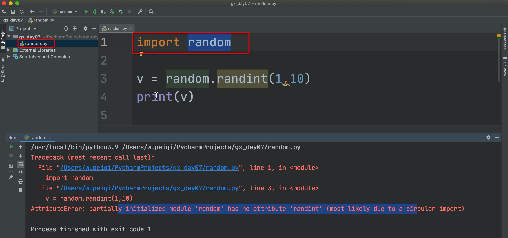
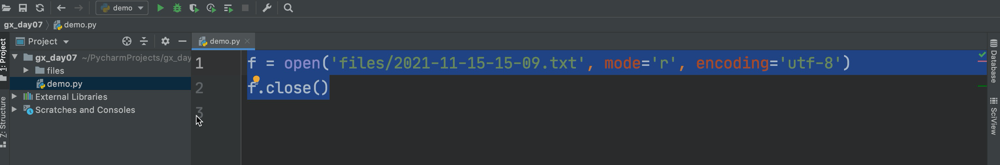

# day07 模块和包

什么是模块和包呢？

- 模块，就是指py文件，我们可以将一些功能按照某个中维度划分。

  ```
  自定义
  内置
  第三方
  ```

- 包，就是指文件夹，我们可以将一些功能按照某个中维度划分。

  ```
  里面包含多个py文件。
  ```

  

一般情况下，大家平时的讨论和沟通时，一般都统称为：模块。


接下来我们要学习模块和包时：

- 自定义模块和包 + 使用
- 常见内置模块 + 使用
- 第三方模块 + 使用


## 1. 自定义模块和包

### 1.1 快速上手

```
gx_day07
├── app.py
└── utils.py
```

```python
# app.py

# 1.导入utils模块
import utils

choice = input("请输入序号：")

# 2.调用utils模块中的str_to_int功能。
res = utils.str_to_int(choice)
if res == None:
    print("输入错误")
else:
    msg = "序号是：{}".format(res)
    print(msg)

```

```python
# utils.py
def str_to_int(str_data):
    """
    字符串转换为整形
    :param str_data: 要转换的字符串
    :return: 整形 or None（无法转换）
    """
    if str_data.isdecimal():
        return int(str_data)
    return None

def f1():
    pass

def f2():
    pass
```


示例2：

```
gx_day07
├── app.py
├── commons
│   ├── pager.py
│   └── pool.py
└── utils.py
```

```python
# app.py 

# 导入
import utils

import commons.pager
import commons.pool

# 调用
v1 = commons.pager.pppppppp()
print(v1)

v2 = commons.pool.ooooooooo()
print(v2)

v3 = utils.str_to_int("123123")
print(v3)

```


### 1.2 关于模块和包的导入路径

上述的案例中，我是把包和模块都放在了：

- 运行文件所在的同级目录。【导入成功】
- 模块和包在Python的安装目录。【导入成功】


如果我想要把某个模块放在 `F:\code\hello.py`，导入到我的项目里来，默认一定是无法导入的，这是因为Python内部在看待 `import xxx` 自动回去某一些目录中寻找。

```
import hello
```

```python
import sys
print(sys.path)

[
    '/Users/wupeiqi/PycharmProjects/gx_day07', 
    '/Users/wupeiqi/PycharmProjects/gx_day07', 
    '/Applications/PyCharm.app/Contents/plugins/python/helpers/pycharm_display', 
    '/Library/Frameworks/Python.framework/Versions/3.9/lib/python39.zip', 
    '/Library/Frameworks/Python.framework/Versions/3.9/lib/python3.9', 
    '/Library/Frameworks/Python.framework/Versions/3.9/lib/python3.9/lib-dynload', 
    '/Library/Frameworks/Python.framework/Versions/3.9/lib/python3.9/site-packages', 
    '/Library/Frameworks/Python.framework/Versions/3.9/lib/python3.9/site-packages/requests-2.26.0-py3.9.egg', 
    
    '/Library/Frameworks/Python.framework/Versions/3.9/lib/python3.9/site-packages/charset_normalizer-2.0.7-py3.9.egg', 
  '/Applications/PyCharm.app/Contents/plugins/python/helpers/pycharm_matplotlib_backend']
```


以上只是了解后，如果你需要让python导入模块是去自定定义的目录中寻找，那么你就需要：

```python
import sys

# 1.自定义文件所在的目录添加到sys.path
sys.path.append(r"F:\code")

# 2.导入
import hello
```


问题：sys.path获取到的是个什么？

```python
import xx
```

```
是个列表，列表是有序。

[
    '/Users/wupeiqi/PycharmProjects/gx_day07', 
    '/Users/wupeiqi/PycharmProjects/gx_day07', 
    '/Applications/PyCharm.app/Contents/plugins/python/helpers/pycharm_display', 
    '/Library/Frameworks/Python.framework/Versions/3.9/lib/python39.zip', 
    '/Library/Frameworks/Python.framework/Versions/3.9/lib/python3.9', 
]
```

注意：千万不要让自己的模块名称和python内置模块的名称同名（此时你想去调用Python内置的模块中的功能时，无法调用）。




### 1.3 关于模块和包的导入方式

#### 1.3.1 import导入

- 导入一个py文件。

```python
import utils
utils.u_f1()

import commons.pager
commons.pager.p_1()
```


#### 1.3.2 from导入

- 导入级别：py文件中的函数
- 导入级别：导入一个py文件

```python
from utils import u_f1
u_f1()

from commons.pager import p_1
p_1()

from commons import pager
pager.p_1()
```


```python
from commons.pager import p_1, p_2, p_3
from commons.pager import *

p_1()
p_2()
p_3()
p_4()
```

```python
from commons.pager import p_1 as p2

def p_1():
    return "ppppp"

p_1()
p2()
```


答疑：

```
import 和 from 两种方式都是导入模块，效果上相同。一般情况下：
- 多个层级
	from commons.xxx.xxx import sdf
- 单层目录（与运行的py文件在同级目录）
	import xx
```


### 小节

- sys.path

  ```python
  import sys
  sys.path.append(".....")
  
  import xx
  ```

- 自己的模块不要内置的重名。

- 导入的方式：import / from xx import xxx


## 2.常见的内置模块

Python内部提供好的功能。

### 2.1 hashlib

是一个对数据进行加密的模块。

```python
import hashlib

data = "admin"
obj = hashlib.md5()
obj.update(data.encode('utf-8'))
res = obj.hexdigest()
print(res)
```


在以后咱们开发项目时，密码不要用明文存储。

```
wupeiqi,21232f297a57a5a743894a0e4a801fc3
```

为了防止数据库泄露，用户名和密码全都泄露。


#### 2.1.1 密文匹配（不能反解）

MD5加密，不可反解。

```python
admin    ->   21232f297a57a5a743894a0e4a801fc3
```


案例：以后登录时候要进行密文匹配。

```python
user_dict = {
    "wupeiqi":"21232f297a57a5a743894a0e4a801fc3"
}

user = input("用户名：") # wupeiqi
pwd = input("密码：") # admin

db_pwd = user_dict.get(user) # 21232f297a57a5a743894a0e4a801fc3
# 将 pwd 进行加密的到密文：21232f297a57a5a743894a0e4a801fc3
```


#### 2.1.2 撞库


> 有些人搞一些机器跑，把明文的密文跑。
>
> ```
> admin	adfasdfasdfasdf
> 123		asdfadfasdfasdfasdf
> ffsdf   asdfadfasdfasdfasdf
> ```


#### 2.1.3 加盐

```python
import hashlib

data = "admin"

salt = "asidfjaksdkjasdiuofiqjskda91qw3asdf"
obj = hashlib.md5(salt.encode('utf-8'))
obj.update(data.encode('utf-8'))
res = obj.hexdigest()
print(res) # c06b63d965921fe0a8803071b623e4e9
```


## 案例：用户注册和用户登录

用户注册案例：

```python
import hashlib

DB_FILE_PATH = "db.txt"
SALT = "asidfjaksdkjasdiuofiqjskda91qw3asdf"


def md5(data_string):
    obj = hashlib.md5(SALT.encode('utf-8'))
    obj.update(data_string.encode('utf-8'))
    res = obj.hexdigest()
    return res


def login():
    """ 登录 """
    print("用户登录")
    user = input("用户名：")
    pwd = input("密码：")
    encrypt_pwd = md5(pwd)

    # 逐行读取文件中的内容，来进行比较
    is_success = False
    with open(DB_FILE_PATH, mode='r', encoding='utf-8') as file_object:
        for line in file_object:
            data_list = line.strip().split(',')
            if data_list[0] == user and data_list[1] == encrypt_pwd:
                is_success = True
                break

    if is_success:
        print("登录成功")
    else:
        print("登录失败")


def register():
    """ 注册 """
    print("用户注册")
    user = input("用户名：")
    pwd = input("密码：")
    encrypt_pwd = md5(pwd)

    line = "{},{}\n".format(user, encrypt_pwd)
    with open(DB_FILE_PATH, mode='a', encoding='utf-8') as file_object:
        file_object.write(line)


def run():
    func_dict = {
        "1": register,
        '2': login
    }

    print("1.注册；2.登录")
    choice = input("序号：")
    func = func_dict.get(choice)
    if not func:
        print("序号选择错误")
        return
    func()


run()
```


### 2.2 random

帮助我们生成一些随机数据。

```python
import random

v1 = random.randint(1, 20)  # 大于等于1； 小于等于20
print(v1)
```

案例：

```python
import random

data_list = ["陈青", "邓新成", "谢鹏", "梁世斌"]

# 获取随机索引值 1
idx = random.randint(0, len(data_list) - 1)

# 调用列表的pop功能，将列表中的某个索引位置的元素删除
# 将删除那个值获取到
element = data_list.pop(idx)

print(element)
print(data_list)
```

```python
import random

char_list = []
for i in range(6):
    num = random.randint(65, 90)
    char = chr(num)
    char_list.append(char)

res = "".join(char_list)
print(res)
```


random模块中的其他常用功能：

```python
import random

# 1.获取随机的整数
v1 = random.randint(1, 20)  # 大于等于1； 小于等于20
print(v1)

# 2.获取随机的小数
v2 = random.uniform(1, 10)
print(v2)

# 3.随机抽取1个数
data_list = [11, 22, 33, 44, 55]
v3 = random.choice(data_list)
print(v3)

# 4.随机抽取多个数
data_list = [11, 22, 33, 44, 55]
v4 = random.sample(data_list, 3)
print(v4)

# 5.打乱顺序
num_list = [i for i in range(100)]
random.shuffle(num_list)
print(num_list)
```


案例：年会抽奖案例

```python
import random

# 1.创建300名员工
"""
user_list = []
for i in range(1, 301):
    item = "工号-{}".format(i)
    user_list.append(item)
"""
user_list = ["工号-{}".format(i) for i in range(1, 301)]

# for i in range(100):
#     user_list.append("工号-137")
#
# print(user_list)


# 2.奖项信息
data_list = [
    ("三等奖", 5),
    ("二等奖", 3),
    ("一等奖", 2),
    ("特等奖", 1)
]

# 3.抽奖
for item in data_list:

    input("点击回车，继续抽奖：")
    text = item[0]
    count = item[1]
    if text == "特等奖":
        message = "荣获特等奖的名单：郭智。"
        print(message)
        break

    # 抽取count=5个员工，恭喜他们获得 ["工号1"，...]
    lucky_user_list = random.sample(user_list, count)
    for name in lucky_user_list:
        user_list.remove(name)

    user_string = "、".join(lucky_user_list)
    message = "荣获{}的名单：{}。".format(text, user_string)
    print(message)
```


## 案例：年会抽奖


### 2.3 json

本质上：是一种数据格式，字符串形式。

用处：让不同编程语言之间实现数据传输。


JSON格式：

- 外部整体大的字符串

- json字符串的内部如果有字符串的话，一定需要用双引号。

- json字符串中不会存在python中的元组那样的格式。

  ```python
  info = {'k1':123,'k2':(11,22,33,44)}
  
  JSON格式：
  	'{"k1":123,"k2":[11,22,33,44] }'
  ```


以下哪些数据是JSON格式的字符串：

```python
v1 = '{"k1":123,"k2":456}'
v2 = "{'k1':123,'k2':456}"
v3 = '{"k1":123,"k2":456,"k3":[11,22,33]}'
v4 = '{"k1":123,"k2":456,"k3":(11,22,33)}'
```

```python
import json

info = {'k1': 123, 'k2': (11, 22, 33, 44)}

# python的数据类型转换为JSON格式的字符串
res = json.dumps(info)
print(res) # '{"k1": 123, "k2": [11, 22, 33, 44]}'
```

```python
import json

data_string = '{"k1": 123, "k2": [11, 22, 33, 44]}'

# 将JSON格式的字符串转换为Python的数据类型
res = json.loads(data_string)
print(res)

print(res['k1'])
print(res['k2'])
print(res['k2'][-1])
```


问题：JSON字符串和普通的字符串有什么区别？

```python
v1 = "asdfasdkfasdfasd"
v2 = "[11,22,33]"
```

问题：

```python
v1 = "(3,6)"   # 是JSON格式的字符串吗？
```


#### 2.3.1 关于中文

```python
import json

info = {"name": "邱恩婷", "age": 19}

v1 = json.dumps(info, ensure_ascii=False)
print(v1) # {"name": "邱恩婷", "age": 19}
```


#### 2.3.2 序列化

在Python中默认只能通过json模块序列化基本的数据类型。

```
    +-------------------+---------------+
    | Python            | JSON          |
    +===================+===============+
    | dict              | object        |
    +-------------------+---------------+
    | list, tuple       | array         |
    +-------------------+---------------+
    | str               | string        |
    +-------------------+---------------+
    | int, float        | number        |
    +-------------------+---------------+
    | True              | true          |
    +-------------------+---------------+
    | False             | false         |
    +-------------------+---------------+
    | None              | null          |
    +-------------------+---------------+
```

```python
# 可以序列化（执行正确）
import json
import decimal
info = {"name": "邱恩婷", "age": 19.5, 'f': True, "hobby": None}
v1 = json.dumps(info, ensure_ascii=False)
print(v1)
```


```python
import json
import decimal

data = decimal.Decimal("0.3")
res = float(data)

info = {"name": "邱恩婷", "age": 19.5, 'f': True, "hobby": None, "data": res}

v1 = json.dumps(info, ensure_ascii=False)
print(v1)
```


## 案例：豆瓣热门电影

案例1：基于requests模块向豆瓣发送请求获取他热门电影。

```python
import json
import requests

res = requests.get(
    url="https://movie.douban.com/j/search_subjects?type=movie&tag=%E7%83%AD%E9%97%A8&sort=recommend&page_limit=20&page_start=20",
    headers={
        "user-agent": "Mozilla/5.0 (Macintosh; Intel Mac OS X 10_15_7) AppleWebKit/537.36 (KHTML, like Gecko) Chrome/95.0.4638.69 Safari/537.36"
    }
)

data_dict = json.loads(res.text)

for item in data_dict['subjects']:
    print(item['title'], item['url'])
```


## 案例：写一个网站

案例2：用Python写一个网站，给Java程序提供数据支持。

```
pip install flask
```

```python
import json
from flask import Flask

app = Flask(__name__)


@app.route('/get/info')
def index():
    data = ['武沛齐', '郭智', '住户费']
    json_string = json.dumps(data, ensure_ascii=False)  # JSON格式的字符串

    return json_string


@app.route('/do/play')
def play():
    info = {
        "code": 1000,
        'status': True,
        'values': [
            {"id": 1, "name": "武沛齐"},
            {"id": 2, "name": "陈青"},
            {"id": 3, "name": "梁树彬"},
        ]
    }
    json_string = json.dumps(info, ensure_ascii=False)  # JSON格式的字符串

    return json_string


if __name__ == '__main__':
    app.run()
```


### 2.4 time

```python
import time

# 1.获取当前的时间戳 （自1970年1月1日开始）
v1 = time.time()
print(v1)  # 1636956070.0133471 / 1636956095.6416771
```

案例：

```python
import time

start_time = time.time()

...
....

end_time = time.time()

interval = end_time - start_time
print(interval)
```


```python
import time

# 1.获取当前的时间戳 （自1970年1月1日开始）
# v1 = time.time()
# print(v1)  # 1636956070.0133471 / 1636956095.6416771

# 2.停止N秒，再继续运行
while True:
    print(1)
    time.sleep(1)
```


### 2.5 datetime

- 时间戳。

  ```python
  import time
  v1 = time.time()
  ```

- datetime格式

  ```python
  import datetime
  
  v1 = datetime.datetime.now()
  print(v1)  # datetime类型
  ```

- 字符串格式

  ```python
  import datetime
  
  ctime_string = datetime.datetime.now().strftime("%Y-%m-%d %H:%M:%S")
  print(ctime_string)
  ```

  

## 案例：用户注册+时间

1. 用户注册

   - while循环，输入：用户名、密码

   - 密码-> md5加密 -> 密文

   - 当前时间，用户注册时间。

   - 写入到db.txt文档中

     ```python
     user,pwd,时间
     ```

   ```python
   """
       1. 代码复用
       2. 代码太长，拆分到不同的函数
   """
   import hashlib
   import datetime
   
   
   def md5(data_string):
       obj = hashlib.md5()
       obj.update(data_string.encode('utf-8'))
       return obj.hexdigest()
   
   
   def run():
       while True:
           user = input("用户名：")
           password = input("用户名：")
           encrypt_password = md5(password)
           ctime_string = datetime.datetime.now().strftime("%Y-%m-%d %H:%M:%S")
   
           line = "{},{},{}\n".format(user, encrypt_password, ctime_string)
   
           with open('db.txt', mode='a', encoding='utf-8') as f:
               f.write(line)
   
           # f = open('db.txt', mode='a', encoding='utf-8')
           # f.write(line)
           # f.close()
   
   
   run()
   
   ```


## 案例：日志，根据时间写到不同文件

2. 日志记录器，按分钟的维度来创建文件，并将内容写入到文件中。

   - 写一个函数，在函数中实现这个功能。

   - 在函数里面

     - 循环让用户输入：文本

     - 需要将文本写入到文件中。

       ```python
       import datetime
       
       # 2021-11-15-14-53.txt
       ctime_string = datetime.datetime.now().strftime("%Y-%m-%d-%H-%M")
       print(ctime_string)
       ```

     

     ```python
     import datetime
     
     def run():
         while True:
             text = input(">>>")
     
             ctime_string = datetime.datetime.now().strftime("%Y-%m-%d-%H-%M")
             file_name = "{}.txt".format(ctime_string)
     
             f = open(file_name, mode='a', encoding='utf-8')
             f.write("{}\n".format(text))
             f.close()
     
     run()
     ```

     

#### 2.5.1 时间转换


- 字符串  -> datetime类型

  ```python
  from datetime import datetime
  text = "2021-11-11"
  res = datetime.strptime(text, "%Y-%m-%d")
  print(res,type(res))
  ```

- datetime -> 字符串

  ```python
  from datetime import datetime
  
  dt = datetime.now()
  res = dt.strftime("%Y-%m-%d-%H-%M")
  print(res)
  ```

- 时间戳 -> datetime类型

  ```python
  import time
  from datetime import datetime
  
  ctime = time.time()
  
  dt = datetime.fromtimestamp(ctime)
  print(dt, type(dt))
  ```

- datetime类型 -> 时间戳

  ```python
  from datetime import datetime
  
  v1 = datetime.now()
  res = v1.timestamp()
  print(res)
  ```

  


#### 2.5.2 datetime类型的意义

```python
from datetime import datetime, timedelta

v1 = datetime.now()
# res = v1 + timedelta(days=280)
# print(res, type(res))

res = v1 + timedelta(days=10, hours=20, minutes=10, seconds=100)
# print(res, type(res))

date_string = datetime.strftime(res, "%Y-%m-%d-%H-%M")
print(date_string)
```

很方便的可以帮我们处理时间加减。


### 2.6 os

- 路径的拼接

  ```python
  window系统：  C:\xx\xxx\xxx
     Mac系统：  /user/xxx/xxx/xxx
   Linux系统：  /user/xxx/xxx/xxx
  ```

  ```python
  import os
  
  path = os.path.join("x1","x2","x3","x4",'log.txt')
  print(path) # x1/x2/x3/x4/log.txt 
  ```

- 找到上级目录

  ```python
  import os
  
  file_path = "x1/x2/x3/x4"
  
  # 找到当前路径的上一级目录
  v1 = os.path.dirname(file_path)
  print(v1) # x1/x2/x3
  ```

- 绝对路径

  ```python
  绝对路径：
  	/Users/wupeiqi/PycharmProjects/gx_day07/2021-11-15-15-10.txt
  相对路径（当前执行的程序）
  	见下图
  ```

  


  如何生成一个绝对路径。

  ```python
  import os
  
  res = os.path.abspath("xx")
  
  # 当前程序所在目录                             相对目录
  # /Users/wupeiqi/PycharmProjects/gx_day07/   xx
  print(res)
  ```

- 判断路径是否存在

  ```python
  import os
  
  res = os.path.exists(file_path)
  print(res) # True/False
  ```

  ```python
  import os
  
  # files/db.txt
  file_path = os.path.join('files', 'db.txt')
  
  # 判断路径是否存在
  if os.path.exists(file_path):
      # 读取文件时，如果文件不存在就会报错：FileNotFoundError
      f = open(file_path, mode='r', encoding='utf-8')
      data = f.read()
      f.close()
      print(data)
  else:
      print("文件不存在")
  ```

- 创建文件夹

  ```python
  import os
  
  path = os.path.join('db', '2021', '11月份')
  print(path)  # db/2021/11月份
  
  os.makedirs(path)
  
  ```

  ```python
  import os
  
  #  path = "db/2021/11月份"
  path = os.path.join('db', '2021', '11月份')
  
  if not os.path.exists(path):
      # 创建目录
      os.makedirs(path)
  ```

- 删除文件、文件夹

  ```python
  import os
  
  path = os.path.join('db', '2021', '11月份', 'log.txt')
  
  # 删除文件
  os.remove(path)
  ```

  ```python
  import os
  import shutil
  
  path = os.path.join('db', '2021')
  
  # 删除文件夹
  shutil.rmtree(path)
  ```

- 判断是否是文件夹

  ```python
  import os
  
  path = os.path.join('db', 'a1.txt')
  res = os.path.isdir(path)
  print(res)
  ```

- os.listdir/os.walk

  ```python
  import os
  
  # 查看某个目录下的所有的文件和文件夹（一级目录）
  for item in os.listdir("/Users/wupeiqi/Documents/视频教程/路飞Python/mp4/开篇"):
      print(item)
      
  """
  03 开篇：学习方法的建议.mp4
  .DS_Store
  02 开篇：授课模式须知.mp4
  课堂笔记
  05 开篇：写在最后.mp4
  04 开篇：笔记和文档的编写.mp4
  01 开篇：讲师和课程内容介绍.mp4
  """
  ```

  ```python
  import os
  
  # 查看某个目录下的所有的文件和文件夹
  for in_path, folder_list, name_list in os.walk("/Users/wupeiqi/Documents/视频教程/路飞Python/mp4/开篇"):
      for name in name_list:
          abs_path = os.path.join(in_path, name)
          print(abs_path)
  ```


## 案例：找目录下的某个文件

案例：找到某个目录下的所有 含有某个关键字 的文件（文件路径）

```python
import os

target_folder_path = "/Users/wupeiqi/Documents/视频教程/路飞Python/mp4"
key = "练习"

# 查看某个目录下的所有的文件和文件夹
for in_path, folder_list, name_list in os.walk(target_folder_path):
    for name in name_list:
        if key in name:
            abs_path = os.path.join(in_path, name)
            print(abs_path)
```


案例：

```python
"""
用户注册：
    - 用户信息需要存储在 db/users/account.txt
"""
import os

while True:
    user = input(">>>")
    line = "{}\n".format(user)

    # 确保文件所在目录已存在 db/users（不存在，就创建）
    folder_path = os.path.join("db", "files")
    if not os.path.exists(folder_path):
        os.makedirs(folder_path)

    # 所在文件夹必须已存在
    file_path = os.path.join(folder_path, 'account.txt')
    file_object = open(file_path, mode='a', encoding='utf-8')
    file_object.write(line)
    file_object.close()
```


## 案例：景区订票系统

- 新创建一个项目
- 创建一个app.py的文件，这个文件实现所有的代码。
- 通过函数编程来实现
  
- 业务需求
  - 启动项目时，监测当前项目目录下是否有 db 文件夹，如果么有就创建。
  - 输入姓名，进入系统，监测：db/用户名.txt 文件是否存在。
    - 老用户，存在。
    - 新用户，新用户。
  - 登录后选择功能：
    - 历史订单，打开文件并逐行读取内容。如果文件夹不存在，则输出无历史记录。
    - 预定，输入：景区、数量、订票时间


```python
import os
import datetime

# DB_FOLDER = os.path.join("db", 'files')
DB_FOLDER = "db"


def history(user_file_path):
    """ 历史记录 """
    # 1.监测文件是否存在？不存在，输出：无历史记录
    if not os.path.exists(user_file_path):
        print("无历史记录")
        return

    # 2.读取文件的内容逐行打印（历史订票信息）
    print("=====历史记录=====")
    with open(user_file_path, mode='r', encoding='utf-8') as f:
        for line in f:
            line = line.strip()
            print(line)


def booking(user_file_path):
    """ 预定 """

    location = input("请输入景区名称：")
    count = input("订票数量：")
    ctime_string = datetime.datetime.now().strftime("%Y-%m-%d %H:%M:%S")

    line = "{},{},{}\n".format(location, count, ctime_string)

    with open(user_file_path, mode='a', encoding='utf-8') as file_object:
        file_object.write(line)


def run():
    # 1.检查文件夹是否存在
    if not os.path.exists(DB_FOLDER):
        os.makedirs(DB_FOLDER)

    # 2.输入用户名，监测是老用户还是新用户
    name = input("请输入姓名：")
    # db/用户名.txt
    file_path = os.path.join(DB_FOLDER, "{}.txt".format(name))
    if os.path.exists(file_path):
        print("欢迎再次回来，老用户")
    else:
        print("欢迎首次使用，新用户")

    # 3.功能的选择
    func_dict = {"1": history, "2": booking}
    while True:
        print("1.查询历史订单；2.预定")
        choice = input("请选择(q/Q)：")
        if choice.upper() == 'Q':
            return
        func = func_dict.get(choice)
        if not func:
            print("序号输入错误，重新输入")
            continue
        func(file_path)


run()
```


