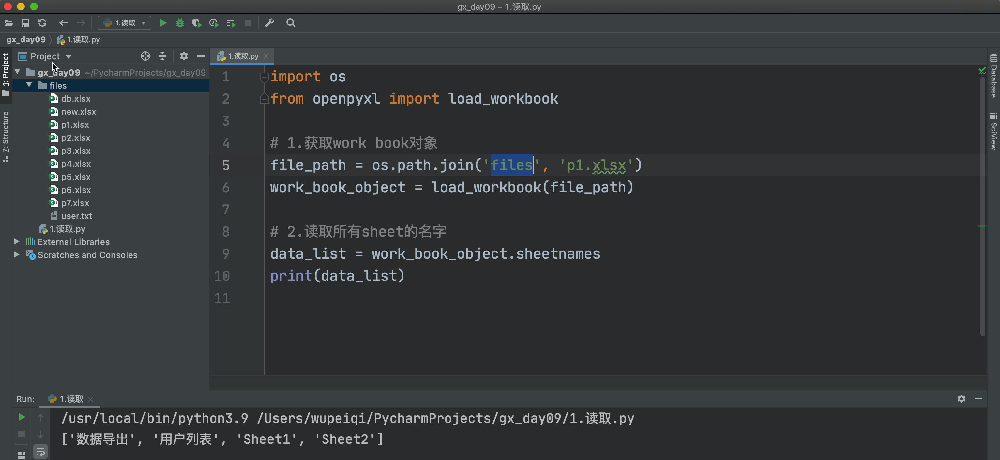
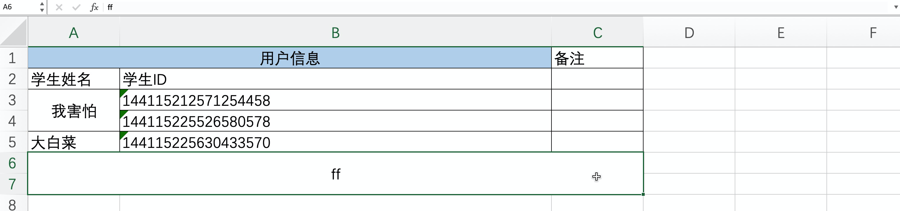
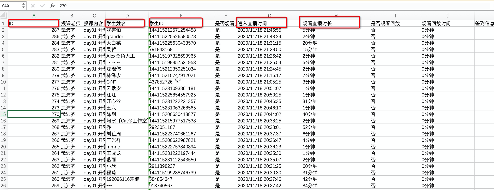
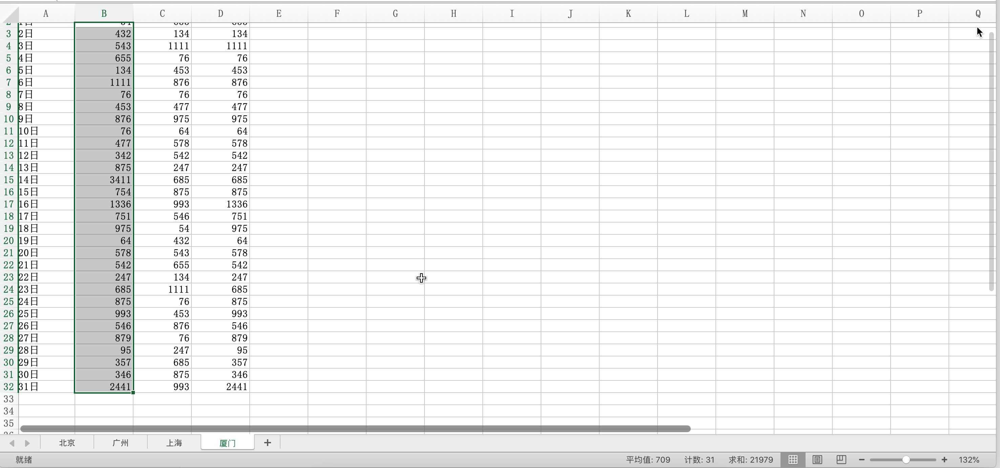
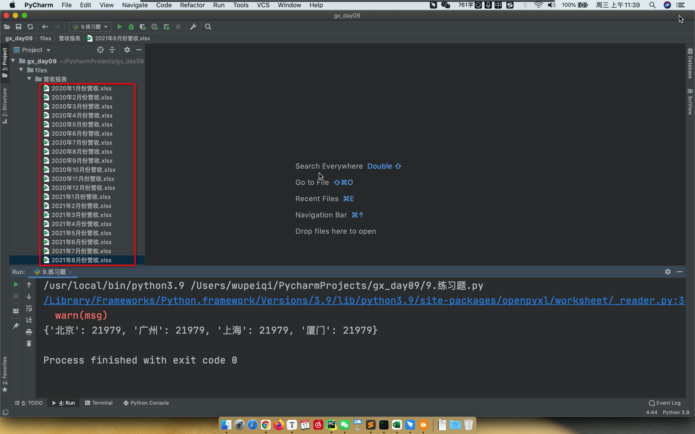
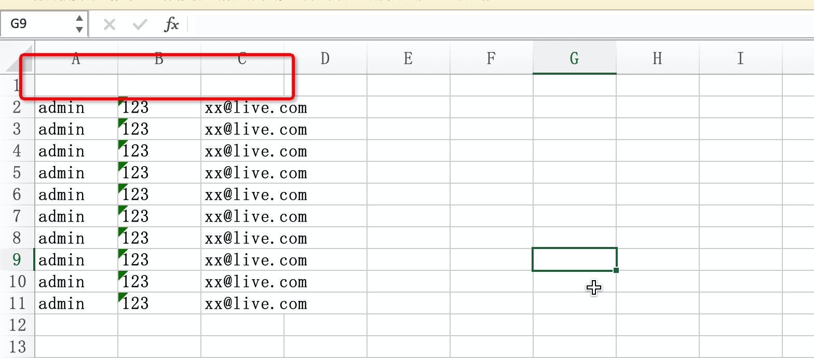
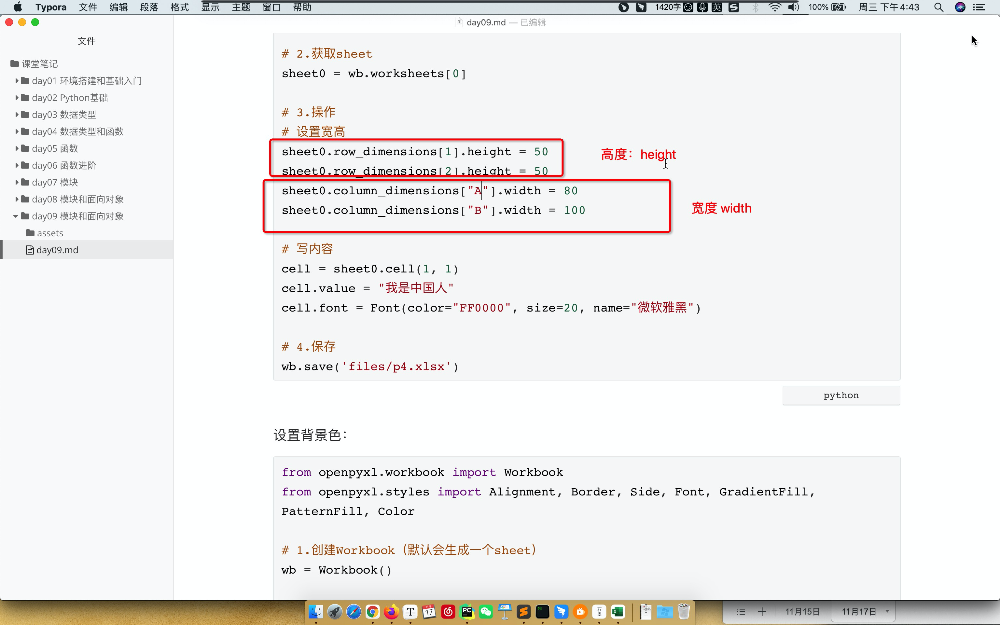
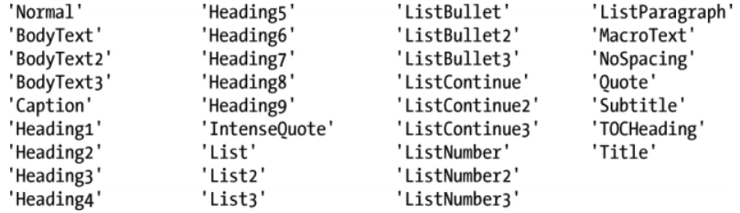

# day09 模块和面向对象

今日概要：

- 模块

  - 自定义模块

  - 内置模块

  - 第三方

    ```
    自动化办公：Excel和Word
    ```

- 面向对象


## 1.面向对象中的概念

对象，什么是对象？

- 内部包含了很多值和功能的 "包裹"。
- 归类概念，把同一类打包在一起。


- 单元格，对象（值/边框/颜色）；写入时，对象（边框/值/颜色)
- sheet，对象（名字/很多单元格）
- workbook，对象。


## 2.模块

### 2.1 自定义模块

### 2.2 内置模块

### 2.3 第三方模块

#### 2.3.1 Excel操作

```
pip install openpyxl
```

##### 1.读



```python
import os
from openpyxl import load_workbook

# 1.获取work book对象
file_path = os.path.join('files', 'p1.xlsx')
work_book_object = load_workbook(file_path)

# 2.读取所有sheet的名字
data_list = work_book_object.sheetnames
print(data_list)

# 3.获取所有的sheet对象（内部包含很多数据）
#   [<Worksheet "数据导出">, <Worksheet "用户列表">, <Worksheet "Sheet1">, <Worksheet "Sheet2">]
v2 = work_book_object.worksheets

# 4.获取某一个sheet对象
sheet_object1 = v2[0]
sheet_object2 = work_book_object["数据导出"]
```


读取cell单元格

```python
import os
from openpyxl import load_workbook

# 1.获取work book对象
file_path = os.path.join('files', 'p1.xlsx')
work_book_object = load_workbook(file_path)

# 2.获取所有的sheet对象（内部包含很多数据）
sheet_object_list = work_book_object.worksheets

# 3.获取某一个sheet对象
sheet_object = sheet_object_list[0]

# ################# 方式1 ####################
# 4.读取sheet中的单元格cell对象
cell_object = sheet_object.cell(1, 1)

# 5.读取cell对象中的文本
print(cell_object.value)

# ################# 方式2 ####################
cell_object2 = sheet_object["E3"]
print(cell_object2.value)
```


读取某一行数据

```python
import os
from openpyxl import load_workbook

# 1.获取work book对象
file_path = os.path.join('files', 'p1.xlsx')
work_book_object = load_workbook(file_path)

# 2.获取所有的sheet对象（内部包含很多数据）
sheet_object_list = work_book_object.worksheets

# 3.获取某一个sheet对象
sheet_object = sheet_object_list[0]

# 4.读取某一行（excel中读取行时，是从1开始，不是从0开始）
row_list = sheet_object[1]
for cell_object in row_list:
    print(cell_object.value)
```


读取所有行的数据

```python
import os
from openpyxl import load_workbook

# 1.获取work book对象
file_path = os.path.join('files', 'p1.xlsx')
work_book_object = load_workbook(file_path)

# 2.获取所有的sheet对象（内部包含很多数据）
sheet_object_list = work_book_object.worksheets

# 3.获取某一个sheet对象
sheet_object = sheet_object_list[0]

# 4.读取所有行
for row in sheet_object.rows:
    row_text_list = []
    for cell_object in row:
        row_text_list.append(cell_object.value)
    print(row_text_list)
```


读取某一列

```python
import os
from openpyxl import load_workbook

# 1.获取work book对象
file_path = os.path.join('files', 'p1.xlsx')
work_book_object = load_workbook(file_path)

# 2.获取所有的sheet对象（内部包含很多数据）
sheet_object_list = work_book_object.worksheets

# 3.获取某一个sheet对象
sheet_object = sheet_object_list[0]

# 4.读取某一列
for row in sheet_object.rows:
    cell_object_0 = row[0]
    cell_object_1 = row[5]
    print(cell_object_0.value, cell_object_1.value)
```


关于合并的单元格：



```python
import os
from openpyxl import load_workbook

# 1.获取work book对象
file_path = os.path.join('files', 'p1.xlsx')
work_book_object = load_workbook(file_path)

# 2.获取所有的sheet对象（内部包含很多数据）
sheet_object_list = work_book_object.worksheets

# 3.获取某一个sheet对象
sheet_object = sheet_object_list[2]

# 4.获取合并的单元格
# cell_1_object = sheet_object.cell(1, 1)  # Cell对象，有值有内容
# print(cell_1_object)
# print(cell_1_object.value)
#
# cell_2_object = sheet_object.cell(1, 2)  # MergedCell对象，无值
# print(cell_2_object)
# print(cell_2_object.value)


# cell_3_object = sheet_object.cell(3, 1)
# print(cell_3_object)
# print(cell_3_object.value)
#
# cell_4_object = sheet_object.cell(4, 1)
# print(cell_4_object)
# print(cell_4_object.value)
```


是否是被合并的单元格：

```python
import os
from openpyxl import load_workbook
from openpyxl.cell.cell import Cell, MergedCell

# 1.获取work book对象
file_path = os.path.join('files', 'p1.xlsx')
work_book_object = load_workbook(file_path)

# 2.获取所有的sheet对象（内部包含很多数据）
sheet_object_list = work_book_object.worksheets

# 3.获取某一个sheet对象
sheet_object = sheet_object_list[2]

# 4.获取合并的单元格（原始内容）
# for row in sheet_object.rows:
#     text_list = []
#     for cell in row:
#         text_list.append(cell.value)
#     print(text_list)

# 4.获取合并的单元格，如果是被合并的单元格值默认等于 -
for row in sheet_object.rows:
    text_list = []
    for cell in row:
        if type(cell) == MergedCell:
            text_list.append("-")
        elif type(cell) == Cell:
            # 判断如果cell是Cell对象、MergedCell
            text_list.append(cell.value)
        else:
            text_list.append("不认识")

    print(text_list)
```


读取被合并单元的真实内容：

```python
import os
from openpyxl import load_workbook
from openpyxl.cell.cell import Cell, MergedCell

# 1.获取work book对象
file_path = os.path.join('files', 'p1.xlsx')
work_book_object = load_workbook(file_path)

# 2.获取所有的sheet对象（内部包含很多数据）
sheet_object_list = work_book_object.worksheets

# 3.获取某一个sheet对象
sheet_object = sheet_object_list[2]


def get_merged_text(coordinate, sheet_obj):
    for item in sheet_obj.merged_cells:
        if coordinate in item:
            return item.start_cell.value


# 4.获取当前sheet中所有的被合并的单元格
for row in sheet_object.rows:
    text_list = []
    for cell in row:
        if type(cell) == MergedCell:
            # 获取单元的内容
            text = get_merged_text(cell.coordinate, sheet_object)
            text_list.append(text)
        elif type(cell) == Cell:
            # 判断如果cell是Cell对象、MergedCell
            text_list.append(cell.value)
        else:
            text_list.append("不认识")

    print(text_list)
```


从第N行开始读：

```python
import os
from openpyxl import load_workbook

# 1.获取work book对象
file_path = os.path.join('files', 'p1.xlsx')
work_book_object = load_workbook(file_path)

# 2.获取所有的sheet对象（内部包含很多数据）
sheet_object_list = work_book_object.worksheets

# 3.获取某一个sheet对象
sheet_object = sheet_object_list[0]

# 4.从第n行开始读取
for row in sheet_object.iter_rows(min_row=2):
    print(row[0].value)

# 5.从第n行读到第m行
for row in sheet_object.iter_rows(min_row=2, max_row=10):
    print(row[0].value)
```


共几行几列：

```python
import os
from openpyxl import load_workbook

# 1.获取work book对象
file_path = os.path.join('files', 'p1.xlsx')
work_book_object = load_workbook(file_path)

# 2.获取所有的sheet对象（内部包含很多数据）
sheet_object_list = work_book_object.worksheets

# 3.获取某一个sheet对象
sheet_object = sheet_object_list[0]

# 4.Excel总共有几行几列
print(sheet_object.max_row)
print(sheet_object.max_column)
```


###### 练习题

1. 读取Excel文件中指定列的数据
   

   输出格式：

   ```
   - 每一行放到一个列表中
   - 直接出列表即可
   
   row_text = [287,"我害怕"..]
   print(row_text)
   ```

   ```python
   import os
   from openpyxl import load_workbook
   
   # 1.获取work book对象
   file_path = os.path.join('files', 'p1.xlsx')
   work_book_object = load_workbook(file_path)
   
   # 2.获取所有的sheet对象（内部包含很多数据）
   sheet_object_list = work_book_object.worksheets
   
   # 3.获取某一个sheet对象
   sheet_object = sheet_object_list[0]
   
   # 从2行开始读取
   for row_list in sheet_object.iter_rows(min_row=2):
       text_list = [
           row_list[0].value,
           row_list[3].value,
           row_list[4].value,
           row_list[6].value,
           row_list[7].value,
       ]
       print(text_list)
   ```

2. 在第1题的基础上，关于时长，提取播放时间，筛选出播放时长 > 10 分钟的所有数据。
   

   ```python
   import os
   import re
   from openpyxl import load_workbook
   
   # 1.获取work book对象
   file_path = os.path.join('files', 'p1.xlsx')
   work_book_object = load_workbook(file_path)
   
   # 2.获取所有的sheet对象（内部包含很多数据）
   sheet_object_list = work_book_object.worksheets
   
   # 3.获取某一个sheet对象
   sheet_object = sheet_object_list[0]
   
   # 从2行开始读取
   for row_list in sheet_object.iter_rows(min_row=2):
       text = row_list[7].value  # "20分钟"
       time_string = re.findall("(\d+)分钟", text)[0]
       time_int = int(time_string)
       if time_int <= 10:
           continue
       text_list = [
           row_list[0].value,
           row_list[3].value,
           row_list[4].value,
           row_list[6].value,
           row_list[7].value,
       ]
       print(text_list)
   ```

3. 获取【厦门】【手机】中的总个数。
   

   ```python
   import os
   from openpyxl import load_workbook
   
   # 1.获取work book对象
   file_path = os.path.join('files', '2020年1月份营收.xlsx')
   work_book_object = load_workbook(file_path)
   
   # 2.获取厦门的sheet对象
   # 方式1：
   sheet_object = work_book_object.worksheets[3]
   
   # 方式2：
   # sheet_object = work_book_object["厦门"]
   
   
   total_count = 0
   for row in sheet_object.iter_rows(min_row=2):
       count = row[1].value
       if not count:
           continue
       total_count += count
   
   print(total_count)
   ```

4. 获取各个地区【手机】销售的数量。

   ```python
   result = {
       "上海":100,
       "厦门":100,
       "北京":100,
       "广州":100,
   }
   ```

   ```python
   import os
   from openpyxl import load_workbook
   
   # 1.获取work book对象
   file_path = os.path.join('files', '2020年1月份营收.xlsx')
   work_book_object = load_workbook(file_path)
   
   # 2.获取所有的sheet
   # 方式1：
   # for sheet_object in work_book_object.worksheets:
   #     print(sheet_object.title, sheet_object)
   
   # 方式2：
   # for name in work_book_object.sheetnames:
   #     print(name, work_book_object[name])
   ```

   ```python
   import os
   from openpyxl import load_workbook
   
   # 1.获取work book对象
   file_path = os.path.join('files', '2020年1月份营收.xlsx')
   work_book_object = load_workbook(file_path)
   
   # 2.获取所有的sheet
   # 方式1：
   # for sheet_object in work_book_object.worksheets:
   #     print(sheet_object.title, sheet_object)
   
   # 方式2：
   # for name in work_book_object.sheetnames:
   #     print(name, work_book_object[name])
   
   result = {}
   for sheet_object in work_book_object.worksheets:
       sheet_name = sheet_object.title
   
       total_count = 0
       for row_list in sheet_object.iter_rows(min_row=2):
           count = row_list[1].value
           if not count:
               continue
           total_count += count
   
       result[sheet_name] = total_count
   
   print(result)
   ```

5. 提供了很多个文件。
   

   ```python
   import os
   
   folder_path = os.path.join('files', "营收报表")
   
   for name in os.listdir(folder_path):
       print(name)
   ```

   需求：找到2020年所有的营收报告，最终得到的字典。

   ```python
   result = {
       "2020年1月份营收":{
           "上海":100,
           "厦门":100,
           "北京":100,
           "广州":100,
       },
       "2020年2月份营收":{
           "上海":100,
           "厦门":100,
           "北京":100,
           "广州":100,
       },
       ...
   }
   ```

   ```python
   import os
   import os
   from openpyxl import load_workbook
   
   folder_path = os.path.join('files', "营收报表")
   
   result = {}
   
   # 1.循环所有的文件
   for name in os.listdir(folder_path):
       if not name.startswith("2020"):
           continue
       title = name.rsplit('.', maxsplit=1)[0]
       excel_file_path = os.path.join(folder_path, name)
       # print(title, excel_file_path)
   
       # 2.打开excel文件
       work_book_object = load_workbook(excel_file_path)
   
       # 3.获取excel中所有sheet对象
       file_dict = {}
       for sheet_object in work_book_object.worksheets:
           total_count = 0
           for row_list in sheet_object.iter_rows(min_row=2):
               count = row_list[1].value
               if not count:
                   continue
               total_count += count
           file_dict[sheet_object.title] = total_count
   
       # print(title, file_dict)
       result[title] = file_dict
   
   print(result)
   ```

   ```python
   import os
   import os
   from openpyxl import load_workbook
   
   FOLDER_PATH = os.path.join('files', "营收报表")
   
   
   def get_sheet_dict(excel_file_path):
       work_book_object = load_workbook(excel_file_path)
       file_dict = {}
       for sheet_object in work_book_object.worksheets:
           total_count = 0
           for row_list in sheet_object.iter_rows(min_row=2):
               count = row_list[1].value
               if not count:
                   continue
               total_count += count
           file_dict[sheet_object.title] = total_count
       return file_dict
   
   
   def run():
       result = {}
       # 1.循环所有的文件
       for name in os.listdir(FOLDER_PATH):
           if not name.startswith("2020"):
               continue
           title = name.rsplit('.', maxsplit=1)[0]
           excel_file_path = os.path.join(FOLDER_PATH, name)
   
           # 3.传递一个excel文件的work_book对象，获取内部各个sheet中的手机的销售量。
           file_dict = get_sheet_dict(excel_file_path)
   
           # print(title, file_dict)
           result[title] = file_dict
   
       print(result)
   
   
   if __name__ == '__main__':
       run()
   ```


##### 2.写

- 修改

  ```
  - 读取，将所有的内容都读取到内存。
  - 都是在内存中修改。
  - 保存。
  ```

  ```python
  import os
  from openpyxl import load_workbook
  
  # 1.获取work book对象
  file_path = os.path.join('files', 'p1.xlsx')
  work_book_object = load_workbook(file_path)
  
  sheet_object = work_book_object.worksheets[0]
  
  # 2.修改内容
  cell_object = sheet_object.cell(1, 1)
  cell_object.value = "序号"
  
  # 3.将内存中的数据写入到文件
  # work_book_object.save("files/news.xlsx")
  work_book_object.save(file_path)
  ```

- 新建

  ```python
  - 读取，空内容。
  - 在内存中修改操作。
  - 保存。
  ```

  ```python
  from openpyxl.workbook import Workbook
  
  # 1.新建sheet
  work_book_object = Workbook()
  
  sheet_object = work_book_object.worksheets[0]
  
  # 2.写入内容
  cell_object = sheet_object.cell(1, 1)
  cell_object.value = "你好呀"
  
  # 3.保存
  work_book_object.save('files/p2.xlsx')
  ```


创建sheet：

```python
from openpyxl.workbook import Workbook

# 1.创建Workbook（默认会生成一个sheet）
wb = Workbook()

# 2.默认sheet修改名称
sheet0 = wb.worksheets[0]
sheet0.title = "数据集"
c0 = sheet0.cell(1, 2)
c0.value = "数据测试"

sheet1 = wb.create_sheet("上海", 1)
c1 = sheet1.cell(1, 2)
c1.value = "哈哈哈哈哈"

sheet2 = wb.create_sheet("北京", 2)
c2 = sheet2.cell(2, 3)
c2.value = "老北京扎镜面"

# 3.保存
wb.save('files/p3.xlsx')
```


拷贝sheet：

```python
import os
from openpyxl import load_workbook

# 获取work book对象
file_path = os.path.join('files', 'p1.xlsx')
wb = load_workbook(file_path)

# 获取第1个sheet
sheet_object0 = wb.worksheets[0]

# 拷贝
new_sheet = wb.copy_worksheet(sheet_object0)
new_sheet.title = "备份"

# 将内存中的数据写入到文件
wb.save("files/news.xlsx")
```


删除sheet：

```python
import os
from openpyxl import load_workbook

# 获取work book对象
file_path = os.path.join('files', 'p1.xlsx')
wb = load_workbook(file_path)

del wb["用户列表"]

# 将内存中的数据写入到文件
wb.save("files/news.xlsx")
```


单元格中写文本：

```python
from openpyxl.workbook import Workbook

# 1.创建Workbook（默认会生成一个sheet）
wb = Workbook()

# 2.获取sheet
sheet0 = wb.worksheets[0]

# 3.操作
cell_object1 = sheet0.cell(1, 1)
cell_object1.value = "123123"

cell_object2 = sheet0['B3']
cell_object2.value = '123'


# 4.保存
wb.save('files/p4.xlsx')
```

```python
from openpyxl.workbook import Workbook

# 1.创建Workbook（默认会生成一个sheet）
wb = Workbook()

# 2.获取sheet
sheet0 = wb.worksheets[0]

# 3.操作（简写）
sheet0.cell(1, 1).value = "哈哈哈"
sheet0['B3'].value = '阿斯顿发士大夫'

# 4.保存
wb.save('files/p4.xlsx')
```


设置对齐方式：

```python
from openpyxl.workbook import Workbook
from openpyxl.styles import Alignment

# 1.创建Workbook（默认会生成一个sheet）
wb = Workbook()

# 2.获取sheet
sheet0 = wb.worksheets[0]

# 3.操作（居中和换行）
cell = sheet0.cell(1, 1)
cell.value = "我是中国人我是中国人我是中国人我是中国人"
cell.alignment = Alignment(horizontal="center", vertical="center", wrap_text=True)

# 4.保存
wb.save('files/p4.xlsx')
```

```python
from openpyxl.workbook import Workbook
from openpyxl.styles import Alignment

# 1.创建Workbook（默认会生成一个sheet）
wb = Workbook()

# 2.获取sheet
sheet0 = wb.worksheets[0]

# 3.操作（居中和换行）
name_list = ["陆梅", "郑莉", "周雪梅", "张可可", "李京生"]
for col, text in enumerate(name_list, 1):
    cell = sheet0.cell(1, col)
    cell.value = text
    cell.alignment = Alignment(horizontal="center", vertical="center", wrap_text=True)

# 4.保存
wb.save('files/p4.xlsx')
```


设置边框：

```python
from openpyxl.workbook import Workbook
from openpyxl.styles import Alignment, Border, Side

# 1.创建Workbook（默认会生成一个sheet）
wb = Workbook()

# 2.获取sheet
sheet0 = wb.worksheets[0]

# 3.操作

cell = sheet0.cell(1, 1)
cell.value = "我是中国人"
cell.border = Border(
    top=Side(style="thin", color="0000FF"),
    right=Side(style="medium", color="0000FF"),
    left=Side(style="thin", color="0000FF"),
    bottom=Side(style="thin", color="0000FF"),
)

# 4.保存
wb.save('files/p4.xlsx')
```


设置字体：大小、颜色、样式：

```python
from openpyxl.workbook import Workbook
from openpyxl.styles import Alignment, Border, Side, Font

# 1.创建Workbook（默认会生成一个sheet）
wb = Workbook()

# 2.获取sheet
sheet0 = wb.worksheets[0]

# 3.操作
cell = sheet0.cell(1, 1)
cell.value = "我是中国人"
cell.font = Font(color="FF0000", size=40, name="微软雅黑")

# 4.保存
wb.save('files/p4.xlsx')
```


设置行高和宽：

```python
from openpyxl.workbook import Workbook
from openpyxl.styles import Alignment, Border, Side, Font

# 1.创建Workbook（默认会生成一个sheet）
wb = Workbook()

# 2.获取sheet
sheet0 = wb.worksheets[0]

# 3.操作
# 设置宽高
sheet0.row_dimensions[1].height = 50
sheet0.row_dimensions[2].height = 50
sheet0.column_dimensions["A"].width = 80
sheet0.column_dimensions["B"].width = 100

# 写内容
cell = sheet0.cell(1, 1)
cell.value = "我是中国人"
cell.font = Font(color="FF0000", size=20, name="微软雅黑")

# 4.保存
wb.save('files/p4.xlsx')
```


设置背景色：

```python
from openpyxl.workbook import Workbook
from openpyxl.styles import Alignment, Border, Side, Font, GradientFill, PatternFill, Color

# 1.创建Workbook（默认会生成一个sheet）
wb = Workbook()

# 2.获取sheet
sheet0 = wb.worksheets[0]

# 3.操作
cell = sheet0.cell(1, 1)
cell.value = "我是中国人"
cell.fill = PatternFill("solid", fgColor="F4A460")

# 4.保存
wb.save('files/p5.xlsx')
```


##### 整合代码

```python
from openpyxl.workbook import Workbook
from openpyxl.styles import Alignment, Border, Side, Font, PatternFill

# 1.创建Workbook（默认会生成一个sheet）
wb = Workbook()

# 2.获取sheet
sheet0 = wb.worksheets[0]

# 3.操作
# 设置宽度
sheet0.column_dimensions["A"].width = 100
sheet0.column_dimensions["B"].width = 100
sheet0.column_dimensions["C"].width = 100
sheet0.column_dimensions["D"].width = 100
sheet0.column_dimensions["E"].width = 100

name_list = ["陆梅", "郑莉", "周雪梅", "张可可", "李京生"]
for col, text in enumerate(name_list, 1):
    cell = sheet0.cell(1, col)
    cell.value = text
    cell.alignment = Alignment(horizontal="center", vertical="center", wrap_text=True)
    cell.border = Border(
        top=Side(style="thin", color="000000"),
        right=Side(style="medium", color="000000"),
        left=Side(style="thin", color="000000"),
        bottom=Side(style="medium", color="000000"),
    )
    cell.font = Font(color='FF0000', size=18)
    cell.fill = PatternFill("solid", fgColor="F4A460")

# 4.保存
wb.save('files/p4.xlsx')
```


###### 练习题

1. 将txt文件的内容写到Excel中。

   ```
   admin,123,xx@live.com
   admin,123,xx@live.com
   admin,123,xx@live.com
   admin,123,xx@live.com
   ```

   ```python
   from openpyxl.workbook import Workbook
   
   # 1.新建sheet
   work_book_object = Workbook()
   
   sheet_object = work_book_object.worksheets[0]
   
   file_object = open('files/user.txt', mode='r', encoding='utf-8')
   
   row_index = 1
   
   for line in file_object:
       line = line.strip()
       line_data_list = line.split(",")
       # print(line_data_list)  # ['admin', '123', 'xx@live.com']
   
       # 第1列
       c1 = sheet_object.cell(row_index, 1)
       c1.value = line_data_list[0]
   
       # 第2列
       c2 = sheet_object.cell(row_index, 2)
       c2.value = line_data_list[1]
   
       # 第3列
       c3 = sheet_object.cell(row_index, 3)
       c3.value = line_data_list[2]
   
       row_index += 1
   
   file_object.close()
   
   # 3.保存
   work_book_object.save('files/p6.xlsx')
   ```

   ```python
   from openpyxl.workbook import Workbook
   
   # 1.新建sheet
   work_book_object = Workbook()
   
   sheet_object = work_book_object.worksheets[0]
   
   file_object = open('files/user.txt', mode='r', encoding='utf-8')
   
   row_index = 1
   
   for line in file_object:
       line = line.strip()
       line_data_list = line.split(",")
       # print(line_data_list)  # ['admin', '123', 'xx@live.com']
       for col, item in enumerate(line_data_list, 1):
           c1 = sheet_object.cell(row_index, col)
           c1.value = item
   
       row_index += 1
   
   file_object.close()
   
   # 3.保存
   work_book_object.save('files/p7.xlsx')
   ```

2. 修改上述程序实现，在Excel添加表头。

   ```
   用户名   密码   邮箱
   ```

   

   ```python
   from openpyxl.workbook import Workbook
   
   # 1.新建sheet
   work_book_object = Workbook()
   sheet_object = work_book_object.worksheets[0]
   
   # 2.处理表头
   h1 = sheet_object.cell(1, 1)
   h1.value = "用户名"
   
   h2 = sheet_object.cell(1, 2)
   h2.value = "密码"
   
   h3 = sheet_object.cell(1, 3)
   h3.value = "邮箱"
   
   file_object = open('files/user.txt', mode='r', encoding='utf-8')
   row_index = 2
   for line in file_object:
       line = line.strip()
       line_data_list = line.split(",")
       # print(line_data_list)  # ['admin', '123', 'xx@live.com']
       for col, item in enumerate(line_data_list, 1):
           c1 = sheet_object.cell(row_index, col)
           c1.value = item
   
       row_index += 1
   file_object.close()
   # 3.保存
   work_book_object.save('files/p7.xlsx')
   ```

   ```python
   from openpyxl.workbook import Workbook
   
   # 1.新建sheet
   work_book_object = Workbook()
   sheet_object = work_book_object.worksheets[0]
   
   # 2.处理表头
   header_list = ["用户名", "密码", "邮箱"]
   for col, item in enumerate(header_list, 1):
       cell = sheet_object.cell(1, col)
       cell.value = item
   
   file_object = open('files/user.txt', mode='r', encoding='utf-8')
   row_index = 2
   for line in file_object:
       line = line.strip()
       line_data_list = line.split(",")
       # print(line_data_list)  # ['admin', '123', 'xx@live.com']
       for col, item in enumerate(line_data_list, 1):
           c1 = sheet_object.cell(row_index, col)
           c1.value = item
   
       row_index += 1
   file_object.close()
   # 3.保存
   work_book_object.save('files/p7.xlsx')
   ```

3. 给表头加上样式。

   ```
   - 背景色
   - 字体颜色
   - 边框
   
   https://tool.oschina.net/commons?type=3
   ```

   ```python
   # 老师可以讲一下enumerate吗，我有点不懂这个。
   data_list = ["汽车", "飞机", "AK47"]
   for idx, item in enumerate(data_list, 1):
       print(idx, item)
   ```

   ```python
   from openpyxl.workbook import Workbook
   from openpyxl.styles import Alignment, Border, Side, Font, PatternFill
   from openpyxl.utils import get_column_letter
   
   border = Border(
       top=Side(style="thin", color="000000"),
       right=Side(style="thin", color="000000"),
       left=Side(style="thin", color="000000"),
       bottom=Side(style="thin", color="000000"),
   )
   
   # 1.新建sheet
   work_book_object = Workbook()
   sheet_object = work_book_object.worksheets[0]
   
   # 2.设置列宽度
   # sheet_object.column_dimensions['A'].width = 200
   # sheet_object.column_dimensions['B'].width = 200
   # sheet_object.column_dimensions['C'].width = 200
   # sheet_object.column_dimensions['D'].width = 200
   # sheet_object.column_dimensions['E'].width = 200
   for idx in range(1, 4):
       location = get_column_letter(idx)
       sheet_object.column_dimensions[location].width = 200
   
   # 3.处理表头
   header_list = ["用户名", "密码", "邮箱"]
   for col, item in enumerate(header_list, 1):
       cell = sheet_object.cell(1, col)
       cell.value = item
       cell.alignment = Alignment(horizontal="center", vertical="center", wrap_text=True)
       cell.border = border
       cell.font = Font(color='000000', size=12)
       cell.fill = PatternFill("solid", fgColor="F4A460")
   
   file_object = open('files/user.txt', mode='r', encoding='utf-8')
   row_index = 2
   for line in file_object:
       line = line.strip()
       line_data_list = line.split(",")
       # print(line_data_list)  # ['admin', '123', 'xx@live.com']
       for col, item in enumerate(line_data_list, 1):
           c1 = sheet_object.cell(row_index, col)
           c1.value = item
           c1.border = border
   
       row_index += 1
   file_object.close()
   # 3.保存
   work_book_object.save('files/p7.xlsx')
   ```


##### 3.补充：写合并单元格

设置合并单元格：

```python
from openpyxl.workbook import Workbook
from openpyxl.styles import Alignment, Border, Side, Font

# 1.创建Workbook（默认会生成一个sheet）
wb = Workbook()

# 2.获取sheet
sheet = wb.worksheets[0]

# 3.操作
# cell = sheet.cell(2, 3)
# cell.value = "我是中国人"

sheet.merge_cells(start_row=5, start_column=5, end_row=8, end_column=10)
# sheet.merge_cells("D2:F8")


# 4.保存
wb.save('files/p8.xlsx')
```

```python
from openpyxl.workbook import Workbook
from openpyxl.styles import Alignment, Border, Side, Font

# 1.创建Workbook（默认会生成一个sheet）
wb = Workbook()

# 2.获取sheet
sheet = wb.worksheets[0]

# 3.操作
cell = sheet.cell(1, 1)
cell.value = "中国联通"
cell.alignment = Alignment(horizontal="center", vertical="center")

sheet.merge_cells(start_row=1, start_column=1, end_row=1, end_column=3)

# 4.保存
wb.save('files/p8.xlsx')
```


整合上述功能和合并单元格的功能：

```python
from openpyxl.workbook import Workbook
from openpyxl.styles import Alignment, Border, Side, Font, PatternFill
from openpyxl.utils import get_column_letter

border = Border(
    top=Side(style="thin", color="000000"),
    right=Side(style="thin", color="000000"),
    left=Side(style="thin", color="000000"),
    bottom=Side(style="thin", color="000000"),
)

# 1.新建sheet
work_book_object = Workbook()
sheet_object = work_book_object.worksheets[0]

# 2.设置列宽度
# sheet_object.column_dimensions['A'].width = 200
# sheet_object.column_dimensions['B'].width = 200
# sheet_object.column_dimensions['C'].width = 200
# sheet_object.column_dimensions['D'].width = 200
# sheet_object.column_dimensions['E'].width = 200
for idx in range(1, 4):
    location = get_column_letter(idx)
    sheet_object.column_dimensions[location].width = 200

# 大表头
cell = sheet_object.cell(1, 1)
cell.value = "中国联通"
cell.alignment = Alignment(horizontal="center", vertical="center")
cell.font = Font(color='000000', size=25)
cell.border = border
sheet_object.merge_cells(start_row=1, start_column=1, end_row=1, end_column=3)
sheet_object.row_dimensions[1].height = 50
# 3.处理表头
header_list = ["用户名", "密码", "邮箱"]
for col, item in enumerate(header_list, 1):
    cell = sheet_object.cell(2, col)
    cell.value = item
    cell.alignment = Alignment(horizontal="center", vertical="center", wrap_text=True)
    cell.border = border
    cell.font = Font(color='000000', size=12)
    cell.fill = PatternFill("solid", fgColor="F4A460")

file_object = open('files/user.txt', mode='r', encoding='utf-8')
row_index = 3
for line in file_object:
    line = line.strip()
    line_data_list = line.split(",")
    # print(line_data_list)  # ['admin', '123', 'xx@live.com']
    for col, item in enumerate(line_data_list, 1):
        c1 = sheet_object.cell(row_index, col)
        c1.value = item
        c1.border = border

    row_index += 1
file_object.close()

# 3.保存
work_book_object.save('files/p7.xlsx')
```


###### 更正




##### 4.补充：写入公式

```python
from openpyxl.workbook import Workbook
from openpyxl.styles import Alignment, Border, Side, Font

# 1.创建Workbook（默认会生成一个sheet）
wb = Workbook()

# 2.获取sheet
sheet0 = wb.worksheets[0]

# 3.操作

# 个数
sheet0["A1"] = 10
sheet0["A2"] = 20
sheet0["A3"] = 8
# 数量
sheet0["B1"] = 3
sheet0["B2"] = 8
sheet0["B3"] = 9

# 写入公式
sheet0["C1"] = "=A1*B1"
sheet0["C2"] = "=A2*B2"
sheet0["C3"] = "=A3*B3"

# 写入公式
sheet0["D1"] = "=SUM(A1,B1)"
sheet0["D2"] = "=SUM(A2,B2)"
sheet0["D3"] = "=SUM(A3,B3)"

# 4.保存
wb.save('files/p4.xlsx')
```

```python
from openpyxl.workbook import Workbook
from openpyxl.styles import Alignment, Border, Side, Font

# 1.创建Workbook（默认会生成一个sheet）
wb = Workbook()

# 2.获取sheet
sheet0 = wb.worksheets[0]

cell = sheet0.cell(3,9)
res = cell.coordinate
print(res)


# 4.保存
wb.save('files/p4.xlsx')
```


##### 5.补充：删除

```python
import os
from openpyxl import load_workbook

# 1.获取work book对象
file_path = os.path.join('files', 'p1.xlsx')
work_book_object = load_workbook(file_path)

sheet_object = work_book_object.worksheets[0]

# idx=从那个位置开始
# amount=向后处理多少个（默认值1）
sheet_object.delete_rows(idx=5, amount=10)
sheet_object.delete_cols(idx=5, amount=10)

work_book_object.save('files/news.xlsx')
```


##### 6.补充：插入

```python
import os
from openpyxl import load_workbook

# 1.获取work book对象
file_path = os.path.join('files', 'p1.xlsx')
work_book_object = load_workbook(file_path)

sheet_object = work_book_object.worksheets[0]

# idx=从那个位置开始
# amount=向后处理多少个（默认值1）
sheet_object.insert_rows(5, 8)
# sheet_object.insert_cols(5,8)


work_book_object.save('files/news.xlsx')
```


##### 7.关于追加

```python
import os
from openpyxl import load_workbook
from openpyxl.workbook import Workbook


def write_excel(user, pwd):
    # 1.文件是否存在
    file_path = os.path.join("files", "db.xlsx")
    if os.path.exists(file_path):
        work_book_object = load_workbook(file_path)
    else:
        work_book_object = Workbook()

    sheet = work_book_object.worksheets[0]

    first_row_data = sheet.cell(1, 1).value
    if not first_row_data:
        row_index = 1
    else:
        row_index = sheet.max_row + 1

    sheet.cell(row_index, 1).value = user
    sheet.cell(row_index, 2).value = pwd

    work_book_object.save(file_path)


def run():
    while True:
        user = input("用户名：")
        pwd = input("密码：")
        write_excel(user, pwd)


if __name__ == '__main__':
    run()
```


##### 方法

- 搜索

  ```
  - 百度（最不可信）
  - 谷歌
  - stackoverflow
  ```

- 官方文档和源码（面向对象）


#### 2.3.2 Word格式

```python
pip install python-docx
```

- .docx，本质就是一个压缩包。

- .docx，底层存储是基于xml格式，`python-docx`本质上就是解析xml格式文件。

  ```
  <x1>Doddddddcument Title</x1>
  <xx>
  	<mm>Asdfas,dfasdfdfadasdfasdfasdfasdfasdf</mm>
  </xx>
  ```

  

##### 1.读

- 段落对象（paragraph）
- 小段（run）

```python
import docx

doc = docx.Document("docfiles/demo.docx")

# 段落对象
p1 = doc.paragraphs[1]
print(p1.text)  # Asdfas,dfasdfdfadasdfasdfasdfasdfasdf

# 获取段落中的所有runs
# [run对象,run对象,run对象,run对象]
r1 = p1.runs[1]
print(r1.text)
print(r1.bold)
print(r1.font.color.rgb)
```




问题：paragraph只能是代指普通编写的文本，图片无法获取的。（难）

问题：paragraph只能是代指普通编写的文本，表格无法获取的。（简+难）

- 简单：段落和表格独立操作。
- 难点：逐行读取。


