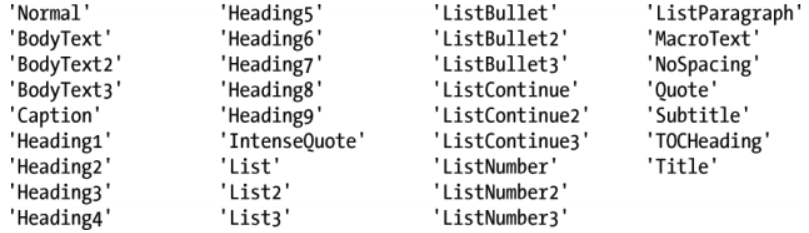
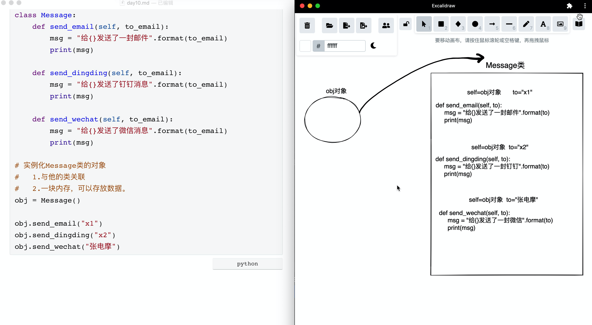
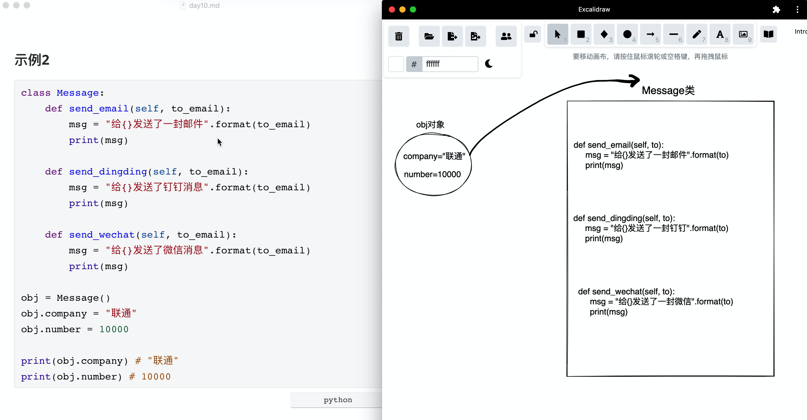
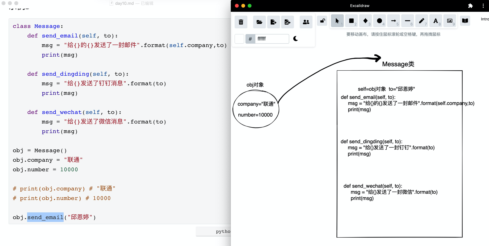
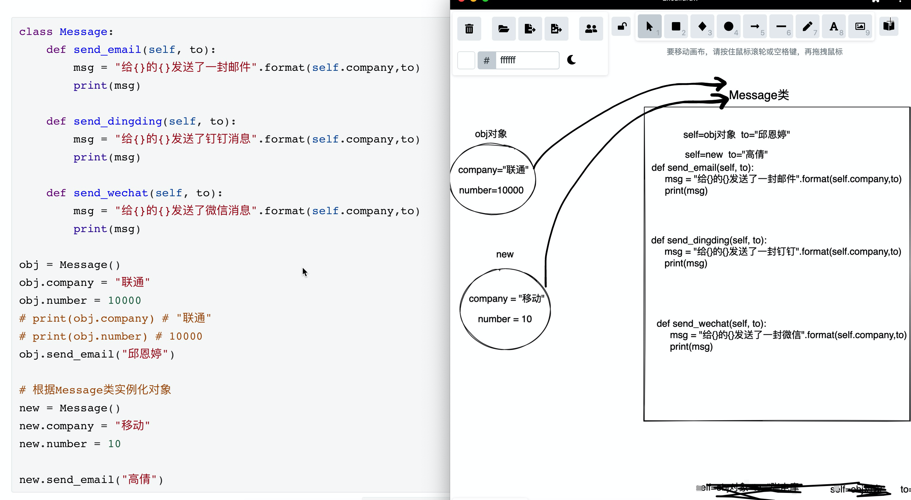
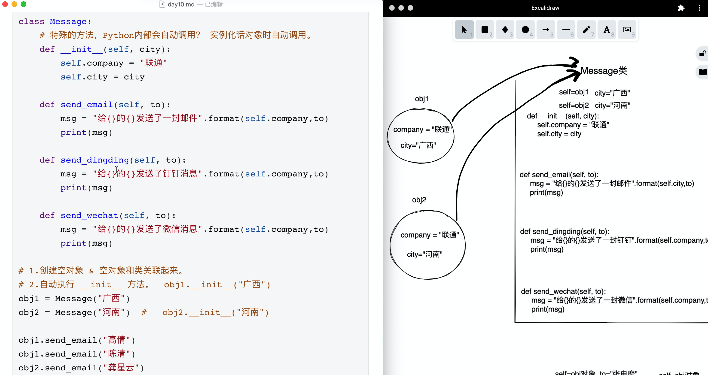
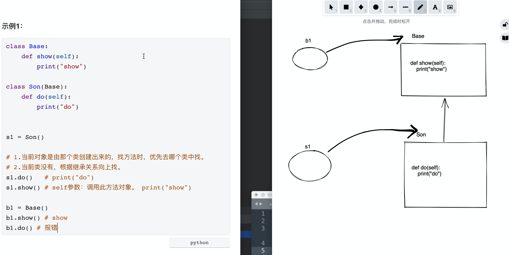
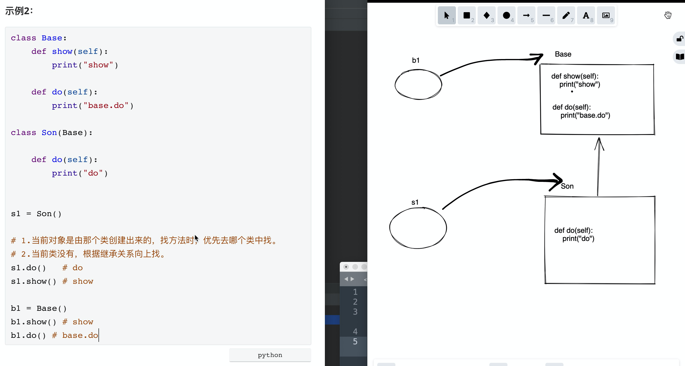
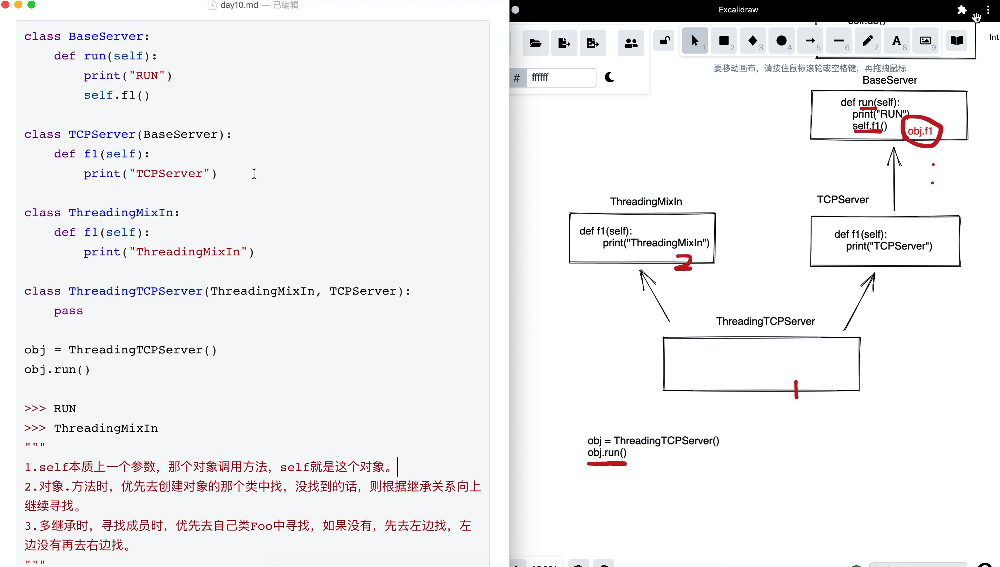

# day10 模块和面向对象

今日概要：

- 第三方模块：word格式
- 面向对象


## 1.word格式（第三方模块）

- 自定义模块：..
- 内置模块：...
- 第三方模块：requests、bs4、openpyxl、python-docx


### 1.1 快速上手

```
pip install python-docx
```

- docx文件，本质上压缩包。

- docx文件本质是由标签将数据包裹起来的（XML格式）

  ```python
  <h>asdfsadf</h>
  <p>
  	<xxx>ff</xxx>
  </p>
  ```


docx中的概念：

- paragraph，段落。
  - run，小段。
- table，表格。


问题：从上到下去解析一个word文件，遇到 表格、图片，无法解析出内容。


### 1.2 读取

#### 1.文本

```python
import docx

doc = docx.Document("docfiles/demo.docx")

for p in doc.paragraphs:
    print(p.style.name, '--->', p.text)
```


#### 2.文本+图片

获取图片ID:

```python
import re
import docx

doc = docx.Document("docfiles/demo2.docx")

# 循环所有的段落 p_obj 对象（读取xml文件并将文件格式处理）
for p_obj in doc.paragraphs:
    # print(p_obj.style.name, '--->', p_obj.text)
    # 原始内容
    # print(p_obj._p.xml)
    if "Graphic" in p_obj._p.xml:
        # 图片：正则获取图片ID
        image_id = re.findall('<a:blip r:embed="(\w+)"/>', p_obj._p.xml)[0]
        print("图片ID=", image_id)
    else:
        # 文本
        print(p_obj.text)
```


获取所有图片id=图片路径的对应关系：

```python
import re
import docx
from docx.parts.image import ImagePart

# {rId6:'',rId7:''}

doc = docx.Document("docfiles/demo2.docx")
image_rel_dict = {}
for item in doc.part.rels.values():
    if type(item.target_part) == ImagePart:
        # print(item.rId, item.target_part.partname)
        image_rel_dict[item.rId] = item.target_part.partname

print(image_rel_dict)
# {'rId8': '/word/media/image3.png', 'rId7': '/word/media/image2.png', 'rId6': '/word/media/image1.png'}
```


遍历word中的没一个段落并获取所有的文字和图片地址：

```python
import re
import docx
from docx.parts.image import ImagePart

# {rId6:'',rId7:''}

doc = docx.Document("docfiles/demo2.docx")

# ################## 1.获取Id对应关系 ##################
image_rel_dict = {}
for item in doc.part.rels.values():
    if type(item.target_part) == ImagePart:
        # print(item.rId, item.target_part.partname)
        image_rel_dict[item.rId] = item.target_part.partname

# ################## 2.读取word文件 ##################
for obj in doc.paragraphs:
    if "Graphic" in obj._p.xml:
        image_id = re.findall('<a:blip r:embed="(\w+)"/>', obj._p.xml)[0]
        image_path = image_rel_dict[image_id]
        print(image_path)
    else:
        # 文本
        print(obj.text)
```


word文件进行处理解压：

```python
import os
import shutil

# 1.重命名（拷贝）
file_path = os.path.join("docfiles", 'demo2.docx')
zip_file_path = os.path.join('docfiles', 'demo2.zip')

shutil.copy(file_path, zip_file_path)

# 2.解压zip文件
target_folder = os.path.join("docfiles", 'demo2')

shutil.unpack_archive(zip_file_path, target_folder, format='zip')
```


#### 3.文本和表格

- 基于底层原来来进行处理

- 段落 和 表格 ，内部已解析，只不过把他们独立的存放。

  ```python
  import docx
  
  doc = docx.Document("docfiles/demo3.docx")
  
  for p in doc.paragraphs:
      print(p.style.name, '--->', p.text)
  
  for t in doc.tables:
      print(t)
  ```

  ```python
  <h>asdfsadf</h>             -> CT_P               -> paragraph对象.text
  <p>                         -> CT_Tbl             -> table对象
  	<xxx>ff</xxx>
  </p>
  <h>asdfsadf</h>             -> CT_P
  <h>asdfsadf</h>             -> CT_P
  <h>asdfsadf</h>             -> CT_P
  <p>                         -> CT_Tbl
  	<xxx>ff</xxx>
  </p>
  ```

  

分开存放：

```python
import docx

doc = docx.Document("docfiles/demo3.docx")

for p in doc.paragraphs:
    print(p)

for t in doc.tables:
    print(t)
```


逐行获取数据格式：

```python
import docx
from docx.oxml.table import CT_Tbl
from docx.oxml.text.paragraph import CT_P

from docx.table import Table
from docx.text.paragraph import Paragraph

doc = docx.Document("docfiles/demo3.docx")

# 循环中间类型格式数据
body = doc.element.body

for child in body.iterchildren():
    if type(child) == CT_Tbl:
        table_obj = Table(child, body)
        print("表格", table_obj)
    elif type(child) == CT_P:
        para_obj = Paragraph(child, body)
        print("段落", para_obj)
```


根据对象去获取文本：

```python
import docx

doc = docx.Document("docfiles/demo3.docx")

for p in doc.paragraphs:
    print(p.text)
```

```python
import docx

doc = docx.Document("docfiles/demo3.docx")


def get_table_list(table_object):
    table_list = []
    for row_object in table_object.rows:
        row_text_list = []
        for cell in row_object.cells:
            row_text_list.append(cell.text)
        table_list.append(row_text_list)
    return table_list


for t in doc.tables:
    data = get_table_list(t)
    print(data)

"""
table_list = [
    ['歌曲', '演唱者', '作曲', '作词', '类型'], 
    ['《风起时》', '胡歌', '孟可', '海宴', '主题曲、片尾曲'], 
    ['《红颜旧》', '刘涛', '赵佳霖', '袁亮', '插曲'], 
    ['《赤血长殷》', '王凯', '于海航', '清彦、冰封', '插曲']
]
"""
```


结合文本和表格：

```python
import docx
from docx.oxml.table import CT_Tbl
from docx.oxml.text.paragraph import CT_P

from docx.table import Table
from docx.text.paragraph import Paragraph


def get_table_list(table_object):
    table_list = []
    for row_object in table_object.rows:
        row_text_list = []
        for cell in row_object.cells:
            row_text_list.append(cell.text)
        table_list.append(row_text_list)
    return table_list


doc = docx.Document("docfiles/demo3.docx")

# 循环中间类型格式数据
body = doc.element.body

for child in body.iterchildren():
    if type(child) == CT_Tbl:
        table_obj = Table(child, body)
        data = get_table_list(table_obj)
        print(data)
    elif type(child) == CT_P:
        para_obj = Paragraph(child, body)
        print(para_obj.text)
```


### 1.3 写入

#### 1.段落

```python
import docx

doc = docx.Document()

doc.add_paragraph(text="中国联通")
doc.add_paragraph(text="中国广西联通")

doc.save('docfiles/new.docx')
```


#### 2.段落和run

```python
import docx

doc = docx.Document()

# 代指当前这个段落
p1 = doc.add_paragraph(text="中国联通")
p1.add_run(text="哈哈哈")
p1.add_run(text="黑盒红")

p2 = doc.add_paragraph(text="中国广西联通")
p2.add_run(text="谢新雪")

doc.save('docfiles/new.docx')
```


#### 3.添加格式




```python
import docx

doc = docx.Document()

# 代指当前这个段落
doc.add_paragraph(text="中国联通", style="Heading 1")
doc.add_paragraph(text="中国联通是中国最NB的运营商...")

doc.add_paragraph(text="河北联通", style="Heading 2")
doc.add_paragraph(text="阿萨德发短发水电费...")
doc.add_paragraph(text="广西联通", style="Heading 2")
doc.add_paragraph(text="法师打发的发送到发送到发斯蒂芬...")

doc.save('docfiles/new.docx')
```


#### 4.样式

##### 4.1 字体大小

```python
import docx
from docx.shared import Pt

doc = docx.Document()

# 代指当前这个段落
p1 = doc.add_paragraph(text="中国联通")

run_object_1 = p1.add_run("广西分部")
run_object_1.font.size = Pt(26)

p1.add_run("陕西分部")

doc.save('docfiles/new.docx')
```


##### 4.2 颜色

```python
import docx
from docx.shared import Pt, RGBColor

doc = docx.Document()

# 代指当前这个段落
p1 = doc.add_paragraph(text="中国联通")

run_object_1 = p1.add_run("广西分部")
run_object_1.font.size = Pt(26)
run_object_1.font.color.rgb = RGBColor(0, 139, 139)

p1.add_run("陕西分部")

doc.save('docfiles/new.docx')
```


##### 4.3 加粗

```python
import docx
from docx.shared import Pt, RGBColor

doc = docx.Document()

# 代指当前这个段落
p1 = doc.add_paragraph(text="中国联通")

run_object_1 = p1.add_run("广西分部")
run_object_1.font.size = Pt(26)
run_object_1.font.color.rgb = RGBColor(0, 139, 139)
run_object_1.font.bold = True

p1.add_run("陕西分部")

doc.save('docfiles/new.docx')
```


##### 4.4 斜体

```python
import docx
from docx.shared import Pt, RGBColor

doc = docx.Document()

# 代指当前这个段落
p1 = doc.add_paragraph(text="中国联通")

run_object_1 = p1.add_run("广西分部")
run_object_1.font.size = Pt(26)
run_object_1.font.color.rgb = RGBColor(0, 139, 139)
run_object_1.font.bold = True
run_object_1.font.italic = True

p1.add_run("陕西分部")

doc.save('docfiles/new.docx')
```


##### 4.5 对齐方式

```python
import docx
from docx.enum.text import WD_ALIGN_PARAGRAPH

doc = docx.Document()

# 代指当前这个段落
p1 = doc.add_paragraph(text="中国联通")
# p1.paragraph_format.alignment = WD_ALIGN_PARAGRAPH.CENTER
p1.paragraph_format.alignment = WD_ALIGN_PARAGRAPH.RIGHT

doc.save('docfiles/new.docx')
```


##### 4.6 缩进

```python
import docx
from docx.shared import Pt
doc = docx.Document()

# 代指当前这个段落
p1 = doc.add_paragraph(text="中国联通")
p2 = doc.add_paragraph(text="中国联通")
p3 = doc.add_paragraph(text="中国联通阿斯顿发送到发送到发送到发送到发阿斯蒂芬阿斯蒂芬阿斯蒂芬阿斯蒂芬阿萨德发")
p3.paragraph_format.left_indent = Pt(20)
p3.paragraph_format.first_line_indent = Pt(20)

p4 = doc.add_paragraph(text="中国联通")


doc.save('docfiles/new.docx')
```


##### 4.7 行间距

```python
import docx
from docx.shared import Pt
doc = docx.Document()

# 代指当前这个段落
p1 = doc.add_paragraph(text="中中国联通阿斯顿发送到发送到发送到发送到发阿斯蒂芬阿斯蒂芬阿斯蒂芬阿斯蒂芬阿萨德发国联通中国联通阿斯顿发送到发送到发送到发送到发阿斯蒂芬阿斯蒂芬阿斯蒂芬阿斯蒂芬阿萨德发阿斯顿发送到发送到发送到发送到发阿斯蒂芬阿斯蒂芬阿斯蒂芬阿斯蒂芬阿萨德发")
# p1.paragraph_format.line_spacing = Pt(50)
p1.paragraph_format.line_spacing = 1.5

p2 = doc.add_paragraph(text="中国中国联中国中国联通阿斯顿发送到发送到发送到发送到发阿斯蒂芬阿斯蒂芬阿斯蒂芬阿斯蒂芬阿萨德发联通阿斯顿发送到发送到发送到发送到发阿斯蒂芬阿斯蒂芬阿斯蒂芬阿斯蒂芬阿萨德发通阿斯顿发送到发送到发送到发送到发阿斯蒂芬阿斯蒂芬阿斯蒂芬阿斯蒂芬阿萨德发联通阿斯顿发送到发送到发送到发送到发阿斯蒂芬阿斯蒂芬阿斯蒂芬阿斯蒂芬阿萨德发")


doc.save('docfiles/new.docx')
```


##### 4.8 换行符

```python
import docx
from docx.shared import Pt

doc = docx.Document()

p1 = doc.add_paragraph(text="中国中国联中国中国联通阿斯顿")
run_object = p1.add_run(text="广西")
run_object.add_break()
p1.add_run(text="四川")

doc.save('docfiles/new.docx')
```


##### 4.9 换页

```python
import docx
from docx.enum.text import WD_BREAK

doc = docx.Document()

p1 = doc.add_paragraph(text="中国中国联中国中国联通阿斯顿")
run_object = p1.add_run(text="广西")
run_object.add_break(break_type=WD_BREAK.PAGE)
p1.add_run(text="四川")

doc.save('docfiles/new.docx')
```


#### 5.写入表格

```python
import itertools
import docx
from docx.enum.text import WD_BREAK
from docx.table import Table

doc = docx.Document()

tb = doc.add_table(rows=3, cols=3, style="Table Grid")
# tb = doc.add_table(rows=3, cols=3, style="Light List Accent 3")

old_data_list = [
    ["姓名", "年龄", "城市"],
    ["武沛齐", "18", "北京"],
    ["电摩", "18", "广西"]
]

data_list = list(itertools.chain(*old_data_list))
# data_list = ["姓名", "年龄", "城市", "武沛齐", "18", "北京", "电摩", "18", "广西"]

index = 0
for row in tb.rows:
    for cell in row.cells:
        cell.add_paragraph(text=data_list[index])
        index += 1
doc.save('docfiles/new.docx')
```


```python
import itertools
import docx
from docx.shared import Pt, RGBColor

doc = docx.Document()

tb = doc.add_table(rows=3, cols=3, style="Table Grid")
# tb = doc.add_table(rows=3, cols=3, style="Light List Accent 3")

old_data_list = [
    ["姓名", "年龄", "城市"],
    ["武沛齐", "18", "北京"],
    ["电摩", "18", "广西"]
]

data_list = list(itertools.chain(*old_data_list))
# data_list = ["姓名", "年龄", "城市", "武沛齐", "18", "北京", "电摩", "18", "广西"]

index = 0
row_count = 1
for row in tb.rows:
    for cell in row.cells:
        p = cell.add_paragraph()
        run = p.add_run(text=data_list[index])
        if row_count == 1:
            run.bold = True
            run.font.color.rgb = RGBColor(0, 139, 139)
        index += 1
    row_count += 1
doc.save('docfiles/new.docx')
```


```python
import itertools
import docx
from docx.shared import Pt, RGBColor, Cm

doc = docx.Document()

tb = doc.add_table(rows=3, cols=3, style="Table Grid")
# tb = doc.add_table(rows=3, cols=3, style="Light List Accent 3")

# 高度
tb.rows[0].height = Cm(3)
tb.rows[0].cells[0].width = Cm(3)

old_data_list = [
    ["姓名", "年龄", "城市"],
    ["武沛齐", "18", "北京"],
    ["电摩", "18", "广西"]
]

data_list = list(itertools.chain(*old_data_list))
# data_list = ["姓名", "年龄", "城市", "武沛齐", "18", "北京", "电摩", "18", "广西"]

index = 0
row_count = 1
for row in tb.rows:
    for cell in row.cells:
        p = cell.add_paragraph()
        run = p.add_run(text=data_list[index])
        if row_count == 1:
            run.bold = True
            run.font.color.rgb = RGBColor(0, 139, 139)
        index += 1
    row_count += 1
doc.save('docfiles/new.docx')
```

```python
c1 = tb.cell(1,1)
c2 = tb.cell(1,2)
c1.merge(c2)
```


#### 6.写入图片

```python
import itertools
import docx
from docx.shared import Pt, RGBColor, Cm

doc = docx.Document()

doc.add_paragraph(text="中国联通")
pic = doc.add_picture('docfiles/wbq.png')

# 固定高度和宽度
# pic.width = Cm(5)
# pic.height = Cm(5)

# 比例缩放
pic.width = int(pic.width * 0.2)
pic.height = int(pic.height * 0.2)


doc.save('docfiles/new.docx')
```


### 1.4 修改

段落修改文本：

```python
import docx

doc = docx.Document("docfiles/demo.docx")

p1 = doc.paragraphs[0]
p1.text = "哈哈哈哈"

doc.save("docfiles/news.docx")
```


段前插入：

```python
import docx

doc = docx.Document("docfiles/demo.docx")

p1 = doc.paragraphs[1]

new_p = p1.insert_paragraph_before(text="联通")
print(new_p)

doc.save("docfiles/news.docx")
```


run中添加内容：

```python
import docx

doc = docx.Document("docfiles/demo.docx")

p1 = doc.paragraphs[1]

run = p1.runs[1]
# run.text = "中国联通"
run.add_text("联通")

doc.save("docfiles/news.docx")
```


插入图片：

```python
import docx

doc = docx.Document("docfiles/demo.docx")

p1 = doc.paragraphs[1]

new_p = p1.insert_paragraph_before()

run = new_p.add_run()
pic = run.add_picture("docfiles/wbq.png")
pic.width = int(pic.width * 0.2)
pic.height = int(pic.height * 0.2)


doc.save("docfiles/news.docx")
```


表格插入数据：

```python
import docx

doc = docx.Document("docfiles/demo3.docx")

tb = doc.tables[0]

row = tb.add_row()
for cell in row.cells:
    cell.add_paragraph(text="哈哈")

doc.save("docfiles/news.docx")
```


### 1.5 删除

删除的段落：

```python
import docx

doc = docx.Document("docfiles/demo3.docx")

p1 = doc.paragraphs[0]

# 清空
p1.clear()

# 删除  ->  父级.remove(自己)
# doc._body._body.remove(p1._p)

# 自己找父级，再通过 父级.remove(自己)
p1._element.getparent().remove(p1._p)

doc.save("docfiles/news.docx")
```


删除段落中的run：

```python
import docx

doc = docx.Document("docfiles/demo3.docx")

p1 = doc.paragraphs[0]

# [run,run,run]
# print(p1.runs)

p1._p.remove(p1._p.r_lst[1])

doc.save("docfiles/news.docx")
```


删除整个表格：

```python
import docx

doc = docx.Document("docfiles/demo3.docx")

tb = doc.tables[0]

tb._element.getparent().remove(tb._tbl)

doc.save("docfiles/news.docx")
```


删除某一行：

```python
import docx

doc = docx.Document("docfiles/demo3.docx")

tb = doc.tables[0]
row = tb.rows[1]

row._element.getparent().remove(row._element)

doc.save("docfiles/news.docx")
```


删除列（删除多个单元格）：

```python
import docx

doc = docx.Document("docfiles/demo3.docx")
tb = doc.tables[0]
col = tb.columns[2]
for cell in col.cells:
    cell._element.getparent().remove(cell._element)

doc.save("docfiles/news.docx")
```


### 案例

```python
import itertools
from docx import Document
from docx.shared import Pt, RGBColor
from docx.enum.text import WD_ALIGN_PARAGRAPH
from docx.oxml.ns import qn

doc = Document()

# 整体字体设置
doc.styles["Normal"].font.name = "宋体"
doc.styles["Normal"]._element.rPr.rFonts.set(qn("w:eastAsia"), "宋体")

# 1.写标题
title = doc.add_paragraph()
run = title.add_run("琅琊榜")
run.font.size = Pt(26)
run.font.color.rgb = RGBColor(255, 106, 106)
run.font.bold = True
title.paragraph_format.alignment = WD_ALIGN_PARAGRAPH.CENTER

# 2.写图片
image = doc.add_paragraph()
run = image.add_run()
run.add_picture("docfiles/图片1.png")
image.paragraph_format.alignment = WD_ALIGN_PARAGRAPH.CENTER

# 3.介绍
summary = doc.add_paragraph()
run = summary.add_run("剧情简介")
run.font.size = Pt(22)
run.font.bold = True

# 4.介绍详细
detail = doc.add_paragraph()
run = detail.add_run(
    "梅长苏（胡歌饰）本远在江湖，却名动帝辇。江湖传言：“江左梅郎，麒麟之才，得之可得天下。”作为天下第一大帮“江左盟”的首领，梅长苏“梅郎”之名响誉江湖。然而，有着江湖至尊地位的梅长苏，却是一个病弱青年、弱不禁风，背负着十多年前巨大的冤案与血海深仇，就连身世背后也隐藏着巨大的秘密。"
)
run.add_break()
run.add_break()
detail.paragraph_format.first_line_indent = Pt(20)

# 5.表格标题
music_title = doc.add_paragraph()
run = music_title.add_run("音乐原声")
run.font.size = Pt(22)
run.font.bold = True

# 6.表格内容
table_data_list = [
    ["歌曲", "演唱者", "作曲", "作词", "类型"],
    ["《风起时》", "胡歌", "孟可", "海宴", "主题曲、片尾曲"],
    ["《风起时》", "胡歌2", "孟可", "海宴", "主题曲"],
    ["《风起时》", "胡歌3", "孟可", "海宴", "主题曲"],
]
data_list = list(itertools.chain(*table_data_list))

tb = doc.add_table(rows=4, cols=5, style="Table Grid")

index = 0
for row in tb.rows:
    for cell in row.cells:
        # cell.add_paragraph(text=data_list[index])
        cell.text = data_list[index]
        index += 1

# 6.1 表头字体加粗
head_row = tb.rows[0]
for cell in head_row.cells:
    # print(cell.text)
    cell_run = cell.paragraphs[0].runs[0]
    cell_run.font.bold = True

# 6.2 找到表格中的某一部分加红色
cell = tb.cell(1, 1)
cell_run = cell.paragraphs[0].runs[0]
cell_run.font.color.rgb = RGBColor(255, 106, 106)

doc.save("琅琊榜.docx")
```


```python
import itertools
from docx import Document
from docx.shared import Pt, RGBColor
from docx.enum.text import WD_ALIGN_PARAGRAPH
from docx.oxml.ns import qn


def create_header(doc):
    # 1.写标题
    title = doc.add_paragraph()
    run = title.add_run("琅琊榜")
    run.font.size = Pt(26)
    run.font.color.rgb = RGBColor(255, 106, 106)
    run.font.bold = True
    title.paragraph_format.alignment = WD_ALIGN_PARAGRAPH.CENTER


def create_image(doc):
    # 2.写图片
    image = doc.add_paragraph()
    run = image.add_run()
    run.add_picture("docfiles/图片1.png")
    image.paragraph_format.alignment = WD_ALIGN_PARAGRAPH.CENTER


def create_summary(doc):
    # 3.介绍
    summary = doc.add_paragraph()
    run = summary.add_run("剧情简介")
    run.font.size = Pt(22)
    run.font.bold = True

    # 4.介绍详细
    detail = doc.add_paragraph()
    run = detail.add_run(
        "梅长苏（胡歌饰）本远在江湖，却名动帝辇。江湖传言：“江左梅郎，麒麟之才，得之可得天下。”作为天下第一大帮“江左盟”的首领，梅长苏“梅郎”之名响誉江湖。然而，有着江湖至尊地位的梅长苏，却是一个病弱青年、弱不禁风，背负着十多年前巨大的冤案与血海深仇，就连身世背后也隐藏着巨大的秘密。"
    )
    run.add_break()
    run.add_break()
    detail.paragraph_format.first_line_indent = Pt(20)


def create_table(doc):
    # 5.表格标题
    music_title = doc.add_paragraph()
    run = music_title.add_run("音乐原声")
    run.font.size = Pt(22)
    run.font.bold = True

    # 6.表格内容
    table_data_list = [
        ["歌曲", "演唱者", "作曲", "作词", "类型"],
        ["《风起时》", "胡歌", "孟可", "海宴", "主题曲、片尾曲"],
        ["《风起时》", "胡歌2", "孟可", "海宴", "主题曲"],
        ["《风起时》", "胡歌3", "孟可", "海宴", "主题曲"],
    ]
    data_list = list(itertools.chain(*table_data_list))

    tb = doc.add_table(rows=4, cols=5, style="Table Grid")

    index = 0
    for row in tb.rows:
        for cell in row.cells:
            # cell.add_paragraph(text=data_list[index])
            cell.text = data_list[index]
            index += 1

    # 6.1 表头字体加粗
    head_row = tb.rows[0]
    for cell in head_row.cells:
        # print(cell.text)
        cell_run = cell.paragraphs[0].runs[0]
        cell_run.font.bold = True

    # 6.2 找到表格中的某一部分加红色
    cell = tb.cell(1, 1)
    cell_run = cell.paragraphs[0].runs[0]
    cell_run.font.color.rgb = RGBColor(255, 106, 106)


def execute():
    doc = Document()

    # 整体字体设置
    doc.styles["Normal"].font.name = "宋体"
    doc.styles["Normal"]._element.rPr.rFonts.set(qn("w:eastAsia"), "宋体")

    create_header(doc)

    create_image(doc)

    create_summary(doc)

    create_table(doc)
    
    doc.save("琅琊榜.docx")


if __name__ == '__main__':
    execute()
```


## 2.面向对象

- Java语言：面向对象方式。
- Python语言：
  - 面向过程【拒绝】
  - 函数式【推荐】，我们所遇到的功能都可以开发出来。
  - 面向对象，目标：了解、看懂、研究源码。


```python
def func():
    功能代码
    
def something():
    功能代码
    
def run():
    功能代码
    func()
    something()

if __name__ == "__main__":
    run()
```


```python
class 类的名字:
    def func(self):
        功能代码
        
	def something(self):
        功能代码
        
	def run(self):
        功能代码
```


### 2.1 初识面向对象

```python
def send_email(to_email):
    msg = "给{}发送了一封邮件".format(to_email)
    print(msg)
    
send_email("424662508@qq.com")
send_email("424662509@qq.com")
```


如果基于面向对象的方式来实现上述代码：

- 定义类和方法
- 调用类中的方法
  - 根据类实例化一个对象
  - 对象调用方法

```python
# 类名（首字母大写）
class Message :
    
    # 在类总定义方法send_email
    def send_email(self, to_email):
        msg = "给{}发送了一封邮件".format(to_email)
	    print(msg)
        
# 根据类名实例化对象 类名()
obj = Message()

# 调用方法时， 对象.方法名()，启动第一个self参数不需要我们传递值。
#    - self，是Python内部传递，默认会将调用此的方法的对象传递进行。obj
#    - to_email="424662508@qq.com"
obj.send_email("424662508@qq.com")
```


```python
class Message:
	def send_email(self, to_email):
        msg = "给{}发送了一封邮件".format(to_email)
	    print(msg)
        
	def send_dingding(self, to_email):
        msg = "给{}发送了钉钉消息".format(to_email)
	    print(msg)
        
	def send_wechat(self, to_email):
        msg = "给{}发送了微信消息".format(to_email)
	    print(msg)
        
msg = Message()
msg.send_email("x1")
msg.send_dingding("x2")
msg.send_wechat("x3")
```


### 2.2 对象到底是个啥？


#### 示例1：



```python
class Message:
    def send_email(self, to_email):
        msg = "给{}发送了一封邮件".format(to_email)
        print(msg)

    def send_dingding(self, to_email):
        msg = "给{}发送了钉钉消息".format(to_email)
        print(msg)

    def send_wechat(self, to_email):
        msg = "给{}发送了微信消息".format(to_email)
        print(msg)


# 实例化Message类的对象
#   1.与他的类关联
#   2.一块内存，可以存放数据。
obj = Message()

obj.send_email("x1")
obj.send_dingding("x2")
obj.send_wechat("张电摩")
```


#### 示例2



```python
class Message:
	def send_email(self, to_email):
        msg = "给{}发送了一封邮件".format(to_email)
	    print(msg)
        
	def send_dingding(self, to_email):
        msg = "给{}发送了钉钉消息".format(to_email)
	    print(msg)
        
	def send_wechat(self, to_email):
        msg = "给{}发送了微信消息".format(to_email)
	    print(msg)
        
obj = Message()
obj.company = "联通"
obj.number = 10000

print(obj.company) # "联通"
print(obj.number) # 10000
```


#### 示例3：



```python
class Message:
	def send_email(self, to):
        msg = "给{}的{}发送了一封邮件".format(self.company,to)
	    print(msg)
        
	def send_dingding(self, to):
        msg = "给{}发送了钉钉消息".format(to)
	    print(msg)
        
	def send_wechat(self, to):
        msg = "给{}发送了微信消息".format(to)
	    print(msg)
        
obj = Message()
obj.company = "联通"
obj.number = 10000

# print(obj.company) # "联通"
# print(obj.number) # 10000

obj.send_email("邱恩婷")
```


#### 示例4：



```python
class Message:
	def send_email(self, to):
        msg = "给{}的{}发送了一封邮件".format(self.company,to)
	    print(msg)
        
	def send_dingding(self, to):
        msg = "给{}的{}发送了钉钉消息".format(self.company,to)
	    print(msg)
        
	def send_wechat(self, to):
        msg = "给{}的{}发送了微信消息".format(self.company,to)
	    print(msg)
        
obj = Message()
obj.company = "联通"
obj.number = 10000
# print(obj.company) # "联通"
# print(obj.number) # 10000
obj.send_email("邱恩婷")

# 根据Message类实例化对象
new = Message()
new.company = "移动"
new.number = 10

new.send_email("高倩")
```


#### 示例5：



```python
class Message:
    # 特殊的方法，Python内部会自动调用？ 实例化话对象时自动调用。
    def __init__(self, city):
        self.company = "联通"
        self.city = city
    
	def send_email(self, to):
        msg = "给{}的{}发送了一封邮件".format(self.company,to)
	    print(msg)
        
	def send_dingding(self, to):
        msg = "给{}的{}发送了钉钉消息".format(self.company,to)
	    print(msg)
        
	def send_wechat(self, to):
        msg = "给{}的{}发送了微信消息".format(self.company,to)
	    print(msg)
        
# 1.创建空对象 & 空对象和类关联起来。
# 2.自动执行 __init__ 方法。  obj1.__init__("广西")
obj1 = Message("广西")
obj2 = Message("河南")  #   obj2.__init__("河南")

obj1.send_email("高倩")
obj1.send_email("陈清")
obj2.send_email("龚星云")
```

#### 小结

- 在面向对象中 self 是什么？

  ```
  self，本质上就是一个参数，参数的值是是由Python内部传递【特殊】
  对象.方法(self)，self等于什么呢？
   - 当前方法是由那个对象调用的，那么self就等于这个对象。
  ```

- 在面向对象中 `__init__`方法

  ```python
  __init__ 一般称为初始化方法，当 `类名()` 即：根据类实例化对象时，自动调用。
  ```

- 一般情况下，把函数放到类型 + self参数 => 方法。

  ```python
  # 函数
  def func():
      pass
  
  class Foo:
      # 方法
      def func(self):
          pass
  ```

- 对象的作用

  ```
  将很多数据封装到一个对象中，再通过这个对象也可以再进行调用里面的数据。
  ```

  

#### 案例：用户注册程序

```python
"""
[
	{"username":"武沛齐", "password":"123"},
	{"username":"高倩", "password":"123"},
	{"username":"吴阳军", "password":"123"},
]
"""
user_list = []

while True:
    user = input("用户名：")
    if user.upper() == 'Q':
        break
    pwd = input("密码：")
    
    info = {"username":user, "password":pwd}
    user_list.append(info)
    
for item in user_list:
    msg = "{}={}".format(item["username"] ,item["password"])
    print(msg)
```


```python
class UserInfo:
    def __init__(self,a1,a2):
        self.username = a1
        self.passsword = a2

# [  对象(武沛齐,123) ，对象(高倩,123) ， 对象(吴阳军,123) ，    ]
user_list = []

while True:
    user = input("用户名：") # "吴阳军"
    if user.upper() == 'Q':
        break
    pwd = input("密码：") # "123"
    
    # 1. 实例化对象，空对象
    # 2. 执行init方法
    obj = UserInfo(user,pwd)
    user_list.append(obj)
    
for item in user_list:
    msg = "{}={}".format(item.username ,item.password)
    print(msg)
```


回忆：在对象中封装一些值。

回忆：

```python
class Foo:
    def f1(self):
        pass
    
    def f2(self,a1):
        pass
    
    def f3(self,a1,a2):
        return a1 + a2
    
# 实例化一个对象
obj = Foo()

# 调用对象中的方法
obj.f1()
obj.f2("xxx")
res = obj.f3(1,2)
print(res)
```

```python
v1 = list()
v1.append(123)

我们以前学习的数据类型，本质上：对象 + 类
```


#### 案例：警匪游戏

```python
class Police:
    """ 警察类 """
    
    def __init__(self,name,age,hit_points):
        self.name = name
        self.age = age
        self.hit_points = hit_points
	
    def catch(self):
        """ 抓小偷 """
        self.hit_points = self.hit_points + 100

	def smoking(self):
        """ 抽烟 """
        self.hit_points = self.hit_points - 50
        
	def shoot(self, user):
        """ 开枪 """
        user.hit_points = user.hit_points - 100
        self.hit_points = self.hit_points - 10
        
# (name="李国良", age=22, hit_points=1000)
p1 = Police("李国良",22,1000)
print(p1.hit_points) # 1000
p1.catch()
print(p1.hit_points) # 1100


p2 = Police("韩超",22, 200)
p2.smoking()
print(p2.hit_points) # 150

p3 = Police("邓新程",22,8000)
p3.catch()
p3.smoking()
print(p3.hit_points) # 8050
```


```python
class Police:
    """ 警察类 """
    
    def __init__(self,name,age,hit_points):
        self.name = name
        self.age = age
        self.hit_points = hit_points
	
    def catch(self):
        """ 抓小偷 """
        self.hit_points = self.hit_points + 100

	def smoking(self):
        """ 抽烟 """
        self.hit_points = self.hit_points - 50
        
	def shoot(self, user):
        """ 开枪 """
        user.hit_points = user.hit_points - 100
        self.hit_points = self.hit_points - 10
        

class Terriorist:
    """ 恐怖分子 """
    def __init__(self, name, hit_points):
        self.name = name
        self.hit_points = hit_points
    
    def shoot(self, user):
        """ 射击 """
        user.hit_points =  user.hit_points - 200
        
	def strafe(self, user_list):
        """ 扫射 """
        for user in user_list:
            user.hit_points =  user.hit_points - 200
	
    def bomb(self, user_list):
        """ 炸弹 """
        for user in user_list:
            user.hit_points =  user.hit_points - 300
            
		self.hit_points = self.hit_points - 100
        
        
p1 = Police("李国良",22,1000)
p2 = Police("韩超",22, 200)
p3 = Police("邓新程",22,8000)

t1 = Terriorist("张电摩",800)
t2 = Terriorist("曹成鑫",1000)

p3.shoot(t2) # Police.shoot方法 -> p3=7990    t2=900

t2.bomb( [p3,p1] ) # Terriorist.bomb方法 -> t2=800  p1=700  p3=p690

t2.bomb( [t1] ) # Terriorist.bomb方法 -> t2=700  t1=500

t1.strafe( [t2,t2] ) # Terriorist.strafe方法 -> t2=100 t1=500
```


## 2.3 面向对象三大特性


#### 2.3.1 封装

将数据打包放在对象中。

```python
class UserInfo:
    
    def __init__(self,name,age,email):
        self.name = name
        self.age = age
        self.email = email
        
obj1 = UserInfo("武沛齐",99,"xx@live.com")
obj2 = UserInfo("武沛齐",99,"xx@live.com")
obj3 = UserInfo("武沛齐",99,"xx@live.com")
obj4 = UserInfo("武沛齐",99,"xx@live.com")
obj5 = UserInfo("武沛齐",99,"xx@live.com")
```


归类，将同一类型的函数，汇总到一个类中：

```python
class Message:
    """ 发送消息类 """
    
    def email(self):
        pass
    
    def wechat(self):
        pass
    
    def dingding(self):
        pass
    
class FileHandler:
    """ 文件操作类 """
    def txt(self):
        pass
    
    def excel(self):
        pass
    
    def word(self):
        pass
```


#### 2.3.2 继承

子承父业。

继承存在的意义？把公共部分的功能提取到父类中。

```python
class Foo:
    pass

# 子类继承父类
class Son(Foo):
    pass
```

```python
class Base:
    def show(self):
        print("123")
    
class F1(Base):
	def do(self):
        pass
    
class F2(Base):
	def exec(self):
        pass
```


##### 示例1：



```python
class Base:
    def show(self):
        print("show")
        
class Son(Base):
    def do(self):
        print("do")
        
        
s1 = Son()

# 1.当前对象是由那个类创建出来的，找方法时，优先去哪个类中找。
# 2.当前类没有，根据继承关系向上找。
s1.do()   # print("do")
s1.show() # self参数：调用此方法对象。 print("show")

b1 = Base()
b1.show() # show
b1.do() # 报错
```


##### 示例2：



```python
class Base:
    def show(self):
        print("show")
        
    def do(self):
        print("base.do")
        
class Son(Base):
    
    def do(self):
        print("do")
        
        
s1 = Son()

# 1.当前对象是由那个类创建出来的，找方法时，优先去哪个类中找。
# 2.当前类没有，根据继承关系向上找。
s1.do()   # do
s1.show() # show

b1 = Base()
b1.show() # show
b1.do() # base.do
```

```
self是什么？
- 本质上是一个参数。
- 由那个对象调用这个方法，他就是那个对象。
```


##### 示例3：

```python
class Base:
    def do(self):
        print("base.do")
        
class Son(Base):
    
    def do(self):
        print("do")
        
	def show(self):
        print("show")
        self.do()
        
s1 = Son()
s1.show()

# show
# do
"""
1.self本质上一个参数，那个对象调用方法，self就是这个对象。
2.对象.方法时，优先去创建对象的那个类中找，根据继承关系向上。
"""
```


##### 示例4：

```python
class Base:
    def do(self):
        print("base.do")
        
	def show(self):
        print("show")
        self.do() # s1.do()
        
class Son(Base):
    
    def do(self):
        print("do")

        
s1 = Son()
s1.show()

>>> show
>>> do
"""
1.self本质上一个参数，那个对象调用方法，self就是这个对象。
2.对象.方法时，优先去创建对象的那个类中找，没找到的话，则根据继承关系向上继续寻找。
"""
```


##### 示例5：

```python
class Base:
    def do(self):
        print("base.do")
        
	def show(self):
        print("show")
        self.do() # s1.do()
        
class Son(Base):
    
    def do(self):
        print("do")

        
s1 = Base()
s1.show()

>>> show
>>> base.do
"""
1.self本质上一个参数，那个对象调用方法，self就是这个对象。
2.对象.方法时，优先去创建对象的那个类中找，没找到的话，则根据继承关系向上继续寻找。
"""
```


##### 示例6：

```python
class F1:
    pass

class F2:
    pass

class Foo(F1,F2):
    pass

obj = Foo()
obj.xxx()

# 寻找成员时，优先去自己类Foo中寻找，如果没有，先去左边找，左边没有再去右边找。
```

```python
class TCPServer:
    def f1(self):
        print("TCPServer")

class ThreadingMixIn:
    def f1(self):
        print("ThreadingMixIn")

class ThreadingTCPServer(ThreadingMixIn, TCPServer): 
    def run(self):
        print('before')
        self.f1() # obj.f1
        print('after')
        
obj = ThreadingTCPServer()
obj.run()

>>> before
>>> ThreadingMixIn
>>> after
```


##### 示例7：



```python
class BaseServer:
    def run(self):
        print("RUN")
        self.f1()

class TCPServer(BaseServer):
    def f1(self):
        print("TCPServer")

class ThreadingMixIn:
    def f1(self):
        print("ThreadingMixIn")

class ThreadingTCPServer(ThreadingMixIn, TCPServer): 
    pass
        
obj = ThreadingTCPServer()
obj.run()

>>> RUN
>>> ThreadingMixIn
"""
1.self本质上一个参数，那个对象调用方法，self就是这个对象。
2.对象.方法时，优先去创建对象的那个类中找，没找到的话，则根据继承关系向上继续寻找。
3.多继承时，寻找成员时，优先去自己类Foo中寻找，如果没有，先去左边找，左边没有再去右边找。
"""
```


#### 2.3.3 多态

Java等编程语言中，多态。

Python语言中默认支持多态（多种形态，多种类型）。

```python
# arg参数可以是多种形态（多类型，即：各种各样的对象）
def func(arg):
    arg.send()

# 对于这个func函数，arg可以传递各种类型的对象 + 对象只要有send方法就可以了。

class F1:
    def send(self):
        pass
    
class F2:
    def send(self):
        pass

obj1 = F1()
obj2 = F2()

func(obj1)
func(obj2)
```


```java
# 再基于多态类可以实现让v1可以传递多种形态、多种类型。
public void func(String v1){
    
}

func("武沛齐")
func(123)
```


面向对象的三大特性：封装、继承、多态。


扩展：有兴趣了解更多数据类型。

```
老版本：https://www.bilibili.com/video/BV18E411V7ku
新版本：https://www.bilibili.com/video/BV1m54y1r7zE?spm_id_from=333.999.0.0
```


